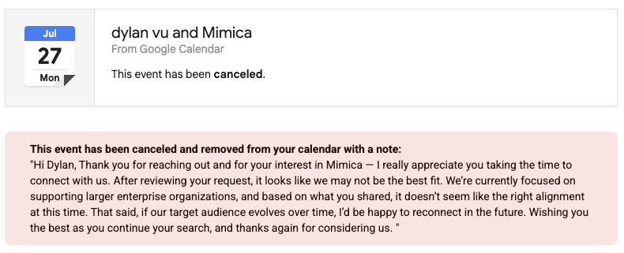

%%
Draft status: first complete draft. Harness section 17 checkpoint 2 reached (first complete draft exists).
Written from: blog-prep-day-0-took-three-days.md (all eight sections, four anchors, claim-ledger wording).
Completed 2026-07-26: first ownership edit, naive-reader full read, citation-binding pass, colon audit, overclaim search, belonging pass, and register re-scan.
Added after the lint passes on 2026-07-26: the section 4 comparison table and its two framing paragraphs, register-checked individually at insertion. Every table cell is a claim.
Completed 2026-07-26: compression pass reduced reader-visible article copy from 2,373 to 1,791 words without removing the table, evidence boundaries, or experiment stages.
Updated 2026-07-27: Mimica canceled the scheduled demo before the product questions could be asked. The Mimica capability cells remain question marks, and the cancellation screenshot now supports only the enterprise-market claim.
Completed 2026-07-27: connective-tissue pass added short causal and contrast words at abrupt seams without changing the argument or section order.
Completed 2026-07-27: global epistemic pass removed wording that made the unrun prediction experiment sound like a negative result.
Remaining before final publication: Dylan's personal read, including a per-cell check of the comparison table; Celonis follow-up before any stronger product claim; final link verification after later edits.
%%

# The Missing Step Between Recording and Prediction

*I wanted to know whether a model could predict the exact place I would go next on my computer. Instead, I spent three days learning what one trustworthy example had to contain.*

I needed examples of what I saw before each move and the exact place I went. Existing tools captured most of the raw material, but I found no public documentation for one that turned ordinary work into verified examples. This post separates what I can reuse now from what a dependable system would still need.

## Day 0 took three days

I planned a four-day experiment. Day 0 was supposed to be recorder setup, but it took three days.

The plan was to record my normal work, replay each moment before I navigated, and ask a model for its top three guesses. If the guesses felt useful, I would bind them to the Tab key as autocomplete for computer navigation.

Prediction never started. Instead, I spent those three days trying to assemble the examples automatically.

I audited [Screenpipe](https://github.com/screenpipe/screenpipe), which records screens and inputs continuously. I added [NAPsack](https://github.com/GeneralUserModels/napsack), which groups activity into captioned bursts, but had to patch its display assignment because my second monitor sits above my main one. I then built a capture layer from Hammerspoon (a macOS automation tool), ScreenCaptureKit (Apple's screen recording framework), and a browser extension. A 30-action diagnostic consumed most of a day and stopped at 12 accepted checkpoints. Even then, the monitors were still out of sync.

That work showed only that higher-fidelity recording was possible. It did not get me to a usable set of examples, so I never reached the prediction test.

The delay had two causes. The tools I could use did not assemble the examples, but I also tried to build a dependable automatic system before running a small test. This post separates the two.

## The example I actually needed

One usable example has four parts:

1. a screenshot or record of what I could see before I moved;
2. the exact place I went next;
3. later evidence showing I really went there;
4. my approval or correction of that answer.

A useful collection also keeps the approved examples in the order they happened.

Suppose I finish an article in Arc, then go to the message box in one specific Codex task. The example must show the article before I moved, name that task and field rather than just "Codex," attach later evidence of the move, and carry my verdict that the label is right.

Two requirements stay strict. The observation must come from strictly before the move, and the recorded destination must be correct. That is because a post-click screenshot can reveal the answer, while a wrong destination makes the score meaningless.

But everything else can be loose at first. I do not need perfectly synchronized monitors, a tamper-proof record, or automatic identification of every on-screen control. The prior-state rule also appears in OpenCUA's [collection method](https://arxiv.org/abs/2508.09123), which pairs each action with the last visually distinct screen from before it. I collected the other relevant studies in [a separate research note](https://dylanduyvu.github.io/30-projects/computer-use-nap-fidelity-research-2026-07-26).

## The recorder is only one part of the tool

The tool I wanted has seven jobs:

1. run quietly during ordinary work, across native apps and browsers;
2. preserve what was on screen strictly before each move;
3. keep correctly attributed evidence from both monitors when a move crosses displays;
4. name the exact destination in one consistent field, whether it is an app, window, page, document, task, input field, link, or button;
5. propose meaningful boundaries between moves, instead of treating every keystroke as its own example;
6. show enough evidence that a person can approve, fix, reject, or park each example; and
7. export the approved examples in time order, in a format a model can train on.

A continuous recording covers the first job and supplies raw material for the rest. But it does not do the rest.

Screenpipe shows the difference. Version 2.5.132 captured both monitors, inputs, app and window changes, web addresses, screenshot text, and the accessibility tree, which is how macOS describes on-screen controls to assistive software.

But it still did not produce my examples. In one 50-minute session, 76 of the 164 screenshots linked to clicks came after the click. So the linked frame was not guaranteed to show the prior state. The full measurements are in [my audit](https://dylanduyvu.github.io/50-sources/screenpipe-live-capture-audit-2026-07-23). At the same time, Screenpipe's [current documentation](https://docs.screenpipe.com/architecture) describes a fuller accessibility tree and more input methods than I observed. These numbers apply only to my version and setup.

## The closest tools already form a product category

I first compared research tools and self-serve products. NAPsack groups passive activity into captioned bursts, but its [published task](https://arxiv.org/abs/2603.05923) predicts plain-language task descriptions rather than exact destinations. [OpenCUA](https://arxiv.org/abs/2508.09123) pairs actions with the last distinct prior screenshot, but collects declared demonstrations; its [macOS setup](https://agentnet-tool.xlang.ai/quickstart/mac_quick_start/) records one display. [Scribe](https://support.scribehow.com/hc/en-us/articles/30708953411229-Using-Autocapture) discovers workflows across approved business apps and lets users review, edit, publish, or discard them. Its documented exports are finished guides, including [Markdown](https://support.scribehow.com/hc/en-us/articles/9254133020189-Exporting-a-Scribe-to-Markdown), rather than raw prediction examples.

Then I looked at enterprise task mining, software that records work to find repeated business processes. [Mimica](https://www.mimica.ai/product) advertises passive desktop capture, task discovery, step-level screenshots, spreadsheet export, and a [native macOS recorder](https://www.mimica.ai/articles/introducing-mimica-task-mining-for-macos) announced July 22, 2026. It sells through enterprise sales, and its public signup rejected my personal email with "This email is not enabled, please contact your admin." Its [proof of concept](https://www.mimica.ai/contact) also starts with sales. On the morning of my scheduled demo, Mimica canceled it after deciding my one-person request did not fit its focus on larger enterprise organizations.

[Celonis Task Mining](https://docs.celonis.com/en/task-mining.html) is another enterprise counterexample. It documents background capture, raw and labeled event tables, and screenshots of [all attached desktops](https://docs.celonis.com/en/event-processing-rules.html), but runs only on Windows. [Skan](https://www.skan.ai/process-discovery-and-analysis) and [UiPath Task Mining](https://docs.uipath.com/task-mining/automation-cloud/latest/user-guide/introduction-as) are in the same category. UiPath's earlier [unassisted mode](https://docs.uipath.com/task-mining/automation-suite/2024.10/user-guide/unassisted-task-mining-analysis-guide) found workflows across monitors before it [was removed](https://docs.uipath.com/task-mining/automation-cloud/latest/release-notes/november-2024) from the cloud in December 2025.

So the category exists. But four narrower questions stayed unresolved in the public material. Is the screenshot from before the move? Does the output name the exact native-app or browser destination? Can the user fix each answer? Can approved examples be exported in time order? For enterprise systems, these may be demo questions rather than gaps.

The table maps public documentation and my capture tests to the seven jobs. A question mark means the material did not answer the question. Vendor rows are vendor claims. Local measurements apply only to my setup in July 2026.

| Tool | 1. Ambient | 2. Prior state | 3. Both monitors | 4. Exact destination | 5. Boundaries | 6. Row review | 7. Export |
|---|---|---|---|---|---|---|---|
| Screenpipe 2.5.132 | Yes (measured) | No (measured) | Partial (measured) | Partial (measured) | ? | ? | Partial (raw data) |
| NAPsack 0.1.3 | Yes | Yes (active display) | No (active display only) | Partial | Yes (bursts) | ? | Partial (JSONL) |
| OpenCUA tool | No (declared tasks) | Yes (documented) | No (one display on macOS) | Partial | Partial (within tasks) | Yes (annotator review) | Yes (trajectories) |
| Scribe Autocapture | Partial (approved apps) | ? | ? | ? | Yes | Partial (guide level) | No (guide formats) |
| Mimica | Yes (vendor claim) | ? | ? | ? | Yes (vendor claim) | ? | Partial (spreadsheet export) |
| Celonis Task Mining | Partial (Windows only) | ? | Partial (all-desktop screenshots) | Partial (event attributes) | Partial | ? | Yes (event tables) |
| UiPath Task Mining | No (known tasks) | ? | ? | Partial (export fields) | Partial | Yes (review) | Yes (raw export) |
| Skan | Partial (vendor claim) | ? | ? | ? | Yes (vendor claim) | Partial | ? |
| My custom stack | Partial (controlled runs) | Yes (measured) | Partial (measured) | Partial (measured) | No | No | No |

The pattern is clearer by column. Several tools cover jobs one, five, and seven, while the questions cluster around prior state, exact destination, and row review. My custom stack is the concession in one row: I built much of the capture layer, imperfectly, but not the parts that made the data usable. Corrections are welcome.

## The strongest objection, conceded

The strongest objection is simple. I missed task mining, then overbuilt a benchmark. Mimica and Celonis already capture and export desktop activity. Screenpipe captured enough raw material to attempt a manual test. Stopping at 12 of 30 checkpoints shows an over-scoped protocol, not a missing product.

Most of that is right. Several tools capture ordinary work, discover workflows, and export detailed records. I treated an automatic dataset as a prerequisite for a small test. That sequencing mistake cost most of the three days.

But the remaining claim is narrower. The enterprise systems were not an immediate self-serve path for my experiment, and I found no public material showing one tool that preserves prior state, names the exact destination, lets me correct each answer, and exports accepted examples in order. That may be an undocumented capability or a thin layer on an existing platform rather than a new category. Mimica canceled the demo before I could ask, so its technical answers remain unknown.

## A first version can be cobbled together

So the first experiment does not need that product. Screenpipe can remain the recorder, while a small offline script finds possible navigation moments, selects the latest usable prior frame, drafts a destination from later evidence, and writes the examples to a table. I have not validated this plan, and I would check every row by hand.

The script skips live suggestions, a review interface, reliable automatic boundaries, perfect monitor synchronization, and stable identification of every control. Its only job is to reduce labeling work. If it becomes another tool-building project, I will label the first examples by hand.

Here, low friction means install, record, and review. It does not mean querying a database, aligning several clocks, or debugging monitor geometry. That is what my three days looked like.

## What a dependable version still needs

A dependable automatic version still has to:

1. notice when I make a meaningful move during ordinary work;
2. identify the target from macOS interface labels, webpage structure, and pixels;
3. match screen, click, app, and browser records across both monitors;
4. flag missing or conflicting evidence;
5. make corrections fast; and
6. export corrected examples consistently.

Whether that requires a new product or a layer on an existing platform is unresolved. Open tools provide the pieces but require custom code, while enterprise systems may already provide enough recording, grouping, review, and export. So I will not call this a new product gap until a demo or trial answers the four questions above.

## Why this matters and what happens next

The idea came from a conversation with [Niyant](https://handsdiff.github.io/phase-1) about personal AI that learns from how you work. I proposed using Tab, or one of three hotkeys, to route me to the place I would likely want next. He first called the idea vague, then said the narrowed version aligned overall. He also warned that if I mostly use a few apps, cycling among them could look useful without understanding anything. That is why I care about the exact place, not the app, and useful predictions, not raw accuracy. The longer idea is in [my Tab note](https://dylanduyvu.github.io/00-inbox/tab-could-autocomplete-the-next-computer-action) and [experiment plan](https://dylanduyvu.github.io/20-syntheses/computer-use-nap-shadow-experiment).

Still, [A Click Ahead](https://arxiv.org/abs/2309.12170) shows that a simpler version can work under easier conditions. Its conventional recurrent neural network, not a large language model, chose the exact next action correctly 34.63 percent of the time from 442 known actions. My destinations are more specific and not confined to a fixed list, so I read the result as precedent, not a forecast.

So the corrected sequence is short. Run the manual pilot. Decide whether the predictions are useful. Use the offline script only if it actually reduces the labeling work. Build, or buy, the dependable version only if the prediction earns it.

If you have built something that already produces these examples, or you are working on it, I want to see it. The seven jobs above are the test. dylanduyvu@gmail.com.
