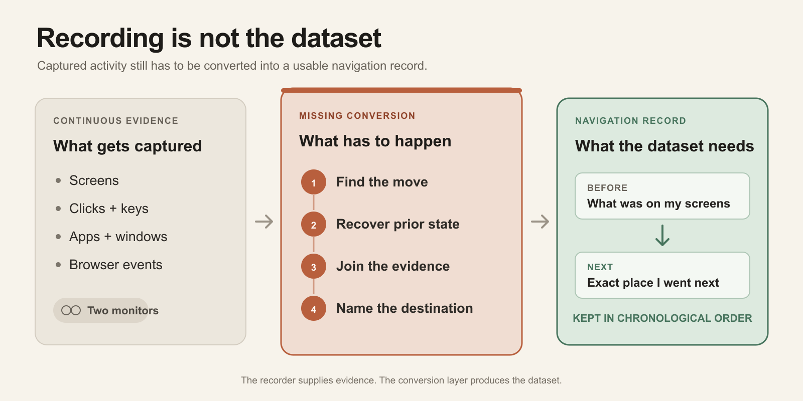

%%
Draft status: first complete draft. Harness section 17 checkpoint 2 reached (first complete draft exists).
Written from: blog-prep-day-0-took-three-days.md (all eight sections, four anchors, claim-ledger wording).
Completed 2026-07-26: first ownership edit, naive-reader full read, citation-binding pass, colon audit, overclaim search, belonging pass, and register re-scan.
Added after the lint passes on 2026-07-26: the section 4 comparison table and its two framing paragraphs, register-checked individually at insertion. Every table cell is a claim.
Completed 2026-07-26: compression pass reduced reader-visible article copy from 2,373 to 1,791 words without removing the table, evidence boundaries, or experiment stages.
Updated 2026-07-27: Mimica canceled the scheduled demo before the product questions could be asked. The Mimica capability cells remain question marks, and the cancellation screenshot now supports only the enterprise-market claim.
Completed 2026-07-27: connective-tissue pass added short causal and contrast words at abrupt seams without changing the argument or section order.
Completed 2026-07-27: global epistemic pass removed wording that made the unrun prediction experiment sound like a negative result.
Updated 2026-07-27: added the causal account of why the controlled capture stack stayed fragile and why making it dependable became product engineering.
Completed 2026-07-27: second compression pass removed repeated setup, conclusions, and product requirements while preserving the causal account, evidence boundaries, counterargument, and experiment stages.
Updated 2026-07-27: rewrote the deck to name the LLM, exact-destination scope, Tab-key interaction, unrun test, and automated dataset attempt; removed repeated opening lines.
Completed 2026-07-27: added the public associated-research, file-specific revision-history, and disclosure links required by the publication harness.
Updated 2026-07-27: expanded the opening into a day-by-day experiment list that defines the baseline, accumulating-history comparison, and qualitative live-demo decision.
Updated 2026-07-27: reorganized the capture-fragility section into five labeled causes while preserving its rationale, sequencing concession, and product implication.
Updated 2026-07-27: reconciled every Mimica and Celonis reference after the canceled demo, distinguishing evidence that the enterprise category exists from products usable in Dylan's setup.
Updated 2026-07-27: rewrote the opening thesis around the personal dataset, named the recorded inputs, and replaced the documentation-led gap claim with the stronger bounded finding that no product Dylan could use assembled the dataset.
Updated 2026-07-27: rewrote the dataset section to establish chronological order once, then stay at the navigation-record level; removed the redundant pilot and research aside.
Updated 2026-07-27: corrected the Screenpipe section to explain its event-driven screenshots, why a click-linked frame could show the post-click state, and how the raw streams could still produce candidates for manual review.
Updated 2026-07-27: narrowed the thesis after recognizing that Screenpipe may already have recorded enough evidence. The untested gap is conversion into proposed records for Dylan to verify, and the custom capture stack was not shown to be necessary.
Updated 2026-07-27: restored the broader dataset-assembly thesis after the Screenpipe reconstruction hypothesis overcorrected the article; kept the narrower concession that the raw-frame extraction path was not tested.
Corrected 2026-07-27: replaced the precision-dependent `76 of 164` Screenpipe ordering figure with the raw-timestamp split of 83 post-click and 81 pre-click frames.
Completed 2026-07-27: compressed the untested Screenpipe reconstruction path into a caveat so it qualifies the evidence without competing with the observed result.
Corrected 2026-07-27: separated the core dataset, acquisition-calibration machinery, and post-failure manual fallback. Human inspection in the 30-action walkthrough graded the recorder; it was not the intended ongoing labeling workflow.
Completed 2026-07-27: moved the acquisition-ladder explanation out of the dataset-schema section and into the capture-fragility section.
Completed 2026-07-27: clarified the Codex destination example, removed the six-action smoke result from the narrative, and rewrote the walkthrough section around why it existed, why it stopped at 12 actions, and which validation gates never ran.
Completed 2026-07-27: rebuilt the article around one six-section narrative, moved the prediction precedent into the setup, removed the body tool matrix and standalone objection, and combined the manual next step with the product-gap conclusion.
Completed 2026-07-27: converted the product survey into two scannable groups and removed its repeated version of the conversion requirements.
Completed 2026-07-27: finished Dylan's top-to-bottom readability pass, clarified the custom system's purpose, defined first-use acronyms, and corrected the two-record navigation example.
Completed 2026-07-27: added a recording-to-dataset graphic after the five conversion steps.
Remaining before final publication: Dylan's final approval after the published readability checkpoint.
%%

# The Missing Step Between Recording and Prediction

---

*This article is a brief detour into [Niyant](https://substack.com/@handsdiff)'s [personalization thesis](https://dylanduyvu.github.io/20-syntheses/niyant-personal-ai-thesis-study-guide).*

*[Associated research](https://dylanduyvu.github.io/30-projects/computer-use-nap-fidelity-research-2026-07-26) | [Revision history](https://github.com/dylanduyvu/dylanduyvu.github.io/commits/main/20-syntheses/day-0-took-three-days.md) | [Disclosure](https://dylanvu.substack.com/about)*

---

*I wanted to test whether a large language model (LLM) could predict the exact app, page, document, task, or field I would navigate to next based on what was currently on my screens and my recent work history. If it worked, pressing the Tab key could take me there. But the prediction test never started. Instead, I spent three days failing to assemble the dataset it needed.*

The dataset itself was simple. Each record needed to pair what was on my screens immediately before I moved with the exact place I went next. The hard part was producing those records automatically from continuous screen activity. Existing tools captured my screens, clicks, app switches, and browser activity, but no product I could use converted that evidence into the dataset.

## Day 0 took three days

I planned one setup day followed by four experiment days.

- **Day 0:** Set up recording and define how captured activity would become navigation records.
- **Day 1:** Record a day of work and create the first day of history.
- **Day 2:** On the same navigation events, compare the LLM seeing only my current screen against the LLM seeing that screen plus Day 1 history.
- **Day 3:** Repeat with zero, one, and two days of history.
- **Day 4:** Repeat with zero, one, two, and three days of history.

If history made the top-three exact-destination guesses qualitatively more useful, I would build a live public demo where pressing Tab took me to the most likely destination. Essentially Cursor Tab, but for navigating my computer instead of editing code.

[A Click Ahead](https://arxiv.org/abs/2309.12170) made the experiment worth running. Its conventional recurrent neural network predicted the exact next action with 34.63 percent accuracy across a fixed set of 442 recurring actions. It did not use an LLM, and its closed list was easier than naming my specific destinations, so the result was a precedent rather than an accuracy forecast.

Then Day 0 took three days, and it was still not complete.

I started with [Screenpipe](https://github.com/screenpipe/screenpipe), which runs in the background and records screen and input activity. I added [NAPsack](https://github.com/GeneralUserModels/napsack), which groups nearby clicks and keystrokes into short segments and describes each segment in plain language. Because my second monitor sits above my main one, I had to patch NAPsack's display assignment. When those tools did not automatically assemble the records I needed, I built a custom capture system using Hammerspoon for Mac automation, Apple's ScreenCaptureKit, and an Arc browser extension.

I tested that system with a 30-action diagnostic covering known clicks, focus changes, app switches, keyboard commands, and page navigations across Mac apps, websites, and both monitors. I stopped after 12 accepted checkpoints. Each new action required another rule for judging the capture, the remaining browser cases needed more code, and the two monitor streams were still not reliably synchronized. The system was not going to scale without much more work. I chose not to spend another half day on it when I still had no dataset for the prediction test.

## What the dataset needed

I needed a chronological dataset of navigation records. Each record needed two parts:

1. what was on my screens immediately before I moved;
2. the exact place I went next.

Suppose I finished reading an article in Arc, then opened the Codex conversation where I was editing it, then clicked its message box. That sequence needed two records. The first showed the article and named the specific conversation I opened. The second showed the conversation and named its message box. Labeling either destination only "Codex" would be too broad.

Both parts had to be right for the prediction test to mean anything. A screenshot taken after I moved could reveal the destination to the LLM. A wrong destination label could make a correct prediction look wrong or a wrong prediction look correct.

## Recording captured evidence, not dataset records

[Screenpipe](https://github.com/screenpipe/screenpipe) handled continuous recording. Turning its output into the dataset required five more steps:

1. identify meaningful navigation moments;
2. select the screen state from before each move;
3. join the correct evidence from both monitors;
4. name the destination consistently across native apps and browsers;
5. export the records in chronological order.

In my test, Screenpipe version 2.5.132 captured both monitors, clicks and keyboard input, app and window changes, web addresses, text from screenshots, and macOS descriptions of on-screen controls. Its [current architecture documentation](https://docs.screenpipe.com/architecture) explains that clicks, app switches, scrolls, typing pauses, and idle periods trigger screenshots instead of fixed-rate video.

The screenshot linked to each click was unreliable in both directions. In one 50-minute session, 83 of 164 linked screenshots came after the click. The other 81 came before it, but some were up to 25 seconds old. I could not use the linked screenshot directly as either the screen the LLM should see or proof of where I went.

The underlying recording may still contain enough evidence. A script could ignore the linked screenshot, use the click timestamp to find the latest earlier frame from each monitor, and use later evidence to identify the destination. I did not test that path, so I do not know how often it would produce a valid record.

The full measurements are in [my Screenpipe audit](https://dylanduyvu.github.io/50-sources/screenpipe-live-capture-audit-2026-07-23). Screenpipe's current documentation describes more complete capture than I observed, so these results apply only to my tested version and setup.

## My custom system became an infrastructure project

Instead of first testing the simpler Screenpipe extraction path, I tried to guarantee clean records at capture time. The 30-action diagnostic was the first validation gate for that custom system. I knew the intended result of each action and checked whether the system reconstructed it correctly.

Four problems kept expanding the work:

- **Each action required a controlled procedure.** I had to prepare the app, mark the start, capture a frozen image of both displays, perform one action, mark completion, and export browser evidence when needed. An extra click, missed marker, or delayed input could corrupt the interval.

- **The evidence used different clocks and identifiers.** The system had to join input events, two display streams, macOS control data, browser events, and an action log. The browser did not know the Mac automation layer's action ID, so the join depended on timestamps, coordinates, and window identity. A monitor that had not changed might also lack a fresh frame.

- **Native apps and webpages described destinations differently.** macOS might return the intended button, an image inside it, a generic container, an unnamed field, or nothing useful. Browser structure was more precise inside webpages but could not describe native controls or browser chrome. Focus changes and dynamic pages could also change the evidence during capture.

- **The validator changed as new cases appeared.** Fixing those cases improved the system, but it also meant the same rules had not judged every checkpoint. A formal test would have required finishing the remaining cases, freezing the validator, and running the diagnostic again.

Even a completed walkthrough would have shown only that the system could reconstruct known actions under controlled conditions. The next gates were a blind 30-action calibration and an audit of 50 to 100 actions from normal work. Only if all three gates passed would later records go directly into the prediction test.

That validation work was reasonable. If the timing or destination labels were wrong, I would not know whether a bad result came from the LLM or the data. The sequencing mistake was making a dependable automatic pipeline a prerequisite for a cheap qualitative test.

## Existing products solve pieces, but not the full conversion

The closest tools fell into two groups.

**Research and self-serve tools**

- **[NAPsack](https://github.com/GeneralUserModels/napsack):** Groups passive activity into captioned segments and exports them as JSONL, a text format with one record per line. Its [published prediction task](https://arxiv.org/abs/2603.05923) predicts those broader activity descriptions rather than exact destinations.

- **[OpenCUA](https://arxiv.org/abs/2508.09123):** Collects deliberate demonstrations, matches actions with the last distinct prior screenshot, supports review, and exports standardized trajectories. Its [Mac setup](https://agentnet-tool.xlang.ai/quickstart/mac_quick_start/) records one display.

- **[Scribe AutoCapture](https://support.scribehow.com/hc/en-us/articles/30708953411229-Using-Autocapture):** Discovers workflows across approved business apps and lets users review, edit, publish, or discard them. Its documented exports are finished guides, including [Markdown](https://support.scribehow.com/hc/en-us/articles/9254133020189-Exporting-a-Scribe-to-Markdown), rather than prediction records.

**Enterprise task-mining products**

- **[Mimica](https://www.mimica.ai/product):** Advertises passive desktop capture, automatic task discovery, step screenshots, spreadsheet export, and a [native Mac recorder](https://www.mimica.ai/articles/introducing-mimica-task-mining-for-macos). But it rejected my personal signup and canceled my demo because a one-person evaluation did not fit its enterprise focus.

- **[Celonis Task Mining](https://docs.celonis.com/en/task-mining.html):** Documents background capture, raw and labeled event tables, and screenshots of [all attached displays](https://docs.celonis.com/en/event-processing-rules.html). Its recorder only runs on Windows.

These products corrected my initial conclusion. Computer activity capture, workflow discovery, and structured export already form a product category. My diagnostic also measured the limits of my custom protocol, not the limits of Screenpipe.

The narrower finding is that I found no self-serve Mac product I could use that completed the five conversion steps above. An enterprise product may already do this without documenting it. The missing piece may also be an adapter for an existing recorder rather than a new product category.

## I am running the experiment manually

I never needed to solve the automatic collection problem before testing whether the predictions were useful. I am now collecting the first navigation records with Screenpipe, then labeling them by hand for the LLM comparison.

I am publishing this as a record of the gap I encountered. Existing tools recorded most of the required evidence, but no product I could use automatically turned it into reliable chronological records of what I saw and the exact place I went next.

If the predictions prove useful, the next step is to test the simpler Screenpipe extractor before building another capture system. A dependable automatic version would still need to find navigation moments, recover prior state from both monitors, identify native and browser destinations, handle missing evidence, and export stable records. I should build that only if the prediction result justifies it.

If you have built a system that already produces these navigation records, or you are working on one, I want to see it. dylanduyvu@gmail.com.
