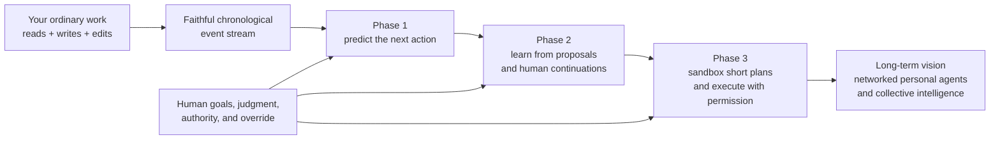
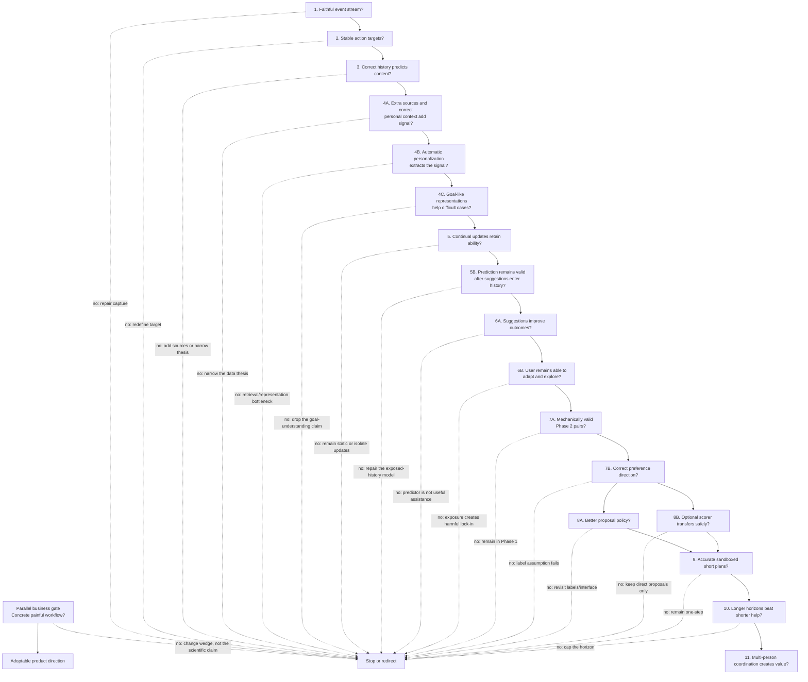

# Niyant’s personal-AI thesis: a beginner’s study guide

_Prepared July 21, 2026 from the complete public “World Models” note set at pinned repository commit [`3151afa`](https://github.com/handsdiff/notes/tree/3151afa93fd81719a6e9dc7862c269ea1f1a70e6) and Niyant’s July 20 all-hands notes. Updated July 22 with a separately marked Google DeepMind paper that bears on the feedback-loop risks. Links to `handsdiff.github.io` are easier to read but may change after this snapshot._

## Read this first

The most important fact is easy to miss: this is a research thesis and experimental roadmap, not a demonstrated system.

- [Phase 1](https://handsdiff.github.io/phase-1) explicitly says it contains no experimental results.
- [Phase 2](https://handsdiff.github.io/phase-2) is conditional on Phase 1 succeeding.
- [Phase 3](https://handsdiff.github.io/phase-3) is a directional extension, not a settled implementation.
- [Local Tasking](https://handsdiff.github.io/local-tasking) marks the phase specifications as drafted, but data design as still in progress; ingestion, experiments, and published results come later.
- [Entry](https://handsdiff.github.io/entry), [Algorithms](https://handsdiff.github.io/algorithms), [Data](https://handsdiff.github.io/data), [Experiment Plan](https://handsdiff.github.io/experiment-plan), [Product](https://handsdiff.github.io/product), [Interaction](https://handsdiff.github.io/interaction), and [Experiments](https://handsdiff.github.io/experiments) are exploratory notebooks. They include discovery links, doubts, and older formulations that the formal Phase 1–3 documents sometimes correct.
- [Google Pi Team](https://github.com/handsdiff/notes/blob/3151afa93fd81719a6e9dc7862c269ea1f1a70e6/Google%20Pi%20Team.md) and [Relevant Events](https://github.com/handsdiff/notes/blob/3151afa93fd81719a6e9dc7862c269ea1f1a70e6/Relevant%20Events.md) are ecosystem and opportunity notes. They reveal influences and possible contacts, but add no completed result to the thesis.

So “understanding the thesis” currently means understanding a chain of hypotheses, the proposed tests, and where the chain should stop if a hypothesis fails.

One source-quality warning: links to X posts, Gemini or Claude chats, conference lists, and papers inside the scratch notebooks are mostly a **research queue**, not replicated evidence. They help explain what influenced the thesis. Any scientific claim drawn from them still needs to be checked against the primary paper and an actual experiment.

## The 30-second version

Current AI can be broadly intelligent while still knowing very little about what _you_ are trying to do right now. Niyant’s core idea is to turn ordinary computer work into a continuous personal learning signal:

1. Record a faithful timeline of what you saw and what you did.
2. Train a model to predict your next meaningful action.
3. Show some predictions as suggestions and learn from what you do after seeing them.
4. If that works, simulate short plans, let you approve or edit them, and execute only with safeguards.
5. Eventually, let many person-specific assistants coordinate while preserving each person’s distinct context and goals.

The best analogy is an apprenticeship:

- **Phase 1 — predict and cautiously participate:** the apprentice learns your next move, then may show controlled suggestions that become part of the history it observes.
- **Phase 2 — learn bounded comparisons:** when a shown proposal and your later continuation concern the same decision, the system tests whether that comparison can improve a separate proposer.
- **Phase 3 — planning:** the apprentice sketches several short plans and their predicted consequences; you choose what may happen.

The current formal target is a stronger **human–AI team**, not a machine that merely copies or replaces the person. The scratch notes still treat augmentation versus replacement, and one model versus separate human/assistant models, as open product questions.

## 1. The overall vision

### 1.1 The claimed problem

A general model may know how to write, code, search, and reason, but not which of those abilities matters to one particular person at one particular moment. The missing information is often tacit and fast-changing:

- the question behind the current search;
- the argument being developed;
- a constraint introduced by a message;
- a connection not yet written down;
- a project whose priority just changed.

Prompts expose only fragments of this state. Conventional “memory” usually stores selected facts after someone has decided they matter. Ratings create cleaner labels but turn work into a feedback chore. Niyant’s alternative is to learn from the work itself. See [Phase 1 §1](https://handsdiff.github.io/phase-1#1-the-missing-substrate-for-personal-ai).

### 1.2 The proposed scarce resource: a personal event stream

The key data structure is a time-ordered stream containing:

- **Inbound/read events:** visible document passages, webpages, received messages, AI outputs, tool results, and application state.
- **Outbound/write events:** note edits, searches, prompts, messages, and other human-authored actions.

The important word is _visible_. If a person saw only one paragraph of a page, the full page cannot be inserted into the past as if they had read it. If an AI answer appeared token by token, its completed answer cannot be treated as available before it rendered. If text was pasted or AI-authored, it cannot be mislabeled as original human thought. The training record must resemble a correctly timed movie of work, not a scrapbook assembled afterward. See [Phase 1 §2](https://handsdiff.github.io/phase-1#2-interleaved-event-stream) and [Data](https://handsdiff.github.io/data).

The broader thesis is that fresh, personal, nondeterministic context is harder to buy than compute and harder to reproduce than public algorithms. A low-friction application is intended to make that context a useful product and renewable data source; neither adoption nor the marginal value of the captured data has been demonstrated yet.

### 1.3 Phase 1: learn behavior before claiming to know goals

Phase 1 asks a narrow question:

> Given everything that was available before a person acted, can a model predict their next bounded action?

An action might be adding one bullet, replacing a coherent passage, submitting a search, sending a message, or writing a prompt. It is intentionally larger than a keystroke but smaller than a whole Git commit. The notes call this a **macro-action**.

The training method is **behavioral cloning**: increase the model’s probability of the action the person actually took. In beginner language, the model’s guess is compared with what happened; collected examples may later update a candidate model in periodic, versioned batches using replay and publication gates, not necessarily after every action. See [Phase 1 §3](https://handsdiff.github.io/phase-1#3-next-action-objective) and [§5](https://handsdiff.github.io/phase-1#5-continual-adaptation-and-replay).

Possible ways to personalize the model include:

- placing raw personal history inside the prompt;
- retrieving a smaller set of relevant past events;
- maintaining a semantic memory;
- explicitly summarizing the current objective;
- fine-tuning adaptable weights;
- combining these approaches.

The experiment is supposed to compare them under matched data and compute budgets, not assume that fine-tuning is automatically best.

Phase 1’s claim about goals is not “prediction equals a true reward function.” It is narrower: difficult prediction in novel or ambiguous situations may require a useful internal representation of what the person is locally trying to accomplish. That bridge must be tested. A model that predicts formatting and favorite files has learned something, but not necessarily the person’s objective. The stronger Phase 1 claim is later causal improvement in joint human–model outcomes. See [Phase 1 §1.1](https://handsdiff.github.io/phase-1#11-from-prediction-to-implied-local-objectives) and [§7.3](https://handsdiff.github.io/phase-1#73-joint-system-outcomes).

### 1.4 Phase 1 also begins participation

After the predictor passes offline tests, it can sample several possible next actions and show some of them. The person may copy, edit, combine, reject, ignore, or move beyond them. The suggestion is recorded as something the person actually saw, and the later human action becomes a new behavioral example conditioned on that expanded history.

This matters because the model changes the data it later learns from. Once suggestions appear, the person is no longer working in the same environment as before. The formal plan does not hide this; it records the suggestion as an assistant-authored event and evaluates the resulting feedback loop. See [Phase 1 §§4.2–4.3](https://handsdiff.github.io/phase-1#42-learning-through-participation).

### 1.5 Phase 2: learn bounded comparisons

Phase 2 asks a different question:

> After the person sees a concrete proposal, what can be learned from the different action they choose to take?

Suppose the model proposes a search query. The person reads it and writes a different query addressing the same decision. Phase 2 tentatively labels the person’s version as locally better.

That label is valid only if:

- the proposal was actually visible before the action began;
- both actions address the same local decision;
- both use comparable boundaries;
- they are meaningfully different.

An unshown sample is not rejected. An exact or semantic copy is a tie. A task switch creates no pair. See [Phase 2 §§2 and 5](https://handsdiff.github.io/phase-2#2-assumptions).

Phase 2 preserves two histories:

- the **pre-display history**, used to compare the proposal and the person’s alternative fairly;
- the **post-display history**, containing the suggestion the person actually saw, used to keep modeling their behavior truthfully.

It also separates three learned objects:

1. A **behavioral model** predicting what the person does inside the collaboration.
2. A **proposal model** learning to generate better suggestions before the person acts.
3. An optional **reward model** scoring local actions for reranking or later research.

The current formal plan prefers **IPO** over the earlier DPO idea because IPO pushes the preferred action ahead by a controlled margin instead of continually demanding more separation from potentially noisy labels. This is a technical choice, not the thesis itself. The load-bearing question is whether the inferred preference pairs are valid and whether training on them improves real outcomes. See [Phase 2 §§4, 6, and 11](https://handsdiff.github.io/phase-2#4-three-distinct-learning-objects).

### 1.6 Phase 3: learn consequences and bounded plans

Phase 3 is justified only if Phases 1 and 2 work and the remaining problems are genuinely sequential: locally sensible moves fail to combine, consequences are delayed, information-gathering matters, or the system must ask “what would happen if?”

The system would:

1. generate several short action sequences;
2. predict their results and uncertainty;
3. test promising branches in an isolated sandbox where possible;
4. show the exact actions, forecasts, uncertainty, and approval boundaries;
5. let the person select, edit, reject, or ask for clarification;
6. revalidate any edited plan;
7. execute only the authorized portion with checkpoints and rollback;
8. compare predicted, sandboxed, and actual outcomes.

The plan deliberately separates a human-response model, action prior, local scorer, world-dynamics model, planner, whole-trajectory scorer, and execution governor. A high model score never creates authority to act. See [Phase 3 §§2, 4, and 7](https://handsdiff.github.io/phase-3#2-separation-of-model-roles).

The central warning is that a local Phase 2 score cannot simply be added across a long imagined plan and called “the user’s objective.” Whole trajectories visit different states and have delayed consequences. Longer horizons require new trajectory comparisons and real outcome evidence. See [Phase 3 §5](https://handsdiff.github.io/phase-3#5-local-rewards-do-not-automatically-compose).

### 1.7 The long-term vision: collective intelligence

The grandest vision is one personal model per person or employee, with those models able to coordinate. [Entry](https://handsdiff.github.io/entry) contrasts this with one monolithic “company agent.” Each assistant would carry distinct context and goals; the hoped-for result is better knowledge sharing, negotiation, simulation, and joint problem solving. The [Product](https://handsdiff.github.io/product) scratchpad separately names the principle of retaining individual authority as “reward-function autonomy/sovereignty.”

This is a vision layer, not a specified or tested fourth phase. The formal roadmap does not yet define a multi-person learning protocol or prove that accurate personal models improve group coordination.

### 1.8 The immediate wedge is much narrower

The scratch notes increasingly distinguish the grand vision from the first useful product:

- a low-friction, versioned personal knowledge environment;
- reliable context across notes, browsing, and AI conversations;
- next-prompt or next-action prediction;
- suggestions that speed up research-heavy knowledge work;
- perhaps, later, team coordination.

[Entry](https://handsdiff.github.io/entry) explicitly recognizes that “collective intelligence” had been conflated with the initial value proposition. A practical early claim is simply: _next-action assistance speeds up a person or small team, if it works_. The target customer, painful workflow, and measurable willingness to adopt remain open.

The latest `Entry` branch now tentatively calls the **context collector** the main value proposition. Its candidate first user is a small, technical team of fewer than 20 people; its measurable pain is the growing time spent re-explaining context to chatbots and agents. The proposed contrarian bet is that cheaper intelligence makes missing context _more_ painful, not less. Retrieval and portability across AI providers may supply daily value, while next-action prediction is both a forcing function for better data and the proactive feature that distinguishes the system from promptable memory.

That branch also exposes unresolved product choices: applications may resist exporting context; keyboard-level capture is unattractive if it records everything; an “AI-embedded Obsidian,” a temporal collector, and a next-action assistant may be separate products; and the business could be open-core, fully closed, or an open-source cleaning pipeline with paid hosting, retraining, and applications. SOC 2 and the line between multi-step augmentation and replacement remain questions, not decisions. See the [pinned July 21 notes](https://github.com/handsdiff/notes/blob/3151afa93fd81719a6e9dc7862c269ea1f1a70e6/Entry.md#L315-L357).

### 1.9 The closest prior result named in the notes: LongNAP

The `Algorithms` scratchpad calls **LongNAP** “THE baseline” because it had already produced a user-action-prediction result. As summarized by Niyant, LongNAP uses a vision-language model to label screenshot/video activity, retrieves from an append-only memory log, trains reasoning with GRPO, predicts a sequence of eight actions, and points toward completing predictable tasks. Niyant’s formulation instead emphasizes one-step suggestions, human augmentation rather than replacement, and a simpler behavioral-cloning starting point. See the [pinned comparison](https://github.com/handsdiff/notes/blob/3151afa93fd81719a6e9dc7862c269ea1f1a70e6/Algorithms.md#L323-L343).

LongNAP therefore raises the bar and supplies an experimental baseline; it does **not** validate this thesis’s specific claims about faithful event reconstruction, personal semantic gain, goal-like representations, useful participation, or continual improvement.

### 1.10 The closest runnable interaction: Tada and Tabracadabra

[Tada](https://generalusermodels.github.io/tada/) is Omar Shaikh's public research platform for testing personal-AI interfaces. Niyant directly links the Tada repository in his `Algorithms` note, which verifies that he knows the platform exists, although the note does not show whether he has installed or deeply inspected its first interaction.

That first interaction, Tabracadabra, uses Option+Tab inside a field the user has already selected. It captures the current monitor and cursor, lets a research phase inspect relevant Tada activity records, and then streams a separate writer phase's continuation or inline answer into the field. The current implementation uses two inference phases with the same configured model identifier; it does not require a distinct research model and writer model.

Tabracadabra is important prior art but not Phase 1 evidence. It retrieves personal records at inference time, does not demonstrate that a model trained on longitudinal behavior beats retrieval, and does not choose the user's next destination. It is a **writer**, while Dylan's proposed computer-use NAP first tests the **router**: which exact semantic field, document, thread, tab, or control will the user focus next?

Dylan therefore decided not to make a Tabracadabra trial the next experiment. See [[omar-shaikh-computer-use-personalization-stack-2026-07-22|the prior-art source]], [[tabracadabra-is-a-retrieval-augmented-writer-not-a-computer-use-nap|the mechanism boundary]], and [[computer-use-nap-shadow-experiment|the direct shadow experiment]].

### 1.11 A new failure-mode model: evolving values under personalized AI

Google DeepMind's July 2026 paper [*AI Value Alignment for Evolving Social Norms*](https://arxiv.org/abs/2607.18506) does not show that Phase 1 prediction works. It studies what can happen after a personalized assistant begins influencing the person it models.

The paper represents the person, the AI's historical model of that person, and a changing environment as vectors in a mathematical simulation. When the lagging historical model strongly pulls the person back toward it, adaptation slows. The authors call this value lock-in. In population extensions, strong coupling can erase local differences or make assistants converge with one another faster than they track their users.

The load-bearing connection is measurement: once suggestions are visible, higher accuracy can mean the model understands the person better, the person has become more like the model's predictions, or both. Acceptance and exposed-history accuracy are therefore not clean evidence of understanding.

This is a conceptual and mathematical warning, not a real-user result. The paper has no new human, LLM-agent, or product experiment, and several findings follow substantially from its assumptions. Its value here is to sharpen the existing Phase 1 endogenous-feedback concern into a concrete adaptation-and-agency test. See [[google-deepmind-ai-value-alignment-for-evolving-social-norms-2026|the full vault source note]].

## 2. The load-bearing details

These are the assumptions that carry the most weight. “Minimum evidence” means the cheapest credible test, not a guaranteed sufficient proof.

The table’s pass language is my proposed operationalization of the source metrics. The notes do **not** yet specify numerical thresholds for words such as “low,” “high,” “adequate,” or “acceptable.”

| Load-bearing detail | Why it matters | Minimum evidence | What failure would mean |
|---|---|---|---|
| **1. Faithful timing and authorship** | The model must receive only what the person could actually know before acting. | Independent replay of sessions with low missing-event, ordering, visibility, and authorship error; no future leakage. | The proposed dataset cannot support any later claim until capture is repaired. |
| **2. A stable macro-action boundary** | “Next action” must be a coherent target, not an arbitrary pause or an entire multi-goal commit. | Human agreement on action boundaries; results remain stable under reasonable segmentation changes. | Change the target granularity; it does not yet disprove all prediction. |
| **3. Prior events contain real signal** | If behavior is dominated by unobserved thoughts, notifications, or randomness, history may not help. | Correct chronological history beats current-artifact, no-history, repetition, and nearest-neighbor baselines. | Add missing sources, change boundaries, or abandon this prediction target. |
| **4. The gain is personal and semantic** | More text or style mimicry is not the desired effect. | Correct personal history beats shuffled, wrong-time, and wrong-person history on content-sensitive and novel examples. | Narrow the claim to formatting/workflow autocomplete. |
| **5. Automatic context selection can find the evidence** | A useful fact somewhere in the archive is not useful if the system cannot retrieve or compress it. | Automatic methods approach a manually selected oracle context. | If the oracle wins but automation fails, retrieval—not the data thesis—is the bottleneck. |
| **6. Goal-like representations help difficult cases** | The “understands what I am trying to do” story depends on more than repetition. | Explicit objective induction or equivalent representations improve novel/ambiguous held-out actions. | A narrower predictor may still work, but the objective-understanding claim weakens. |
| **7. Personal context still matters with strong models** | Better general models may make custom training unnecessary—or may use private context better. | Within the same model, correct personal context beats no/wrong context across model sizes. | If gains vanish at the frontier, narrow the thesis to rare/private context or a context product. |
| **8. Continual updates do not erase useful abilities** | The person and projects change, but frequent tuning can forget older work or damage reasoning/tool use. | Recent gains plus historical retention, general-capability checks, immutable versions, and successful rollback. | Keep a static model, improve replay/isolation, or stop weight updates. |
| **9. Prediction produces useful possibilities** | A model can predict behavior accurately without helping. | Randomized comparisons show better time, quality, errors, rework, or goal satisfaction than no output and static assistance. | The prediction science may survive; the augmentation product does not. |
| **10. The feedback loop remains healthy** | Suggestions may anchor, narrow, manipulate, or train the user to become easier to predict. | Stable or improved outcomes and diversity across exposure rates, with override, provenance, and rollback. | Stop exposure even if prediction metrics improve. |
| **11. Phase 2’s local-superiority label is defensible** | “The user acted later” does not automatically mean “the later action was better.” | High independent agreement on comparable pairs, adequate pair yield, and delayed/outcome checks. | Stay in Phase 1 or collect explicit/outcome feedback. |
| **12. Preference optimization improves help, not just imitation** | A proposer may win its own pair metric by becoming more human-like without becoming more useful. | IPO beats its exact reference, BC-only, DPO, and static baselines on blinded and randomized outcomes. | Revisit the interface, labels, or proposer architecture. |
| **13. A local reward transfers safely** | A scorer can exploit style or verbosity and fail on new policies or tasks. | Calibration across later proposer versions, adversarial checks, and correlation with blinded outcomes. | Keep direct proposals; do not treat the scorer as a reusable reward. |
| **14. A world model can predict short transitions** | Phase 3 needs counterfactual consequences, not just action imitation. | One- and two-step calibration in a reversible structured sandbox, then sandbox-to-production agreement. | Keep shorter-horizon assistance; do not expand planning. |
| **15. Longer horizons add real value** | Error and reward misspecification compound with every step. | Each horizon beats no-plan and shorter-horizon controls while retaining calibration, reversibility, and acceptable intervention rates. | Stop at the strongest shorter horizon. |
| **16. There is a painful, adoptable product wedge** | A coherent research result is not automatically a company. | A defined user/workflow, measured time or money cost, willingness to install capture, and repeated use. | The science may remain interesting while the proposed business direction changes. |

### Four separations that prevent conceptual mistakes

1. **Prediction is not understanding.** Better next-action accuracy may come from repetition, style, or workflow regularity. Goal understanding is a separate test.
2. **Understanding is not usefulness.** A predictor can model a person without improving their work. Live outcomes are a separate test.
3. **Behavior is not preference.** What someone did is not necessarily what was best. Phase 2 adds a local comparative assumption, not a universal reward.
4. **A local preference is not a trajectory objective.** What is better at one state cannot automatically be summed across a long plan.

## 3. The invalidation ladder

The formal Phase 1 notes already state a six-claim ladder: faithful stream → predictive signal → personalization gain → safe continual adaptation → useful displayed samples → better joint-system outcomes. The expanded ladder below carries that logic through Phases 2 and 3.

**Current evidence status:** every scientific rung through Phase 3 is untested. There is no reported reconstruction audit, ingestion pipeline result, sealed prediction result, live outcome trial, preference dataset result, reward-transfer result, or sandbox-planning result. The collective-intelligence test is not yet specified. “Pass” and “invalidate” below describe the proposed future decisions.

### Parallel business gate — Problem and adoption _(current evidence: LBH in progress)_

**Question:** Who suffers enough from lost context or slow knowledge work to change behavior and permit granular capture?

**Pass:** A specific workflow has a measured time or money cost; users repeatedly adopt the product and tolerate its privacy/setup burden.

**Invalidate or redirect:** The benefit is interesting but not painful, the user is vague, or users will not expose enough data. This does not refute the science, but it refutes the current wedge.

This gate comes primarily from [Entry](https://handsdiff.github.io/entry) and the all-hands LBH. It is **parallel to**, not a formal prerequisite for, the Phase 1 scientific ladder: the science could work without producing the current business, and the context product could have value before the full science works.

### Rung 1 — Reconstruction _(current evidence: untested)_

**Question:** Can the exact pre-action information state be recreated?

**Test:** Manually replay sampled Obsidian, browser, and AI-chat sessions. Measure missing events, ordering errors, incorrect visible spans, authorship errors, boundary disagreement, and leakage. Compare behavior before and after capture begins so instrumentation effects are visible. Do not begin the first full comparison until every major source has usable coverage and the sealed future window contains enough independent sessions and content-bearing actions—not merely a large count of adjacent edits.

**Invalidate or block:** Reviewers cannot reconstruct the same history, AI/pasted text is mislabeled as human, or gains disappear when leakage-prone examples are removed. Repair capture before modeling. See [Phase 1 Experiment 0](https://handsdiff.github.io/phase-1#84-experimental-staircase).

### Rung 2 — Action definition _(current evidence: untested)_

**Question:** Is a bullet, query, message, or edit burst a coherent prediction target?

**Test:** Version the segmentation rules and audit agreement. Vary reasonable pause and boundary definitions.

**Invalidate or redirect:** Results reverse under small boundary changes or one target routinely contains multiple goals. Change granularity.

### Rung 3 — Basic signal _(current evidence: untested)_

**Question:** Does personal history beat simple baselines on future content?

**Test:** Begin with Obsidian. Compare last-action repetition, common action/location, nearest neighbor, current note only, and temporally valid history. Use chronological—not random—splits, an embargo at least as long as the largest ordinary context window, and a final test interval sealed until the analysis is frozen.

**Invalidate or redirect:** Correct history does not beat controls, or the gain is only punctuation, formatting, and location. Add sources, redesign hard negatives, or narrow the claim.

### Rung 4A — Source value and selector diagnosis _(current evidence: untested)_

**Question:** Do correctly timed notes, browser events, and chats add personal signal beyond the current artifact?

**Test:** Compare no history, correct history, shuffled history, wrong-time history, wrong-person history, and a human-selected oracle context.

**Decision branches:**

- Oracle helps, automation does not → the information exists; selection is the bottleneck.
- Oracle does not help → the source coverage, action boundary, or personal-data thesis is weak.

### Rung 4B — Automatic personalization and local scaling _(current evidence: untested)_

**Question:** Can an automatic method extract the signal from long, noisy history, and does the gain survive stronger base models?

**Test:** Under matched evidence, model, and compute budgets, compare raw long context, retrieval, semantic memory, and SFT/weight adaptation while varying personal-data quantity, recency, context budget, adaptation capacity, and base-model capability.

**Invalidate or redirect:** No automatic method closes an established oracle gap, or stronger models erase the within-model gain from personal history. Improve selection, narrow the thesis to rare/private context, or build a simpler context product.

### Rung 4C — Goal-like representation _(current evidence: untested)_

**Question:** Do representations of the person’s local objective improve difficult, novel, or ambiguous predictions?

**Test:** Compare explicit objective induction with matched-budget raw context; use similar language with different goals and new action forms serving a familiar goal.

**Invalidate or redirect:** Objective summaries sound plausible but add no held-out predictive value. Retain a narrower behavior predictor and drop the stronger “understands what I am trying to do” claim.

### Rung 5A — Continual adaptation _(current evidence: untested)_

**Question:** Can the model track new projects without forgetting old workflows or losing general ability?

**Test:** Repeat the frozen analysis on a later interval; update with recent examples plus stratified replay; test recent, historical, and general capabilities. A good average is insufficient if a high-priority application, action family, provenance class, or target-length slice fails.

**Invalidate or redirect:** Every recent gain requires old-task or reasoning loss, one session dominates, or evidence becomes stale faster than it accumulates. Reject the update, roll back, isolate adapters, or remain static.

### Rung 5B — Exposed-history predictive validity _(current evidence: untested)_

**Question:** Once suggestions enter the event stream, can the behavioral model still predict human actions under the histories people actually experienced?

**Test:** Report prediction separately for histories with and without assistant-authored events while using the same estimator. Audit copying, refinement, synthesis, rejection, and task-switch slices.

**Invalidate or redirect:** Prediction becomes unstable or qualitatively different after exposure, or the model cannot reconstruct how its suggestions changed the person’s information state. Repair the interaction record and behavioral model before interpreting live outcomes.

### Rung 6A — Causal usefulness _(current evidence: untested)_

**Question:** Does showing predictions improve the person’s work?

**Test:** Randomly compare unaided work, static assistance, and continual personalized assistance on bounded tasks. Measure time, blinded quality, errors, rework, completion, interruption, and goal satisfaction.

**Invalidate or redirect:** Prediction improves but outcomes do not. Then the model may be an interesting predictor but not a useful assistant. If outcomes or behavioral diversity regress, stop exposure and roll back.

### Rung 6B — Adaptation and agency under exposure _(current evidence: untested)_

**Question:** Does personalization help without making the person conform to a stale historical model or become easier to predict by narrowing their behavior?

**Test:** Randomize no-suggestion, static-suggestion, and personalized-suggestion windows. Preserve shadow-mode predictions and randomize slate order. Introduce or wait for a clearly declared project or goal change, then compare recovery under different update and replay policies. Include washout periods where suggestions disappear. Measure outcomes, adaptation speed, overrides, corrections, novel actions, behavioral diversity, persistence during washout, and prediction accuracy separately for exposed and unexposed histories.

**Invalidate or redirect:** Exposure raises acceptance or prediction accuracy but slows adaptation after the declared change, reduces outcomes, narrows useful exploration, or leaves unwanted effects after removal. Stop exposure, weaken the feedback loop, change retention and forgetting, or keep the system in shadow mode. This gate is motivated by Phase 1's endogenous-feedback warning and [[google-deepmind-ai-value-alignment-for-evolving-social-norms-2026|the GDM value-lock-in model]].

### Rung 7A — Mechanical Phase 2 pair validity _(current evidence: untested)_

**Question:** Do ordinary interactions yield enough pairs with confirmed exposure, the same local decision, the same action boundary, and non-equivalent actions?

**Test:** Audit exposure timing, task comparability, boundaries, equivalence, pair yield, reversals, and independent/delayed judgments.

**Invalidate or redirect:** Exposure, comparability, boundary, or equivalence labels are unreliable, or too few interactions produce mechanically defensible pairs. Remain in Phase 1 or collect a different feedback signal.

### Rung 7B — Preference-direction validity _(current evidence: untested)_

**Question:** Even when a pair is mechanically valid, is the later human action actually locally better than the proposal?

**Test:** Use independent judgments, delayed user reflection, reversals, and bounded task outcomes rather than inferring quality from temporal order alone.

**Invalidate or redirect:** Independent or delayed judgments frequently favor the proposal, or “later” mostly reflects convenience, exploration, confusion, or anchoring. The core Phase 2 label assumption fails.

### Rung 8A — Better proposer _(current evidence: untested)_

**Question:** Does IPO or another preference method improve suggestions and outcomes beyond BC and the unchanged reference?

**Test:** Compare IPO, DPO, BC-only, static/generic models, and the exact collection-time proposer. Each preference pair must be scored against the exact proposer checkpoint that generated it; replaying an old pair under a new reference changes the objective. Include model-versus-model judgments and delayed outcomes.

**Invalidate or redirect:** Pair margins improve but human outcomes do not, results hinge on text length, or changing/reference-mismatching the checkpoint reverses the learned result. Revisit labels, UI, and reference accounting.

### Rung 8B — Optional reusable local scorer _(current evidence: untested)_

**Question:** If a reusable reward model is needed, does it transfer safely across later proposer versions, applications, and projects?

**Test:** Check pairwise calibration, length/style robustness, cyclic preferences, adversarially searched actions, support coverage, and correlation with blinded outcomes.

**Invalidate or redirect:** The scorer rewards nonsense, fails on later proposers, or tracks style instead of outcomes. Keep the direct proposer if it works, but do not carry a reusable reward into Phase 3.

### Rung 9 — Short world-model and sandbox accuracy _(current evidence: untested)_

**Question:** Can the system correctly predict one- and two-step consequences in one reversible application?

**Test:** Compare learned-model predictions with sandbox truth and sandbox predictions with authorized production outcomes; check uncertainty outside familiar states and whether people can correctly interpret the displayed uncertainty before approving a plan.

**Invalidate or redirect:** Two-step forecasts are uncalibrated, sandbox and production diverge, or exogenous events cannot be separated from action effects. Stay with one-step assistance.

### Rung 10 — Whole-plan value and horizon expansion _(current evidence: untested)_

**Question:** Do longer plans improve real outcomes beyond the best shorter-horizon system?

**Test:** Collect whole-plan selections, edits, rejections, interventions, and delayed outcomes. Test reward transfer under planner-generated actions. Expand from one to two to three steps only after each horizon passes outcome, calibration, reversibility, permission, and safety gates. Irreversible or socially consequential actions need a separately reviewed authority model, if they are permitted at all.

**Invalidate or redirect:** Users select attractive forecasts that fail, abort rates rise with horizon, model errors become less recoverable, or the planner wins its own simulated score while making the person worse off. Cap the horizon.

### Rung 11 — Collective-intelligence vision _(current program: not specified)_

**Question:** Do networks of person-specific models improve coordination while preserving distinct goals, privacy, and authority?

**Test:** Not yet specified in the formal notes.

**Invalidate or redirect:** A monolithic context system performs as well, personal models misrepresent their principals, cross-agent dynamics become unsafe, or the coordination benefit does not exceed the cost and complexity. This rung is currently the most speculative.

## 4. Niyant’s July 20 all-hands context

I was able to access the internal/workspace page [All hands 7.20](https://app.notion.com/p/3a3307288ccf800c9d43e5386a0a1b4f). This guide reflects the version last edited July 20, 2026 at 17:20 UTC; readers outside the workspace may not be able to open it. Niyant’s section adds execution context that the public phase documents do not.

### What happened

His prior LBH was to articulate the vision, the growing problem, and evidence of time or money cost in a writeup after understanding the practical algorithms better. He marked it failed with “weekend was cooked.” The note records a scheduling/execution failure and no hypothesis test; saying that the thesis survived would therefore be an inference, not an experimental result.

His renewed near-term LBH is the same core deliverable, now targeted for Thursday.

### The planned—not completed—evidence-producing sequence

The notes outline roughly five and a half weeks of expected LBHs:

1. Publish the vision/problem writeup and take random tasks from `Entry`.
2. Produce a data plan **or invalidate the direction’s premises**.
3. If the premises survive, specify data structures and ingestion surfaces versus alternatives.
4. Implement working data pipelines.
5. Explain the data structure, objective, and competing algorithms.
6. Build a toy comparison of SFT, in-context learning, memory approaches, and different randomly selected context amounts.
7. Publish the result.
8. Rerun the toy example with newly ingested data and publish again.
9. Seek external “algorithm invalidators” from the AI-engineering community.

This identifies the current **planned work focus** as data design and a clean Phase 1 toy experiment, not exotic Phase 3 planners. The plan itself does not empirically prove that this is the only bottleneck.

Dylan’s section adds useful decision context: he wrote that he had not yet gone through Niyant’s notes or conviction ladder over the weekend. His goal was to understand the personalization interim thesis by Wednesday and then choose a new LBH either within that thesis or around GPU financing. The meeting note therefore records an active evaluation, not a settled team commitment to the full roadmap.

In a July 22 follow-up, Dylan asked what Niyant would have him, or a second pair of hands generally, build to contribute to the vision. Dylan reported that Niyant's answer was to build the computer-use NAP concept. This makes exact semantic computer routing an endorsed complementary workstream rather than an outside alternative to Niyant's next-write experiment. The answer establishes relevance but leaves the target and implementation scope open. See [[dylan-niyant-computer-use-nap-followup-2026-07-22|the source capture]].

### A potentially confusing status label

[Local Tasking](https://handsdiff.github.io/local-tasking) calls Phases 1–3 “DONE,” but the surrounding checklist shows that this means the documents were drafted and enriched with failure modes. Data design is still in progress; ingestion, experiment implementation, and experiment publication are later. The all-hands notes reinforce that interpretation.

## 5. The most important open questions

`[Explicit]` means the notes directly ask or acknowledge the question. `[Partly explicit]` means the source names part of the issue but this guide extends it. Fully inferred reviewer questions are kept in a separate subsection.

### Ranked author-stated and partly stated questions

#### Highest priority: questions that determine whether Phase 1 is worth building

1. **What exact painful workflow is the first product solving—and is prediction the product or a forcing function?** `[Explicit]`

   The latest candidate is a context collector for small technical teams, with time spent supplying missing context as the cost; retrieval may be the daily value and next-action prediction the proactive forcing function. This is a useful narrowing, but who is retained, how large the cost is, and what improvement justifies granular capture remain unanswered. The packaging is also open: open-core, closed source, or an open cleaning pipeline plus paid hosting/retraining/applications. Source: [Entry, pinned July 21 branch](https://github.com/handsdiff/notes/blob/3151afa93fd81719a6e9dc7862c269ea1f1a70e6/Entry.md#L315-L357).

2. **What is the correct action unit?** `[Explicit]`

   Is the target a token, sentence, bullet, prompt, search, edit burst, semantic action, or structured `{app, location, operation, content}` record? A target that is too small measures style; one that is too large mixes multiple decisions. Source: [Phase 1 §2.1](https://handsdiff.github.io/phase-1#21-macro-actions).

3. **Can the actual pre-action state be observed and collected?** `[Explicit]`

   Thoughts, conversations, notifications, memories, and off-screen information may drive the next action. Browser history records visits, not what was read; screen capture records pixels, not attention. Distribution is also load-bearing: apps may withhold context, while keyboard-level capture feels invasive because it sees everything. How much missing state is tolerable, and what will people consent to install? Sources: [Phase 1 §8.2](https://handsdiff.github.io/phase-1#82-data-collection-and-integrity) and [Entry, pinned July 21 branch](https://github.com/handsdiff/notes/blob/3151afa93fd81719a6e9dc7862c269ea1f1a70e6/Entry.md#L325-L337).

4. **Does richer personal history predict meaning, or only routine?** `[Explicit]`

   The crucial evidence is improvement on novel, ambiguous, content-sensitive actions—not punctuation, locations, copied text, or repeated phrases. Source: [Phase 1 §7.1](https://handsdiff.github.io/phase-1#71-predictive-validity).

5. **Is prediction a necessary bridge to useful assistance?** `[Explicit]`

   Could an assistant get most of the value by asking for the current goal, retrieving relevant history, or responding to prompts? The thesis needs to show that predicting the person provides incremental value over simpler explicit-goal systems. Sources: [Phase 1 §1](https://handsdiff.github.io/phase-1#1-the-missing-substrate-for-personal-ai) and [Entry](https://handsdiff.github.io/entry).

6. **Does good prediction actually create a goal-like representation?** `[Explicit]`

   Phase 1 correctly treats this as a testable bridge, not a theorem. An induced objective must improve held-out behavior or outcomes, not merely sound persuasive. Source: [Phase 1 §7.2](https://handsdiff.github.io/phase-1#72-local-objective-representation).

7. **Which personalization mechanism wins under fair budgets?** `[Explicit]`

   The all-hands toy comparison names the right contest: raw context/ICL, retrieval or memory, and SFT/weight adaptation across different data amounts. Cost, latency, update frequency, and capability retention matter alongside accuracy. Sources: [All hands 7.20](https://app.notion.com/p/3a3307288ccf800c9d43e5386a0a1b4f) and [Phase 1 §8.4](https://handsdiff.github.io/phase-1#84-experimental-staircase).

8. **Does personal evidence remain valuable as base models improve?** `[Explicit]`

   Capability may substitute for personal context or make better use of it. This determines whether the company should own a custom-model layer, a context layer, or mainly a data-capture product. Source: [Phase 1 §8.4](https://handsdiff.github.io/phase-1#84-experimental-staircase).

9. **How much data is required, and how quickly does it expire?** `[Explicit]`

   There is no current sample-size or local-scaling law. The answer may differ by action type, model size, recency, and whether the information is private or repeated. Source: [Phase 1 §8](https://handsdiff.github.io/phase-1#8-experimental-program).

10. **Can continual tuning retain reasoning, question answering, and tool use?** `[Explicit]`

    A model specialized for predicting one person could become a worse general assistant. The notes have publication gates, but acceptable thresholds and update schedules remain unspecified. Sources: [Phase 1 §5](https://handsdiff.github.io/phase-1#5-continual-adaptation-and-replay) and [§8.3](https://handsdiff.github.io/phase-1#83-chronology-manifests-and-readiness-gates).

#### Phase 2 and interaction questions

11. **Is the later human action truly better than the shown proposal?** `[Explicit]`

    The person might be distracted, exploring, settling for convenience, or wrong. Phase 2 depends on enough cases where local superiority is credible. Sources: [Phase 2 §2](https://handsdiff.github.io/phase-2#2-assumptions) and [§5](https://handsdiff.github.io/phase-2#5-pair-construction).

12. **Which preference counts when a short-term choice conflicts with a long-term goal?** `[Explicit]`

    A person may want candy now and still want to lose weight. Optimizing only the immediate action can conflict with the longer-term objective; overriding the immediate action can become paternalistic or wrong. The notes raise this tension but do not give Phase 1 or 2 a validated way to resolve it. Source: [Interaction, pinned lines 45–47](https://github.com/handsdiff/notes/blob/3151afa93fd81719a6e9dc7862c269ea1f1a70e6/Interaction.md#L45-L47).

13. **How should suggestions be displayed, and when should the system stay silent?** `[Explicit]`

    A good suggestion can appear rejected because it was badly timed or awkwardly placed. Interface quality is a direct label confound, not cosmetic polish. Sources: [Phase 1 §4.2](https://handsdiff.github.io/phase-1#42-learning-through-participation) and [Phase 2 §5](https://handsdiff.github.io/phase-2#5-pair-construction).

14. **Does the suggestion change the person in a beneficial way?** `[Explicit]`

    The system may inspire and expand behavior, or anchor and narrow it. Predictability could rise while outcomes fall because the model learned the person better or because it made the person more like its predictions. What randomized exposure, goal-change, washout, diversity, and rollback tests distinguish those mechanisms? Sources: [Phase 1 §4.3](https://handsdiff.github.io/phase-1#43-endogenous-feedback) and [[google-deepmind-ai-value-alignment-for-evolving-social-norms-2026|GDM's value-lock-in model]].

15. **Should the human model and assistant remain separate?** `[Explicit]`

    One design learns a clean model of the person and trains another policy to help them. Another directly trains one “human+” centaur model. The current formal documents prefer separation for interpretability, but the long-run product architecture is not settled. Sources: [Phase 2 §4](https://handsdiff.github.io/phase-2#4-three-distinct-learning-objects) and [Entry](https://handsdiff.github.io/entry).

16. **Do automatically derived pairs contain enough information for IPO?** `[Explicit]`

    Nearly every state may be unique; pair yield may be low; length and style may dominate. This is empirical, and the notes appropriately retain BC-only and DPO baselines. Source: [Phase 2 §11.1](https://handsdiff.github.io/phase-2#111-pair-validity).

17. **What counts as a real outcome?** `[Explicit]`

    “Time to acceptable result,” “quality,” and “goal satisfaction” are categories, not yet a frozen evaluation. Which tasks, judges, effect sizes, and primary endpoints determine success? Source: [Phase 1 §7.3](https://handsdiff.github.io/phase-1#73-joint-system-outcomes).

#### Phase 3 and long-run questions

18. **How can a world model cover actions never tried historically?** `[Explicit]`

    Passive logs reveal what happened under past behavior, not arbitrary counterfactuals. A sandbox helps for files and apps but cannot simulate another person’s reaction or irreversible external consequences. Source: [Phase 3 §3](https://handsdiff.github.io/phase-3#3-world-dynamics-learning-and-sandbox-grounding).

19. **How do local comparisons become trajectory values, if at all?** `[Explicit]`

    The formal Phase 3 note correctly refuses to sum Phase 2 scores. Whole-plan feedback and actual outcomes are required, but the best estimator—trajectory preference, outcome model, IPO, or AIRL—is open. Sources: [Phase 3 §5](https://handsdiff.github.io/phase-3#5-local-rewards-do-not-automatically-compose) and [§6](https://handsdiff.github.io/phase-3#6-directional-trajectory-objectives).

20. **Where should the horizon stop?** `[Explicit]`

    More steps create more potential value and more compounding error. The plan says to expand only after calibrated evidence, but numerical thresholds are absent. Source: [Phase 3 §7](https://handsdiff.github.io/phase-3#7-horizon-curriculum-and-bounded-execution).

21. **How are privacy, consent, and cross-person authority enforced?** `[Partly explicit]`

    The product wants unusually granular notes, browsing, chats, perhaps audio, and eventually agent-to-agent interaction. What remains local, what is public, who can query it, and how does one person revoke or correct a model speaking for them? Sources: [Data](https://handsdiff.github.io/data), [Product](https://handsdiff.github.io/product), and [Phase 3 §7](https://handsdiff.github.io/phase-3#7-horizon-curriculum-and-bounded-execution).

### Cross-cutting gaps in the current research plan

- Numerical pass/fail thresholds are not specified.
- There is no power or sample-size plan.
- Outcome tasks and judges are not frozen.
- The design compares many models, context sources, data amounts, targets, slices, and metrics. Without a preregistered primary endpoint, frozen analysis plan, correction for repeated comparisons, and prospective replication, a lucky result could be mistaken for a robust one.
- Data cleaning and ingestion remain unfinished.
- The core Phase 2 label is still an assumption awaiting audit.
- The business wedge and the collective-intelligence vision are not yet cleanly separated in all notes.

### Additional inferred questions a skeptical reviewer should ask

These are not all posed cleanly in the notes, but they follow from the proposed design.

1. **Would a result on Niyant generalize to anyone else?** A founder who designs, uses, and evaluates the system can establish a personal case study, not a general scientific or market result. Multi-user replication and inclusion criteria are missing.
2. **What numerical result counts as success?** The plan names sensible metrics but not minimum effect sizes, tolerated leakage, required pair yield, acceptable capability regression, or horizon-expansion thresholds.
3. **How will self-evaluation bias be controlled?** “Acceptable result,” action comparability, and goal satisfaction can all be judged by the person building the system. Blinded artifacts, independent raters, and frozen rubrics need operational details.
4. **Does visible text equal attended or understood text?** Viewport, focus, scrolling, and dwell are weak proxies for cognition. The model may include text that was technically visible but ignored, while missing thoughts or conversations that caused the action.
5. **How can an immutable history support deletion and consent?** Append-only stores, Git history, public publishing, and trained adapters complicate deletion, correction, third-party consent, and recovery from accidental capture.
6. **Could public notes contaminate the baseline?** A future base model may train on the public vault, meaning the “no personal history” condition already knows the author. Private prospective holdouts and frozen model versions are important.
7. **How is partial causal credit handled?** `[Explicit limitation; falsifier inferred]` A human may combine several suggestions or improve one. Treating every displayed proposal as a loser can punish the proposal that caused the improvement.
8. **How does evaluation stay fresh during continual deployment?** Repeated model versions can overfit a once-sealed test set; hosted base models can also change silently. The system needs renewable future holdouts.
9. **Can replay preserve durable knowledge without freezing an obsolete person?** Old behavior may represent a previous job, project, or value. Retention and adaptation are not always the same as remembering and forgetting.
10. **What happens outside the reward model’s support?** `[Explicit limitation; falsifier inferred]` Phase 2 compares actions sampled by one proposer; a later planner may search much more widely and exploit the scorer. Abstention and support boundaries are not yet defined.
11. **Do latency and unit economics work?** Continuous capture, parsing, retrieval, multiple samples, fine-tuning, storage, sandbox simulation, and evaluation may cost more time or money than they save.
12. **What can rollback actually undo?** Reverting weights cannot retract an external message, recover a leaked secret, or reverse a belief changed by a harmful suggestion. Consequence recovery is broader than model rollback.
13. **How do personal agents negotiate conflicting goals?** The collective-intelligence step needs protocols for strategic behavior, permissions, information boundaries, accountability, and conflict—not just accurate user models.
14. **Does a network of personal agents improve coordination at all?** Accurate individual prediction does not automatically create shared truth, trust, negotiation, governance, or a positive-sum equilibrium. A monolithic context system or ordinary collaboration tools may perform as well with much less complexity.

### Apparent contradictions and the safest current reading

The notes are a live thinking process. When sources conflict, the formal Phase 1–3 documents appear to be the current canonical design.

| Older or unresolved branch | Current safest reading |
|---|---|
| [Experiment Plan](https://handsdiff.github.io/experiment-plan) suggests that accepted or ignored top-K samples can feed DPO. | [Phase 2](https://handsdiff.github.io/phase-2) permits a preference pair only for a rendered, comparable, non-equivalent proposal followed by a relevant human action. Mere ignoring is not rejection. |
| [Entry](https://handsdiff.github.io/entry) considers one “human+” model. | Current [Phase 2](https://handsdiff.github.io/phase-2#4-three-distinct-learning-objects) and [Phase 3](https://handsdiff.github.io/phase-3#2-separation-of-model-roles) separate behavioral, proposal, reward, dynamics, planning, and execution roles so failures remain attributable. |
| Earlier [Algorithms](https://handsdiff.github.io/algorithms) language sometimes implies a superhuman model. | Current [Phase 1](https://handsdiff.github.io/phase-1#73-joint-system-outcomes) success means a better human–model system; it does not require a standalone model that outperforms the human at their own goals. |
| Some [scratch notes](https://handsdiff.github.io/algorithms) question whether general question-answering and tool ability need to survive personalization. | Current [Phase 1 publication gates](https://handsdiff.github.io/phase-1#83-chronology-manifests-and-readiness-gates) require general-capability retention. |
| [Product](https://handsdiff.github.io/product) favors public-by-default context, while [Data](https://handsdiff.github.io/data) and other notes resist exposing browser data. | This remains unresolved; a schema field called `privacy_state` is not yet a privacy architecture. |
| [Algorithms](https://handsdiff.github.io/algorithms) says Phase 1 and 2 may be practically inseparable because prediction is useful only when shown. | Current [Phase 1](https://handsdiff.github.io/phase-1#42-learning-through-participation) allows controlled exposure, but [Phase 2](https://handsdiff.github.io/phase-2#2-assumptions) preference optimization remains gated until predictive and outcome evidence exists. |
| [Interaction](https://handsdiff.github.io/interaction) sometimes treats the user’s reward as hard to codify or even recognize, while the [Algorithms scratchpad](https://github.com/handsdiff/notes/blob/3151afa93fd81719a6e9dc7862c269ea1f1a70e6/Algorithms.md#L345-L347) says an expressible latent goal exists and only the demonstrated policy is suboptimal. | The safest formal reading is narrower: a **local** objective may exist and may sometimes be expressible, observed behavior may be suboptimal, and Phases 1–2 do not establish one stable global reward function. |

## 6. Beginner glossary

| Term | Plain-English meaning |
|---|---|
| **LLM** | A model trained to predict and generate language. It can also represent tool calls and computer actions as text-like sequences. |
| **Context window** | The limited amount of evidence the model can inspect during one prediction. |
| **Event stream** | The ordered record of what entered the person’s information state and what they did next, including time, authorship, application, and visibility. |
| **Temporal fidelity / future leakage** | Temporal fidelity means the record shows only information available at that moment. Future leakage means later information accidentally appears in the model’s past, making evaluation look falsely easy. |
| **Weights** | The model’s learned internal numbers. Fine-tuning changes them; prompting does not. |
| **In-context learning (ICL)** | Giving examples or history inside the prompt so the model adapts for that one request without changing its weights. |
| **Retrieval / memory** | Selecting relevant past information and inserting it into the current context. |
| **SFT** | Supervised fine-tuning: changing model weights to make demonstrated outputs more likely. |
| **Behavioral cloning (BC)** | SFT whose demonstrations are actions taken by a person; the model learns to imitate behavior. |
| **Negative log-likelihood** | A measure of how surprised the model was by the action that actually happened. Lower is better. |
| **Macro-action** | One meaningful action such as adding a bullet or sending a search, rather than one keystroke or a whole work session. |
| **Local objective / reward** | What appears to matter for one bounded decision. It is not automatically the person’s enduring value system or a score that can be summed across a long plan. |
| **Chronological holdout** | A future time period kept away from training so the model is tested on genuinely later actions. |
| **Ablation** | Remove or replace one source/component to learn whether it actually contributes. |
| **Oracle context** | Relevant history selected manually. It tests whether the needed information exists even if automatic retrieval is poor. |
| **Hard negative** | A plausible wrong alternative designed to reveal whether the model understands meaning rather than surface style. |
| **Continual learning** | Repeatedly updating a model as new work arrives. |
| **Replay** | Mixing older examples into new updates to reduce forgetting. |
| **Catastrophic forgetting** | Learning new material while losing older abilities. |
| **Policy** | A model viewed as a rule for choosing the next action. |
| **Behavioral model / proposal model** | The behavioral model predicts what the person will do in the collaboration. The separate proposal model tries to produce a more useful suggestion before the person acts. |
| **Coactive learning / preference pair** | Learning from a proposal shown during normal work and the person’s comparable continuation. A valid pair says one action is preferred to a less-preferred alternative; merely ignoring something is not enough. |
| **DPO / IPO** | Methods that tune a model from preferred-versus-less-preferred pairs. IPO uses a finite target margin and is the current Phase 2 first choice. |
| **Reward model** | A learned scorer estimating which action or plan is better. It can be wrong or exploitable. |
| **World/dynamics model** | A learned simulator predicting how an environment changes after actions. |
| **Rollout / trajectory / horizon** | An imagined sequence of actions and states; the horizon is its number of steps. |
| **Sandbox** | An isolated environment where actions can be tested without changing the real system. |
| **Calibration** | Confidence that matches reality—for example, events predicted at 70% happen roughly 70% of the time. |
| **Closed loop / endogenous feedback** | The assistant’s output changes what the person sees and does, which changes the model’s future training data. The data is partly caused by the deployed system itself. |
| **Reward hacking** | Finding actions that score well under a learned judge without producing the result the person actually wanted. |
| **Assistance game / CIRL** | A framework in which human and AI cooperate while the AI remains uncertain about the human’s objective. |
| **Centaur / joint system** | The human and AI treated as one collaborative system; combined outcomes are what matter. |
| **Multi-agent system** | Several people or AI policies acting and reacting in a shared environment. |
| **LBH** | Load-bearing hypothesis: a claim important enough that its failure should change the plan. |

## 7. What evidence should matter most next?

If you want to track progress without getting lost in algorithms, watch for these artifacts in order:

1. **A concrete problem statement:** named user, repeated workflow, measured cost, and reason existing context/memory products are insufficient.
2. **A reconstruction audit:** evidence that the time-ordered dataset is real and leakage-free.
3. **An Obsidian smoke test:** correct history versus trivial/current-note baselines on a sealed future interval.
4. **A source ablation:** notes versus browser versus chats, plus shuffled/wrong-person/wrong-time and oracle controls.
5. **The all-hands toy matrix:** ICL/raw context versus retrieval/memory versus SFT across data quantity and model capability.
6. **A prospective repetition:** the result survives a later untouched interval.
7. **A continual-update result:** recent improvement without historical or general-capability loss.
8. **A randomized live-assistance result:** suggestions improve bounded outcomes, not just prediction.
9. **An adaptation-and-agency result:** after randomized exposure and a declared goal change, the system adapts without narrowing useful behavior or leaving unwanted washout effects.

Do not let Phase 2, Phase 3, or collective-intelligence language substitute for evidence at an earlier rung.

## 8. Bottom line

The thesis is best understood as three nested bets:

1. **Infrastructure bet:** a faithful personal event stream has value because current AI loses context across applications and time.
2. **Assistant bet:** prediction plus interaction can become meaningful work autocomplete, not merely word autocomplete.
3. **Coordination bet:** accurate personal models can eventually support safe multi-person and multi-agent collaboration.

The strongest part of the work is its current conceptual discipline: the formal notes separate prediction, goal-like representation, causal usefulness, local preference, trajectory value, and execution authority. They also provide real stop/redirect branches.

The weakest and most load-bearing leaps are:

- that enough of the person’s pre-action state can be captured;
- that personal history improves semantic prediction beyond simpler context systems;
- that prediction is a necessary route to useful assistance or goal inference;
- that a later human action is a trustworthy local preference label;
- that the immediate product wedge is painful and adoptable;
- that the eventual multi-person coordination benefit follows from individual human models.

My overall reading is: **the vision is coherent as a conditional staircase, but essentially all empirical conviction should still come from the first few rungs.** The current center of gravity is data construction and evaluation—not algorithm novelty and not autonomous planning. Niyant’s all-hands sequence is aligned with that reality.

## Suggested reading order

For a nontechnical reader, this order gives the highest signal:

1. [Phase 1 abstract, §§1, 7, 8, and 10](https://handsdiff.github.io/phase-1)
2. [Phase 2 abstract, assumptions, pair construction, and evaluation](https://handsdiff.github.io/phase-2)
3. [Phase 3 introduction, model roles, local-reward warning, and experimental sequence](https://handsdiff.github.io/phase-3)
4. [Local Tasking](https://handsdiff.github.io/local-tasking) and [All hands 7.20](https://app.notion.com/p/3a3307288ccf800c9d43e5386a0a1b4f) for current status
5. [[omar-shaikh-computer-use-personalization-stack-2026-07-22|Omar Shaikh's computer-use personalization stack]] for LongNAP, Tada, and the writer-versus-router boundary
6. [AI Value Alignment for Evolving Social Norms](https://arxiv.org/abs/2607.18506) as a feedback-loop red-team, not Phase 1 evidence
7. [Entry](https://handsdiff.github.io/entry), [Algorithms](https://handsdiff.github.io/algorithms), and [Data](https://handsdiff.github.io/data) only after the formal structure is clear

The scratch notes are valuable because they expose genuine uncertainty, but they are a poor starting point: they mix current plans, abandoned framings, links, product ideas, and unanswered questions.

## Vault links

- Project: [[personal-ai-context-learning|Personal AI Context Learning]]
- Strategy: [[personal-ai-strategy-and-evidence-sequencing|Personal AI strategy and evidence sequencing]]
- Phase 1: [[personal-ai-phase-1-next-action-prediction|Can an AI learn what matters to you by watching you work?]]
- Phase 2: [[personal-ai-phase-2-local-preference-learning|Can a better next move train a better AI?]]
- Phase 3: [[personal-ai-phase-3-bounded-multi-step-assistance|Can an AI help with more than the next move?]]
- New insight: [[a-personal-predictor-can-improve-by-making-its-user-more-predictable|A personal predictor can improve by making its user more predictable]]
- Tada boundary: [[tabracadabra-is-a-retrieval-augmented-writer-not-a-computer-use-nap|Tabracadabra is a retrieval-augmented writer, not a computer-use NAP]]
- Computer-use experiment: [[computer-use-nap-shadow-experiment|Computer-use NAP shadow experiment]]
- Prior art: [[omar-shaikh-computer-use-personalization-stack-2026-07-22|Omar Shaikh's computer-use personalization stack]]
- Niyant follow-up: [[dylan-niyant-computer-use-nap-followup-2026-07-22|Dylan and Niyant: computer-use NAP contribution follow-up]]
- Paper: [[google-deepmind-ai-value-alignment-for-evolving-social-norms-2026|Google DeepMind: AI Value Alignment for Evolving Social Norms]]
