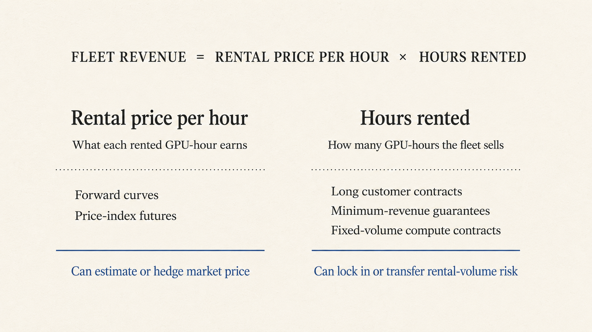

# Why New GPU Fleets Can Go Unfunded in a Compute Shortage

---

*[Associated research](https://dylanduyvu.github.io/50-sources/gpu-loans-without-long-term-customer-claim-ledger-2026-07-19)*

*[Revision history](https://github.com/dylanduyvu/dylanduyvu.github.io/commits/main/20-syntheses/the-gpu-backed-credit-market-does-not-exist-yet.md)*

*[Disclosure](https://dylanvu.substack.com/about)*

---

Lenders prefer contracted revenue. That is not surprising. What needs explaining is why they still rely on it when compute is expected to remain scarce. [In April, SemiAnalysis argued](https://newsletter.semianalysis.com/p/the-great-gpu-shortage-rental-capacity) that GPU scarcity was likely to persist and rental prices were more likely to rise than fall as token demand grew and supply tightened. Even if that forecast is right, a shortage across the market does not guarantee that one fleet securing a loan will stay rented.

USD.AI's pipeline makes the problem visible. In June, its team told me customers were waiting for GPUs or paying premiums to skip the line. Yet [eight of its nine upcoming loans](https://dylanduyvu.github.io/50-sources/usd-ai-public-loan-book-snapshot-2026-07-17), representing 98 percent of the money, were backed by signed customer contracts. The only exception involved GPUs already earning rental revenue. This snapshot cannot show rejected applications or prove that USD.AI requires contracts, but it shows the gap between market demand and revenue a lender can count on from one fleet.

The lender must predict both the price each GPU-hour will earn and the number of hours the fleet will sell before the operator has rental history. Lenders handle that uncertainty with long customer contracts, an established company's financial history, or another company's promise to pay.

## The lender needs this fleet to stay rented for years

The loan may begin before the GPUs are installed and remain outstanding for three years or longer. Even if the broader shortage persists, demand for this fleet can weaken during the loan.

Demand may also be for a different fleet. Customers care about the chip, cluster size, networking, location, and whether the operator can keep it running. Even a customer that chooses the fleet may not commit for as long as the lender needs. [SemiAnalysis reports](https://newsletter.semianalysis.com/p/nvidia-gpu-debt-backstop-unleashes) that companies renting GPUs to run AI products often want capacity for one year or less because they cannot predict demand for their own products.

A company can urgently need compute today and still refuse to promise years of payments. The lender needs a reason to expect cash from these GPUs over the life of the loan. A long customer contract, usually called an offtake agreement in GPU finance, provides one.

## Long contracts turn market demand into loan payments

Contract length is not enough. The customer must also be able to pay. In June 2026, IREN raised $3.6 billion through loans and notes tied to a Microsoft contract. The [public documents](https://www.sec.gov/Archives/edgar/data/1878848/000114036126023427/ef20075181_8k.htm) gave lenders claims on the hardware and Microsoft payments. The lenders could demand early repayment if the project's cash flow stayed less than 10 percent above its debt payments for six months.

Nebius used a similar structure in July. Its [$775 million facility](https://nebius.com/newsroom/nebius-raises-775-million-in-first-secured-debt-financing-to-accelerate-global-buildout) was backed by installed GPUs and payments from a customer with a strong credit rating.

In both deals, customer payments supplied cash while the loans were working. The GPUs supplied recovery if the projects failed.

A lender can lean more heavily on the hardware by lending less than the GPUs should fetch in a sale. But that forces the operator to fund more of the build and may leave the project short of money.

A long contract solves much of the lender's problem, but only if the operator can secure years of payments before the GPUs are installed.

Is it possible to finance a fleet without one long customer carrying the loan?

## Lambda borrowed against an on-demand fleet

In April 2024, Macquarie arranged up to [$500 million](https://www.businesswire.com/news/home/20240402148086/en/Lambda-Announces-%24500M-GPU-Backed-Facility-to-Expand-Cloud-for-AI/) for Lambda's on-demand cloud. Customers could rent the financed GPUs without signing long contracts.

Macquarie was willing to finance a fleet whose customers change. But the public release omitted how much Lambda drew, the interest rate, the share of hardware cost funded, the repayment schedule, and the minimum rental revenue.

Lambda was not a new operator. It was founded in 2012 and reported more than 100,000 customer sign-ups by the time of the loan. That history did not guarantee future demand because its customers could still leave. But Macquarie could use it as evidence that Lambda had repeatedly found customers for an on-demand cloud.

The deal shows that changing customer demand can be financed for an established operator. It does not show whether a young operator can get the same loan before building that history.

Lambda later graduated from a fleet-level loan to financing for its broader business, including a [$1 billion facility](https://lambda.ai/blog/lambda-closes-1-billion-senior-secured-credit-facility) in 2026. Vultr, another established cloud with hundreds of thousands of active customers, raised a [$329 million package](https://www.businesswire.com/news/home/20250623608954/en/Vultr-Secures-%24329-Million-in-Credit-Financing-to-Expand-Global-AI-Infrastructure-and-Cloud-Computing-Platform) in 2025. Both had enough financial history for lenders to judge the company as a whole rather than one fleet.

## USD.AI charges for the uncertainty

A younger operator lacks that history. USD.AI will lend against a GPU fleet with short-term rental revenue, but the uncertainty changes the terms.

Its [lending policy](https://usd.ai/insights/usdai-underwriting-and-risk-management) lists annual interest rates of 7 to 9 percent when a highly rated customer has signed a long contract. A long contract with a less creditworthy customer costs 10 to 12 percent. A loan supported by short-term rentals costs 12 to 15 percent.

Under USD.AI's published policy, borrowers relying on short-term rentals must show documented history of on-demand revenue. Projected rentals alone are not enough. USD.AI also lends no more than 80 percent of the hardware cost, requires cash for three months of loan payments, and expects repayment over three years.

This method finances an existing rental business, not projected demand for a new one. The higher rate and added protections cover uncertainty about who will rent the GPUs and for how long.

One unknown is the price those future rentals will earn. Can a market price make these loans easier?

## A forward price solves one variable

The compute market is beginning to publish prices for future GPU rentals. [Silicon Data launched a forward curve](https://www.silicondata.com/news-room/silicon-data-unveils-first-gpu-forward-curve) in April 2026 using observed agreements lasting up to three years. [CME](https://www.cmegroup.com/media-room/press-releases/2026/5/12/cme_group_and_silicondatapartnertolaunchfirstcomputefutures.html) and [ICE](https://ir.theice.com/press/news-details/2026/ICE-and-Ornn-to-Launch-GPU-Compute-Futures-Contracts/default.aspx) have announced financial contracts tied to rental-price indexes. If those contracts attract enough trading, an operator could protect itself against a broad fall in prices.

_The same fleet can earn less because hourly prices fall or because fewer hours are rented._

A price-index futures contract protects against a broad decline in rental prices. It does not guarantee how many hours this fleet rents.

Suppose the market rental price stays at $3 per hour, but a young operator loses its main customer and half its GPUs sit idle. The price index has not fallen, so the futures contract does not pay. The operator's revenue still drops by half.

A contract for a fixed number of GPU-hours could cover the missing variable. If a buyer or financial firm promised to pay for those hours over several years, the lender would still receive payments when ordinary renters did not show up. The risk would move to whoever made the promise. In practice, this would resemble standardized offtake.

## NVIDIA may be supplying the long revenue promise customers will not

NVIDIA may be making that revenue promise itself. It announced a [revenue-sharing and credit-support program](https://blogs.nvidia.com/blog/nvidia-unlocks-ai-compute-at-scale-capital-partners-to-power-ai-infrastructure-buildout/) for partner clouds in July, although its public post does not disclose the terms. [SemiAnalysis reports](https://newsletter.semianalysis.com/p/nvidia-gpu-debt-backstop-unleashes) that NVIDIA promises partners a minimum amount of revenue for several years. If ordinary rentals fall short, the lender can still count on that minimum. This shifts some of the risk that the GPUs do not rent enough hours to NVIDIA.

## The remaining problem is a new operator with no history and no promised revenue

In every example, the lender relies on more than the general compute shortage: past rental revenue, an established company's financial history, or an outside promise of revenue. The unresolved case is a young operator with none of the three.

A missing long-term contract is not evidence of a weak operator. Inference customers often avoid multi-year commitments because they cannot predict demand for their own products. A capable operator serving them may face real demand without having years of payments locked in before the fleet is built.

Forward prices estimate what each rented hour may earn, not how many hours the operator will sell. Because the operator is new, there is no past rental performance to examine. A specialist lender may still investigate the operator and require more cash, but the public record does not reveal a method another lender could apply to the next one.

The public examples do not show a repeatable way to finance enough of a new fleet for the project to proceed when the operator has no rental history and no one promising minimum revenue.

## Why this matters for compute buildout

Not every new operator should receive debt. In most industries, uncertain demand for a first project belongs to equity until the company has enough history to borrow. GPU fleets may be no different. Can GPU collateral and observable short-term demand move some of that risk from equity to debt earlier than in a typical startup?

Under current lending models, the first fleet faces a circular problem. Without a long customer contract or outside revenue promise, the operator needs rental history to borrow. But it needs financing to build the fleet that would produce that history.

If the demand described at the start persists and existing fleets remain full, the market will need more capacity. But some fleets may go unbuilt even if they could have served real demand, because customer commitments are shorter than the loans. The evidence here shows that mismatch, not how much capacity it prevents.

## What would change my mind

Three observations would weaken this argument.

1. Young operators begin receiving fleet-level loans large enough for their projects to proceed despite having no long customer contracts, operating history, or third-party revenue promises.
2. Several unrelated lenders make these loans using similar terms and assumptions.
3. Once compute futures begin trading, lenders reduce their need for long customer contracts or guarantees from companies like NVIDIA.

Until lenders have a repeatable way to estimate what a new fleet will earn when its customers may change before the loan is repaid, new fleets can go unfunded even while the market is short of compute.

If you lend against GPUs or have structured one of these loans, I would like to compare notes. I am at dylanduyvu@gmail.com.
