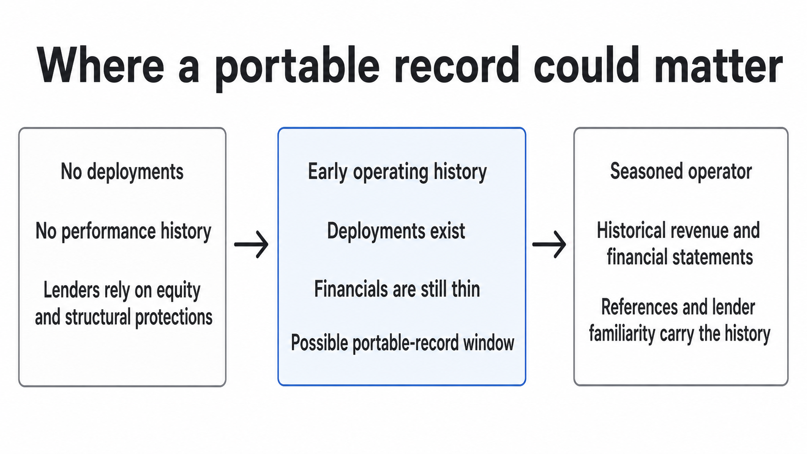

# The Verification Gap Wasn't the Financing Gap

---

*[Associated research](https://dylanduyvu.github.io/20-syntheses/research-behind-the-verification-gap-was-not-the-financing-gap)*

*[Revision history](https://github.com/dylanduyvu/dylanduyvu.github.io/commits/main/20-syntheses/the-verification-gap-was-not-the-financing-gap.md)*

*[Disclosure](https://dylanvu.substack.com/about)*

---

In my last two posts, I argued that GPU credit was missing a portable record of operator performance. Then I tried to find out whether that record would actually change a loan.

The broad thesis did not survive. Lenders care whether an operator can deploy and run a cluster. But when I asked what a portable record would change, the people I reached could not name a lower interest rate, a larger loan, a smaller required cash contribution, or an approval that would otherwise be denied. They already handle uncertain operators through financials, reference calls, customer contracts, equity, reserves, insurance, and control of the collateral.

Direct performance data may be missing. But the risk is not untreated.

This came from outreach, not a survey. It includes an investor evaluating large private-credit facilities, people working around smaller GPU equipment loans, operators, and public material from USD.AI. The sample is uneven. The pattern was still strong enough to kill the broad version of the idea.

## The question behind the record

My first post on this problem was [The Ununderwritten Half of GPU Credit](https://dylanvu.substack.com/p/the-ununderwritten-half-of-gpu-credit). It argued that lenders had machinery for customer credit but no comparable instrument for operator delivery.

The next post, [The Track Record That Can't Travel](https://dylanvu.substack.com/p/the-track-record-that-cant-travel), narrowed the idea. Large operators can turn repeated execution into cheaper and broader financing because ratings, public filings, the banks arranging their loans, and repeat lenders carry their history. Smaller operators cannot package their history as easily for the next lender.

A lender had already told me that seeing whether live clusters met their promised uptime could reduce the risk of lost revenue and justify better terms. But monitoring a live cluster or insuring a current contract is not the same product as a portable record of prior deployments. I was testing whether history from one deployment could change the next loan.

That left one practical test. Hold the equipment and customer constant. Give the lender a third-party record showing that the operator's earlier clusters went live on time, ran as promised, and produced customer payments. Does anything in the new loan change?

The record only matters as a product if the answer is yes.

## In one large-deal seat, the contract still decided

A private-credit investor evaluating large GPU facilities, whose answers were relayed to me through a colleague, described three separate requirements. The operator needs a deployment history. Power must be secured and the equipment committed. The deal also needs a long contract with an investment-grade customer, one rated as relatively likely to pay, or a comparable guarantee from another creditworthy company.

I asked whether a trusted deployment record could compensate for a weaker customer. His answer was no. A strong operator without an investment-grade customer contract was still an automatic decline. The risks he named were speculative building, site problems, and a long lease supported by short customer rentals.

Operator history could not fix a mismatch between a long liability and short revenue.

The operator's record was also absent from the pricing formula he described. Pricing began with the customer's own credit curve, meaning the borrowing rates implied by its existing debt. The lender then added roughly 1.5 to 2.5 percentage points based on the protections in the contract. Operator diligence determined whether the team could execute the deal. Customer credit and contract quality determined what the debt cost.

The diligence was not missing. His group relied on materials from the lead lender, outside consultants, and industry calls. For operator references, the calls reached former employees, customers, consultants, and the local general contractor.

A new performance record would therefore compete with an existing process. It would not fill an empty seat.

## At the smaller end, cash solves many concerns

The response was different around smaller equipment deals, but it did not favor a verification product.

One residual-value insurer, a company that guarantees lenders a minimum recovery value if the GPUs must be sold, gave a simple example. An unproven operator could get $10 million of equipment financed by contributing $5 million of its own cash. Asked why, he said extra equity can resolve almost any lender concern.

I later held the equipment and customer constant and added the trusted operator record. Would the $5 million contribution fall? He did not know. He added that prior deployments already appear in historical revenue, and most lenders would rather diligence financials than uptime metrics or equipment operations.

That answer does not prove a record has no value. But it shows what the record has to beat. Before an operator has deployed anything, there is no history to verify. After it has operated long enough, revenue, financial statements, references, and lender familiarity begin to carry the history. The portable record therefore lives in the narrow period between those states.

_A portable record has a narrow opening after performance exists but before financials and lender familiarity make it redundant._

It also has to beat a crude alternative. A lender can advance less money and require the borrower to absorb more of the loss.

## USD.AI uses structure to reduce the operator risk

USD.AI shows the structural approach in its clearest form.

Its [published underwriting policy](https://usd.ai/insights/usdai-underwriting-and-risk-management) says the lender's main protection is what it can recover by selling the GPUs, rather than the operator's broader corporate credit. It then builds a loan that limits how much the operator can hurt the lender.

The GPUs, customer contract, data-center agreement, and revenue accounts sit inside a separate legal entity created for the deal. USD.AI holds the first lien, giving it the first claim on those assets after a default.

The borrower contributes at least 20 percent equity and funds a three-month debt-service reserve, enough cash to cover three months of loan payments. Capital stays in escrow until the hardware is installed and independently verified. The loan uses straight-line amortization, repaying the same amount of principal each month over three years. A collateral warranty covers part of any shortfall if the GPUs sell for less than the value listed in an agreed schedule.

USD.AI still checks whether the operator can install the hardware, run it, and generate enough revenue to repay the loan. A lien cannot make a cluster work.

But the structure reduces the consequences of getting that judgment wrong. The borrower absorbs early losses, USD.AI controls the project cash and collateral, and the warranty covers part of a deeper shortfall. That lets it finance less-proven operators without relying as heavily on years of reputation.

## Lenders do pay for information

Lenders still buy and require plenty of information.

Large lead lenders hire consultants. Participants validate their work through expert calls. USD.AI requires financial statements, purchase orders, contracts, checks for other claims on the assets, and operating revenue history. It also requires independent installation and collateral verification before releasing capital.

The information that gets bought is attached to a transaction and a decision. It can help the lender approve the deal, release money from escrow, decide how much to lend, check whether the borrower kept its promises, or act after a breach.

But a portable operator score sits outside any one transaction. It may duplicate financials, references, or a lender's own prior experience. To become a product, it has to earn a budget and change something those substitutes do not change.

This is where my original argument went wrong. I treated the absence of a clean measurement as evidence of missing underwriting. Credit markets often handle risks they cannot measure directly by demanding more protection. The risk can be expensive without being ignored.

## The middle may be expensive to manufacture

The search also produced a competing explanation for the financing gap.

In a [February interview with Messari](https://open.spotify.com/episode/3gxodvhx8c9qarj30jOVrS), USD.AI cofounder Connor Moore said its typical cluster is around $30 million to $50 million. He argued that conventional private-credit processes are too customized for many deals in that range. Legal work, diligence, and custom documents make each loan expensive to arrange before the lender has taken any risk.

His numbers should be treated as a founder describing his own wedge. The mechanism is plausible. A portable record cannot unlock a loan that is already understood but too expensive to manufacture.

USD.AI combines standard documents, a visible pool of committed capital, and direct claims on the GPUs and project revenue. Its advantage is packaging familiar lender protections cheaply and repeatedly, not discovering that GPUs have resale value.

That points toward a different problem. Mid-sized GPU operators may need faster closing, predictable terms, standard documents, and capital willing to write the check. Better evidence only matters if it changes one of those outcomes.

## What survives

Operator performance still matters. A bad or absent track record can kill a large deal. Historical revenue can make a seasoned operator easier to finance. Installation verification can determine whether loan proceeds leave escrow.

The product test I took from the search is that verification should control money.

It needs to change approval or a loan term. That could mean the borrower's equity contribution, the repayment schedule, required cash reserves, insurance cost, when funds are released, or the share of the purchase the lender funds, known as the advance rate. A dashboard that makes diligence cleaner but leaves the deal unchanged is a feature inside someone else's underwriting process.

There may still be a window for operators that have completed a few deployments but do not yet have financial histories lenders are willing to rely on. I have not found evidence that this window is large, durable, or willing to pay for a standalone record. It remains a testable corner, not a market-wide thesis.

The question I will carry into the next idea is simple. When someone says a lender needs better data, which line of the term sheet moves?

If nothing moves, the data is not the financing product.
