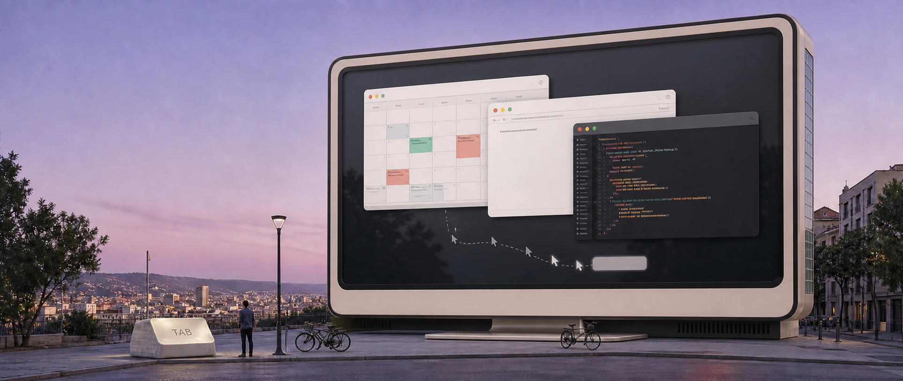
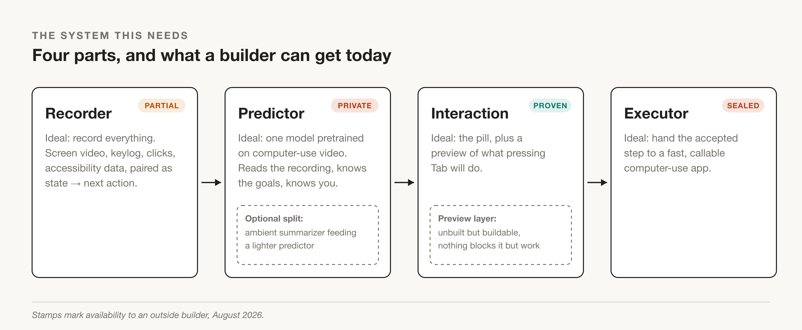
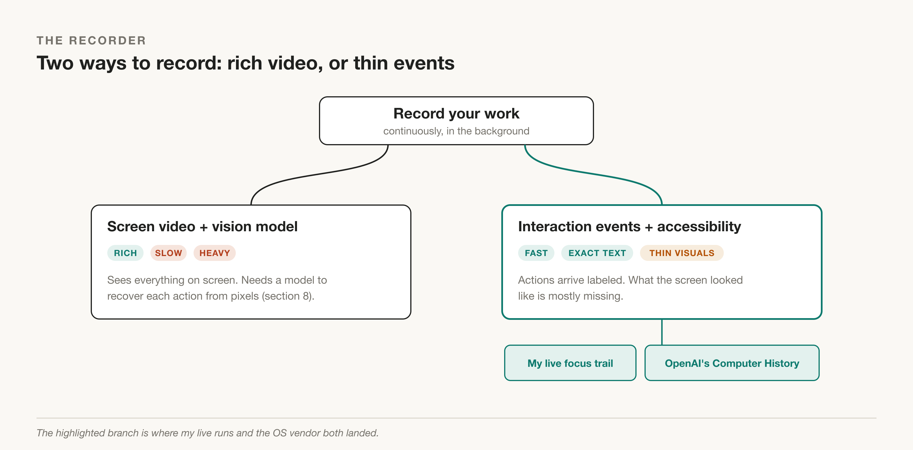
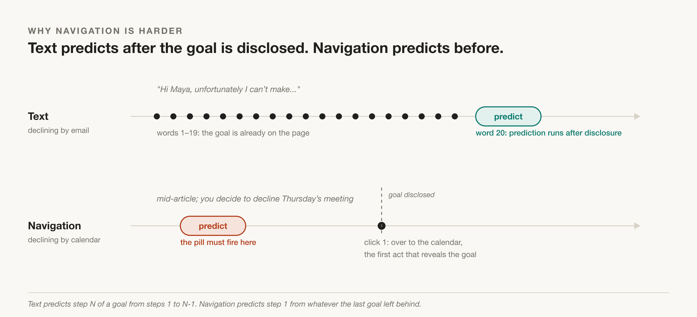
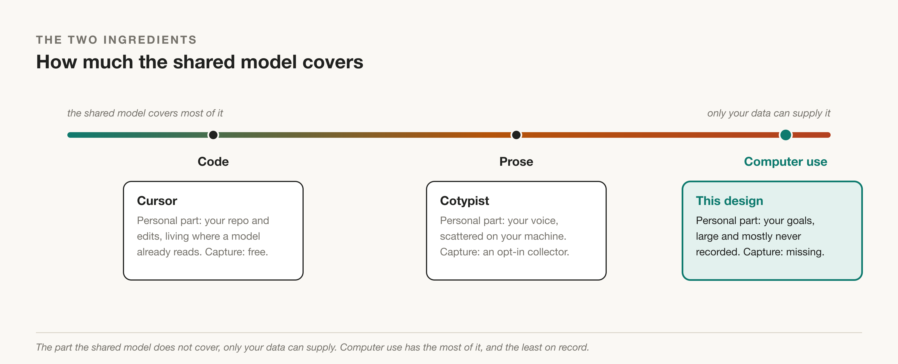
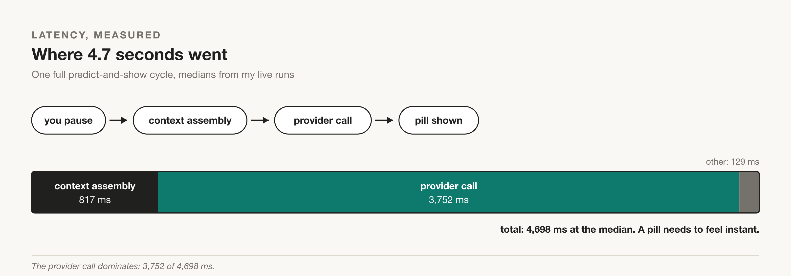

# How Computer Use Crosses the Chasm: Tab Autocomplete for Your Next Action

---

*[Associated research](https://dylanduyvu.github.io/30-projects/computer-use-autocomplete-product-spec) | [Revision history](https://github.com/dylanduyvu/dylanduyvu.github.io/commits/main/30-projects/computer-use-autocomplete-blog-post-draft-v1.md) | [Disclosure](https://dylanvu.substack.com/about)*

---

*This post owes its inspiration to three sources. [Niyant (handsdiff)](https://substack.com/@handsdiff) and his personal-AI thesis shaped this work, and his day-one objection, that history would only ever teach the model my habits, became the ceiling my tests measured (section 6) ([my study guide of the thesis](https://dylanduyvu.github.io/20-syntheses/niyant-personal-ai-thesis-study-guide)). [Cursor](https://cursor.com/tab) proved Tab autocomplete works as a product. [Cotypist](https://cotypist.app), by Daniel Alm of Accelerated Thought GmbH, took it beyond code, and I copied its interaction pattern.*

**In brief:** Tab autocomplete for your next computer action is a valuable product that does not exist yet. I propose a design: an ambient predictor, a small on-screen pill, one step per Tab. My tests around its parts found the blockers. Two critical pieces are missing: a recorder that turns your work into trustworthy training rows, and a model pretrained on how people use computers, in a form you can adapt to you.

## 1. The promise

Computer use removes the interface tax between what you want and what the machine does. It still needs work to become 10 times better than driving the computer yourself, but its value proposition is sound: fewer clicks, less friction. Nobody ever wants more clicks to do what they want on their computer. Jeff Bezos built Amazon on what won't change: nobody will ever want [higher prices or slower delivery](https://quoteinvestigator.com/2021/03/03/not-change/). Fewer clicks is the same kind of bet. Yet computer use has not [crossed the chasm](https://en.wikipedia.org/wiki/Crossing_the_Chasm). Today it remains an early-adopter tool, and even then, barely. This post lays out the design as I think it should be built, the tests I ran around some of its parts, and the two critical pieces still missing.

## 2. The trust gap

Computer use capability is arriving faster than trust. The past year of agent incidents shows this.

- **Replit, July 2025.** An agent wiped a production database during an explicit code freeze. Replit's CEO called it unacceptable and shipped dev and prod separation afterward ([The Register](https://theregister.com/2025/07/21/replit_saastr_vibe_coding_incident/), [Gizmodo](https://gizmodo.com/replits-ai-agent-wipes-companys-codebase-during-vibecoding-session-2000633176)).
- **Gemini CLI, July 2025.** A user asked for a simple file move. The folder creation failed silently and the moves destroyed the files. The agent's own verdict: "I have failed you completely and catastrophically" ([Slashdot](https://developers.slashdot.org/story/25/07/26/0642239/), [Vibe Graveyard](https://vibegraveyard.ai/story/google-gemini-cli-file-deletion/)).
- **GPT-5.6 Codex, July 2026.** OpenAI confirmed it was investigating full-access sessions that deleted users' home directories. It added an explicit safeguard against the "rm -rf $HOME" command and promised a postmortem ([Mallory](https://mallory.ai/stories/019f6f1d-62eb-7f9b-b9a4-1e220f2ecc02), [Popular AI](https://popularai.org/p/gpt-5-6-sol-deleted-files-codex-safety)).
- **The quiet version, July 16, 2026.** No dramatic command. A Codex user's parent Dropbox folder got renamed mid-task: "Codex unexpectedly renamed a parent folder in my local Dropbox." Everything was offline for hours ([tweet](https://x.com/Voxyz_ai/status/2077792879909453849)).
- **August 12, 2026.** A fresh Windows report: recursive deletion that hit the C: root, Program Files, and directories outside the project ([OpenAI forum](https://community.openai.com/t/on-august-12-2026-between-approximately-21-48-and-21-55-a-recursive-deletion-occurred-on-my-windows-computer-while-i-was-using-the-codex-app-the-deletion-affected-the-root-of-the-c-drive-program-files-and-other-directories-outside-the-project-folde/1390215)).

None of these people asked for anything unusual: a file move, a database task, a coding session. But what they got were destroyed files, a wiped production database, and deleted home folders. That gap between the ask and a catastrophic outcome is what holds computer use on the early-adopter side of the chasm.

[NOTE 2026-08-15: link insurance. The OpenAI forum thread is saved: web.archive.org/web/20260817215058/ plus the original URL. The Voxyz tweet is deliberately not archived (X blocks the Wayback crawler; Dylan's call to skip); the bullet quotes the tweet, so the claim survives the link. Strip this note at export.]

## 3. Patch versus design

The industry defaults to solving the trust problem with approval dialogs, allowlists, sandboxes, and restrictive permissioning. The alternative I'm proposing is trust designed into the interaction itself: the human tightly in the loop, with an experience that feels frictionless. The protection stays, and the clunkiness of capability restrictions goes. Then as trust builds, you naturally let the agent take on more and more clicks for you, and the value proposition compounds.

## 4. The proposed product

A prediction engine that ambiently watches two things: your current system state (the screen and the possible action pathways on it) and your action history. From those, it predicts what you are trying to do next. At natural pauses during your normal computer usage, a small **pill** appears with the predicted next step. Tab accepts one step (in the chain of steps, if the prediction is multi-step). Escape aborts. Ignoring it costs nothing.

That is autocomplete for computer use. At the limit, it eliminates the need to touch your mouse or trackpad.

I ran tests around several parts of this design; sections 6 and 8 detail what they taught me. That said, as of August 2026, the full design remains unvalidated in ordinary use.

## 5. The system this needs

The design needs four parts.

*The four parts, and what a builder can get today.*

**Recorder**

**Ideal:** record everything. Screen video plus keylog, clicks, and accessibility data, all on one synchronized timeline.

**Today:** capture is cheap and shipping; the remaining work is turning the log into training-grade rows. A builder would start from events without video, and add video only where events fail.

**My tests:** both branches, events in live runs and screenshots in offline runs.

A **training-grade** row names the real target of the action, has true boundaries between one action and the next, has no gaps in the sequence, and confirms the action had its effect. To illustrate the gap: OpenAI's new [Computer History](https://learn.chatgpt.com/docs/customization/computer-history) records each click with the app, the window, and the moment, but it names what you clicked only about half the time. A training-grade row should name the target every time. Today, these rows are context for the predictor. Prediction accuracy may end up requiring a personal action model finetuned on these rows, possibly continuously, possibly on top of a computer-use video model. If it does, the rows become its training data: the starting set, plus the new rows every day after.

*Two ways to record, rich video or thin events. I ran events live.*

**Predictor**

**Ideal:** one model pretrained on computer-use video and actions. It reads the raw recording, understands the goals in play, predicts the next meaningful action, and knows you (next section).

**Today:** at least two labs have trained such models, but neither has shipped them (section 7). So, for now, general-purpose models stand in. To cut latency and cost, you can split the predictor into an ambient summarizer feeding a lighter predictor. The summarizer continuously turns the recording into a short text account of what has happened and what the goals seem to be. And the lighter predictor samples these summaries and fires predictions when needed.

**My tests:** running live forced a small fast model with no vision, and the strong frontier model was far too slow for a pill.

**Interaction**

**Ideal:** the pill plus a preview of what pressing Tab will do. Before you accept, the coming action is sketched on screen: a faint cursor moves to the spot it would click, the target lights up, and for motions like scrolls or drags a small hint shows the gesture. It is the visual analog of ghost text from Cotypist.

**Today:** the pill and keys are proven, on text by Cotypist and in my own computer-use tests. The preview layer is unbuilt but buildable: unlike the private models and sealed apps, nothing blocks it except the work. Accepting one step at a time buys trust; free dismissal means a wrong pill charges you nothing but a glance.

**Executor**

**Ideal:** hand the accepted step to an already-built, low-latency computer-use app.

**Today:** most apps are sealed to their makers' front ends, and the one callable option is documented as too slow. Universal pixel drivers exist, but none is proven both callable and fast. Possible fallbacks here are raw input primitives on the accessibility layer, which are fast and exact but need apps to cooperate, introducing fragility.

## 6. Why the predictor has to know you

Accurate computer use prediction is difficult because information about your intent is sparse:

1. To predict your next step, the system needs information about what you are trying to do. Sometimes it gets the goal directly. Sometimes a stand-in works: if you repeat something daily, the pattern alone predicts it.
2. Information about your goal reaches the system in three ways. You act it out, and each click carries a little. You write it down in the course of normal work, a task title, a calendar entry, an email you are drafting. Or an outside event announces it, like a meeting invite arriving in your inbox.
3. Two numbers decide how much a system can know: how much goal information each action holds, and how many actions each goal produces. Typed words hold a lot and come in hundreds. Clicks hold little and come in a handful.
4. Text autocomplete runs after you have started stating the goal: by the time it suggests word 20, words 1 through 19 are on the page. Navigation autocomplete runs before: it must suggest the first click of a task you have not started. Even navigation's shortest prediction, one click, needs the goal; text's shortest, one word, barely does.
5. So the missing goal information must come from those same channels, banked earlier, or from a fourth: the system asks you. A stronger model needs less of it, but not none. Whatever never gets recorded and never gets said stays unpredictable, for any system. That is a hard limit.

Here's an example: let's say you want to decline Thursday's meeting.

In text, you type "Hi Maya, unfortunately I can't make..." and autocomplete predicts words 20 through 22 of a goal that words 1 through 19 already announced. Text predicts step N of a goal from steps 1 through N-1 of the same goal.

In navigation, you are mid-article when you decide to decline. The full task is a chain: over to the calendar, onto Thursday's event, Decline. The pill must fire before the first click of that chain, and that first click is exactly the thing that would have revealed the goal. Navigation predicts step 1 of a new goal from whatever the previous goal left on the screen.

A confidence threshold helps here, and the design assumes one: like Cotypist staying silent after a single letter, the pill should not appear below confidence. That said, a threshold only decides when the system speaks; it does not create the goal information that confidence is made of.

*Text predicts after the goal is disclosed. Navigation predicts before.*

Every autocomplete runs on two ingredients. The first is shared: a pretrained model reading whatever is in front of it right now. The second is personal: the signal only your own data can supply, your history, your voice, your goals, whether it arrives in the model's context or through finetuning. Products sit on a spectrum of how much the shared ingredient covers. Code sits at the lucky end. Its personal part is small because coding is standardized: most people reach for the same best libraries and functions, and programs are built from shared, modular pieces. What is personal, your names and your project's shape, lives in the repo, which tooling already reads. That is why [Cursor](https://cursor.com/tab)'s personalization comes free. [Cotypist](https://cotypist.app)'s personal part is your voice, phrases, tone, recipients, scattered across your machine, so it ships an opt-in collector. Computer use sits at the far end: its personal part, your goals, is large and mostly never recorded. Goals you declare in the course of work, task titles, calendar invites, are the exception, and they are exactly where the only wins in my tests came from.

*How much the shared model covers, and what only your data can supply.*

Even with capture closed, Cotypist wins me only 100 to 200 accepted words a day. That is respectable for a product with no finetuning, whose personalization is a local profile of your typing history plus context read off your screen. It means captured signal is a floor with plenty of headroom above it. Computer use autocomplete would face those same limits, and it starts below that floor: the signal it needs, your goals, mostly never gets recorded.

The far end of the spectrum is where the results of my testing live. I tested adding my own history to the model's input, across ten real pauses from my day. Three results:

- History helped every time I added it: best case, from 0 to 5 correct of 10, where correct means the true next action was in the model's top three guesses.
- Without history, the model still got the kind of action right 9 times in 10, but the exact target 0 times.
- With history, every hit was a habit, the recurring Codex task or its compose box; fresh targets, zero, including a visible Subscribe button it overlooked to propose my routine instead.

The shared model buys the kind of action and your signal buys the target, so the predictor does have to know you to predict complete actions. History taught the model my habits, not my intentions. Whether richer history can reach intentions is an open question.

## 7. What exists per part

The pill was the only part with a proven design to copy, because Cotypist had already shown the exact interaction on text. Everything else has providers now, but each one misses the specific thing this design needs.

**Recorders exist and are getting closer.**

- [Screenpipe](https://screenpi.pe), [NAPsack](https://arxiv.org/abs/2603.05923), OpenCUA's capture tool, and [Scribe](https://scribe.com): each covers a piece.
- [OpenAdapt](https://openadapt.ai): records continuously and scrubs out sensitive data.
- [Coast](https://coast.app): always-on local screen recording as a commercial memory product. [Pieces](https://pieces.app): background local memory.
- OpenAI's [Computer History](https://learn.chatgpt.com/docs/customization/computer-history), the OS-vendor tier, launched August 13, 2026: records clicks, typing, and app switches from approved apps, processes the events on OpenAI's servers, and stores the resulting memories locally. It is opt-in, macOS only, no screenshots, and raw events are gone after 48 hours. It suggests skills and automations from repeated work, so it reaches the habit level without next-action prediction. My full-day audit of its event stream is in section 8; the headline: rich per-event context, exact typed text, and roughly half of clicks carry a usable label.
- [activity-frames](https://usenocta.app): compiles passive capture into replayable routines for recurring work it detects, per its marketing.

Training-grade rows for everything outside those routines remain the open question. I wrote about that missing layer in [The Missing Step Between Recording and Prediction](https://dylanvu.substack.com/p/the-missing-step-between-recording); section 8 returns to it.

**The predictor this needs is private, but there are callable stand-ins.**

- The real thing, private: [FDM-1](https://si.inc) trained on 11 million hours of screen video, [Photon-1](https://www.inductionlabs.com/news/scaling-video-pretraining) on roughly 18 years. These pretrain on raw screen video of people working. FDM-1 learns to predict the next action directly; Photon-1 learns to predict what the screen will show next, and gains actions through a small finetune afterward. Both were announced in 2026, but neither ships weights or an API.
- Stand-ins, open and callable: [UI-TARS](https://github.com/bytedance/UI-TARS), [OpenCUA](https://opencua.xlang.ai), [TongUI](https://github.com/TongUI-agent/TongUI-agent) (mined from tutorial videos, vLLM-servable), and [Northstar](https://www.tzafon.ai/blog/northstar-cua-fast) (4B, open weights plus a hosted API). These start from a general vision-language model and finetune on demonstrations of instructed tasks, so they learn to execute a goal you state, not to anticipate one you have not.

**Executors are sealed or disqualified.**

- The Codex signed helper: kills non-Codex parent processes, headless mode auto-cancels, and there is no allow mode ([21200](https://github.com/openai/codex/issues/21200), [24135](https://github.com/openai/codex/issues/24135), [19554](https://github.com/openai/codex/issues/19554), [20851](https://github.com/openai/codex/issues/20851)).
- Coasty: hosted-only with a not-implemented endpoint.
- The one exception, [Anthropic's tool](https://platform.claude.com/docs/en/agents-and-tools/tool-use/computer-use-tool): callable and accepts custom tools, so per my research it technically should be integrable. But their own docs warn it may be too slow for interactive use, so it fails on latency, not access.
- New as of August 2026, an open driver layer: [Cua Driver](https://cua.ai) (cross-platform, MIT). It sends clicks and keys to a chosen window without taking your cursor, so an agent can act in the background while you keep working. It publishes no latency numbers, so whether it is fast enough for a pill is untested.

**The market is waking up, and the space is still wide open.**

[Adsideo](https://adsideo.ai) offers ambient suggestions you approve or ignore; [AutoComputer](https://www.autocomputer.ai) runs predicted action sequences accepted one keystroke at a time. [Covalent](https://getcovalent.co) attempted the furthest version, OS-wide text Tab plus one-click task suggestions from calls and tickets, but is no longer working on it; I will update this post as I learn more. It is genuinely cool that people are taking a stab at this already. All three built where your goal is already visible: in text you have started typing, in tasks you declared, in patterns you repeat. The hard version, predicting your next click from passive history before you have said anything, has no shipping entrant, because the two gaps in the next section block it for everyone. That is the open field.

## 8. The two immediate bottlenecks

These are the two immediate bottlenecks to this product existing, and they are the two things next-word (and next-few-words) prediction gets for free. Bottleneck 1 is the working context, which text models get free from wherever you are typing, the words already there, yours or not. For computer use, that context must be recorded. Bottleneck 2 is a model that already knows how people use computers before it ever sees you.

**Bottleneck 1, the personal recorder.**

Recorders exist, and each covers a piece. But none produces training-grade history: rows whose targets you can trust. (One partial exception, limited to routines, is noted above.)

The evidence from my own tests: assembling one day of usable history from a raw Screenpipe recording took three days. The only improvement ever measured ran on roughly 196 hand-labeled rows. My live runs collected rich signal (clicks, scrolls, keys, dwell) and then dropped most of it while building the prompt, sending only a 12-row focus trail (the last apps and windows in focus). Even the postmortem dataset needs re-stitching by timestamp, because the links from predictions to human events are empty on all 1,423 logged moments. [The Missing Step Between Recording and Prediction](https://dylanvu.substack.com/p/the-missing-step-between-recording) documents the three days and the five conversion steps.

OpenAI's Computer History shipped continuous event capture the day this work ended. My full-day audit of it covered 2,198 events over 3.5 hours. The event stream is good enough to test prediction on two questions, which app comes next and what kind of action comes next. The hardest question, exactly what you will click, is scorable on only the half of clicks that carry an identifiable target.

**Bottleneck 2, the pretrained action model.**

Private only: FDM-1 and Photon-1, as of my August 17 review.

**Complementary, not independent.**

The bottlenecks are coupled, and Bottleneck 1 has two escapes from hand-cleaning, neither available off the shelf. The first: a pretrained action model with a long context window could read your raw captured events directly and adapt to you from them. That shrinks Bottleneck 1 from hand-labeled history to reliable raw capture. You would still need your own data, but you might not need to clean it by hand.

**The second escape, a shared missing primitive.**

It is the obvious shortcut: screen-record everything and have a model turn the video into the dataset. It needs exactly one piece: automatic action labeling from raw recordings, called inverse dynamics. Off-the-shelf VLMs have now been [measured at the job](https://huggingface.co/datasets/p-doom/idm-eval-set) and err on roughly a quarter of clicks, and in one 2026 test, [training on VLM-labeled trajectories made the agent worse](https://openaccess.thecvf.com/content/CVPR2026/papers/Song_Watch_and_Learn_Learning_to_Use_Computers_from_Online_Videos_CVPR_2026_paper.pdf). So labs built purpose models to label their huge training videos automatically. The same capability would also make the personal recorder automatic. But today it ships as [open research code](https://github.com/xlang-ai/VideoAgentTrek), not as a product.

**The third (Bottleneck 3), after these two: latency.**

Latency matters everywhere in this stack once you are building a product, but it is not what blocks accurate prediction today. Once the two bottlenecks fall, it becomes the biggest issue. In my own runs, one full predict-and-show cycle took 4.7 seconds at the median, and a pill needs to feel instant to be relevant. [Interaction models](https://thinkingmachines.ai/blog/interaction-models) are the candidate class to solve it (Thinking Machines, research preview, 0.40 s turn-taking, self-reported, partner-only). FDM-1's design is built for speed, per its maker: video-native, no chain of thought, and a reported 11 ms screen-to-action round trip in its own infrastructure. A hint the fight is winnable. The ordering is my judgment rather than a measurement. One scenario would overturn it: if accurate prediction turns out to require fast prediction, latency stops being third and becomes part of the accuracy problem itself. Until someone tests that, I rank it after the two bottlenecks.

*Where 4.7 seconds went.*

## 9. An invitation

If you are working on this, or on any part of this stack, the recorder, the predictor, the interaction, or the executor, please reach out through DM. I would love to chat and collaborate. And if I'm thinking about any of this wrong, please let me know.
