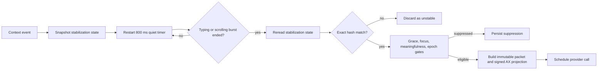
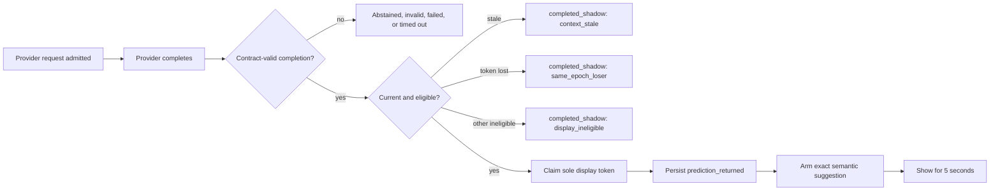
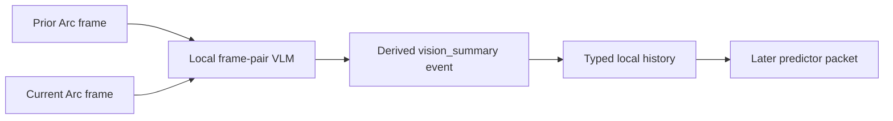

# Computer-use autocomplete: living product spec

This is the always-current description of the Tab autocomplete product: what is live on Dylan's Mac, what has been physically proven, why the architecture is shaped this way, what is deliberately disabled, and which optimizations remain evidence-backed rather than speculative. Dated notes and private machine artifacts remain the evidence record. If this note and the running system disagree, the system wins and this note must be corrected.

> [!important] Living-spec rule
> Update this note on the same day as any live cutover, safety-policy change, action-vocabulary change, trigger change, material physical result, or architecture decision. Verify claims against running health, the ledger, committed source, or a named evidence artifact. Never write intended behavior as live behavior.
>
> **Live stamp, directly verified 2026-08-12.** The semantic candidate is running at source commit `9d9e6048416dd0140ad1b139a2243f8f838a7d88`, runtime `e195ee67-e82d-4df2-ba4e-a5b2a2a356a1`, bridge session `019ff68c-359c-7d26-b43c-1bca9db8bac9`, `mode: natural`, `ready: true`, with no blocker codes and SQLite integrity `ok`. The frozen V0 trial ended durably at 2026-08-12 09:56:20 EDT without reopening. The semantic cutover completed at 11:16:56 EDT. Its post-cutover smoke proved: event tap alive, pill rendered, one `completed_shadow` logged, a synthetic consequential action held with zero release, and Escape aborted. The smoke proves the deployed control surfaces, not an organic felt-use verdict.

## Five-minute audit

### The product in one sentence

The system predicts one useful, bounded computer-use completion at a receptive moment, shows the promise in a five-second pill, lets the first Tab accept it, executes only fresh-read element-addressed actions, and requires an exact second Tab for any consequential click.

### What is actually live

1. The existing Hammerspoon event tap remains the sole physical authority for Tab, Escape, manual pull, privacy, and input attribution.
2. Three triggers can request a semantic prediction: manual pull, exact active-thread Codex completion, and a stable decision-idle pause.
3. A fresh foreground AXCLI tree is joined to the immutable V0 packet, filtered to actionable metadata, and sent to Haiku through Anthropic structured output.
4. User resume does not cancel the provider call. A valid completion either earns the single display token or lands as a silent shadow.
5. The first Tab starts a bounded read, gate, act, reread, replan loop. The promise and scope cannot expand.
6. The installed actuator can physically dispatch `click` and `scroll`. `select_text` is present in the semantic contract and gate but the AXCLI adapter deliberately rejects it. `set_value` is V2-only. Typing and keypress actions do not exist.
7. Submit, Send, Delete, Purchase, Confirm, and unresolved targets hold at the wire. Escape aborts globally. A later exact second Tab is the only release.

### The current product bet

The open question is not whether the system can display a pill, parse an AX tree, or hold a Send click. Those mechanisms are proven. The open question is whether semantic completions arrive at useful enough moments and finish useful enough routes that Dylan develops a reflex to press Tab again.

### The largest known limitations

| Limitation | Current consequence | What would change it |
|---|---|---|
| Organic felt use is sparse | mechanics are ahead of product evidence | log a week of semantic pills, accepts, routes, holds, and aborts |
| Automatic focus suppression blocks editable fields | idle pills disappear in composers and editors | change only with evidence that safe automatic suggestions are wanted there |
| Post-switch grace is active at 6,000 ms despite a decision to remove it | useful after-switch opportunities may be suppressed | a policy-only change with a ledger marker |
| Provider history is thin | the model sees recent destinations, not a rich behavioral narrative | complete the packet audit and add only measured high-value fields |
| Arc viewport meaning can be thinner than its AX tree | the predictor may know controls without knowing what changed in the page content | after the history upgrade, test deferred local frame-pair summaries only if Arc predictions feel context-starved |
| System-executed action history is not yet confirmed in future packets | the planner may not know what it just did | prove or add a separate system-action history channel |
| `verified_exact` does not prove the intended UI effect | it proves a bounded dispatch and a fresh signed post-state, not semantic task completion | add target-specific or route-level postconditions |
| AXCLI requires the target app in front | V1 cannot act unobtrusively in the background | new physical evidence from a different actuator or sanctioned app intents |
| Tree-less surfaces have no safe live fallback | canvas-only controls are invisible | a separately evaluated vision fallback with an explicit gate downgrade |

### Audit map

- **Need the user experience:** read [[#Product thesis and current experience]] and [[#Exact runtime flows]].
- **Need the trigger truth:** read [[#6. Trigger policy separates receptivity from prediction quality]] and [[#Resolved live configuration register]].
- **Need the safety proof:** read [[#9. The execution wire, not the prompt, owns consequence]] and [[#Control and failure invariants]].
- **Need the packet truth:** read [[#4. The packet has a local truth side and a provider-safe side]] and [[#Provider-visible packet contract]].
- **Need the deferred vision design:** read [[#Deferred local vision history for Arc]].
- **Need to optimize:** read [[#Optimization and audit queue]] and [[#Decision ledger]].
- **Need evidence strength:** read [[#Evidence semantics and known measurement gaps]] and [[#Physical evidence ledger]].

## Truth labels

- **Live:** deployed in the current semantic runtime and directly verified.
- **Physically proven:** demonstrated on Dylan's Mac with real apps or physical input. It may also be live, but the evidence is stronger than a synthetic test.
- **Decided next:** an explicit product decision not yet reflected in the live commit.
- **Open:** unresolved and paired with a named observation or experiment.

## Product thesis and current experience

**Live.** This is Mac-native autocomplete for bounded navigation and computer use. At a receptive moment the system predicts one semantic completion, such as opening a specific Slack thread, and presents a one-line promise. The first Tab accepts that promise. The system may execute up to five element-addressed actions, rereading the world before and after every action. A consequential click, such as Send, Confirm, or Delete, does not execute on the first Tab. It becomes a held boundary that requires an exact second Tab. Escape globally aborts the plan. Ignoring a displayed pill costs nothing; it expires after five seconds.

The product is deliberately not a general autonomous agent. V1 physically executes clicks and scrolls. It cannot author text, press keys, set values, run in the background, or cross a consequential boundary without renewed human intent. `select_text` remains in the semantic schema and safety classifier but is fail-closed in the live AXCLI adapter, so it is not a shipped physical capability. The felt question remains: after the system completes useful routes, does Dylan instinctively reach for Tab again?

## Current system at a glance

| Layer | Live behavior | Main bound or invariant |
|---|---|---|
| Input authority | Existing Hammerspoon tap observes input, owns Tab and Escape, and fails closed | no competing product tap |
| Triggers | manual pull, decision-idle, exact Codex turn completion | 50 ms poll; manual > completion > idle |
| Packet | immutable V0 context plus signed live AX state, projected locally | metadata only, no pixels or text bodies |
| Predictor | Haiku emits one bounded semantic completion or abstains | 1 to 5 proposed actions |
| Provider scheduler | in-flight work completes after user resume and becomes visible or shadow | 4 active, 16 queued |
| Display | one display-authority token per epoch and generation | five-second TTL |
| Actuator | AXCLI reads and acts on foreground apps | click and scroll live; `select_text` fail-closed |
| Executor | fresh read, resolve, gate, dispatch, observe, replan | at most five turns and five actions |
| Consequential gate | exact target and same-snapshot wire decision | one-use second-Tab release |
| Abort | global physical Escape through the existing tap | kill first, reap and persist after |
| Evidence | five-axis episode ledger plus atomic trajectories | every path ends once |

## Exact runtime flows

### Automatic decision-idle flow

The 800 ms timer is not a two-second idle threshold. It is the earliest time at which the system is willing to test whether the world stayed unchanged. Printable typing extends a separate 750 ms burst and scrolling extends a 400 ms burst. A title, URL, focused role, privacy, display, window, task, bundle, or editable-state change makes the scheduled state ineligible even if the quiet timer elapsed.

### Manual pull flow

1. Hammerspoon recognizes the manual chord and prevents its own modifier transitions from cancelling the request.
2. The opportunity manager skips burst timers, quiet, stability, post-switch grace, meaningfulness, and same-epoch automatic suppression.
3. It still applies focus suppression. The semantic composition converts suppression, abstention, stale context, or provider unavailability into a visible five-second `No suggestion available` state.
4. A manual request can supersede a live completion or idle request. Display priority is manual, then exact Codex completion, then decision idle.

This is a pull contract, not a guarantee that the model will manufacture an answer. The guarantee is visible acknowledgement instead of silence.

### Exact Codex completion flow

1. The Codex activity source emits `turn/completed`.
2. The completion identity join requires an exact previously verified Codex thread identity.
3. The opportunity manager requires the completed `thread_id` to equal `active_thread_id`.
4. If identity is unresolved or the completion is in a background thread, it logs `completion_identity_unresolved` and does not mint an opportunity.
5. A valid active-thread completion bypasses quiet, stability, grace, meaningfulness, and same-epoch automatic checks, but still respects focus suppression.

The implemented trigger is therefore narrower than the product idea of “delegated work finished.” It handles the completion of the exact Codex task Dylan is already viewing. Background agent completions, terminal jobs, builds, Slack notifications, and iMessage notifications remain future trigger sources.

### Prediction completion and display flow

Ordinary user resume invalidates eligibility but does not cancel the physical provider call. Queued stale work can close before launch as `overtaken_before_launch`. Queue overflow becomes `capacity_suppressed`. Shutdown and fatal resync remain explicit cancellation paths.

### First Tab, safe-action, and replan flow

1. Hammerspoon synchronously decides whether the key belongs to an exact armed semantic suggestion. A rejection passes Tab through to the foreground app.
2. Node opens a semantic plan authority bound to episode, plan, first-Tab sequence, accepted promise, scope, snapshot, epoch, generation, and session.
3. Before action 1, the executor performs a new signed read. It never dispatches from the prediction-time snapshot.
4. If the selected target or relevant state drifted, the planner receives one bounded replan against the fresh state. A second drift or unsupported target stops cleanly.
5. The gate resolves the action against that same fresh snapshot.
6. An allowlisted action opens an exact helper-process causal envelope, waits for Hammerspoon acknowledgement, dispatches through AXCLI, reads a new signed post-state, then closes the envelope with another exact acknowledgement.
7. The continuation planner receives the accepted promise and scope, prior trajectory, fresh state, and remaining turn and action budgets. It may return exactly one next action or abstain.
8. The loop stops at completion, abstention, a held boundary, drift, failure, five planner turns, or five executed actions.

### Held boundary and second Tab flow

1. A consequential or unresolved action is not dispatched. The executor persists `held` and arms a visually distinct boundary pill with the exact action promise.
2. The boundary binds the exact action hash, resolved target identity and hash, current focus identity, acted-from snapshot and provenance, first-Tab sequence, leases, epoch, generation, session, and expiry.
3. Hammerspoon continuously withdraws the boundary if focus, privacy, heartbeat, generation, leases, or TTL fail.
4. A later physical Tab creates a one-use signed release capability bound to the same plan, action, target, snapshot, session, and second-Tab sequence.
5. The executor performs another fresh signed read, re-resolves the target, and rejects replay, drift, expiry, wrong target, or changed provenance before dispatch.
6. A successful release persists one `boundary_released` row. Escape before release must preserve zero release rows.

### Escape and fault cleanup flow

Escape is out-of-band control. It must not wait behind a provider turn, AXCLI call, command acknowledgement, or held-boundary waiter.

1. Hammerspoon classifies physical Escape as human input. Exact helper-origin synthetic input cannot self-abort.
2. The executor latches terminal intent and aborts bounded waiters.
3. It revalidates the owned process-group and helper identity, kills the process group, and reaps the exact helper.
4. It closes the actuator and requests planner cancellation without letting cooperative cancellation block the kill.
5. The per-plan serialized trajectory lane drains, then one `cancelled_partial` terminal row lands last.
6. Command gaps or uncertain semantic authority use the exact cleanup reset path. Lower or replayed resets are side-effect-free.

## Architecture and rationale

### 1. Hammerspoon remains the physical authority

**Live and physically proven.** Hammerspoon owns the event tap, pill surface, exact Tab decision, and global Escape path. The semantic system reuses that existing tap instead of installing a second product listener. Human Tab and Escape remain human; helper-origin events are fenced by exact process identity so synthetic input cannot release or abort its own plan.

This boundary survived three August 10 lifecycle crashes safely: the product could strand internal state, but it did not consume a wrong key. The final V0 repair at `1d189e41` unified accept, Escape, expiry, withdrawal, input invalidation, and context staleness through one exact-identity disarm path. The semantic lifecycle preserves that rule and adds exact applied or rejected command acknowledgements, bounded cleanup, process-group termination, and replay-safe reset.

**Why:** a model or asynchronous Node process must never be the final authority over a physical keystroke. The decision lives where the key is observed and fails closed when health, identity, privacy, generation, or lease evidence is missing.

### 2. Electron focus is activated and read, not guessed

**Live.** The candidate applies `AXManualAccessibility=true` per process, falling back to `AXEnhancedUserInterface`, then waits for an app-scoped AX tree to become ready. Focus discovery uses the target app first and the system-wide element second. Manual pull is no longer silently discarded on unknown focus: it must produce either a pill or a visible non-actionable "No suggestion" state.

The design borrows the narrow useful ideas from Niyant's Coupled source, but not its codebase. Coupled's renderer activation and app-scoped focus read are real; its robustness is tied to a narrow role allowlist, fixed capture settles, a second event tap, synchronous capture work, and dataset-specific limits. The decision is to reimplement the small perception primitives inside the existing authority model, not hand off the watcher to Coupled.

**Why:** the 877 then 1,447 unknown-focus suppressions clustered around Electron surfaces, Dylan's main apps. That was not evidence of unsafe intent. It was missing perception. Adding a second tap or adopting a capture pipeline would solve a different problem and weaken the single-authority design.

#### Coupled source-review verdict

| Question | Audit conclusion |
|---|---|
| Is its Electron focused-field detection real? | yes, it activates renderer accessibility and performs app-scoped AX reads, but robustness depends on a limited role set, app assumptions, and capture-oriented timing |
| Would a code handoff solve our `unknown_focus`? | no; the underlying idea applies, but our failure sits inside a different privacy, authority, and stabilization contract |
| What lifts cleanly? | `AXManualAccessibility` activation with enhanced-UI fallback, app-first focus lookup, settle-until-quiet as a concept, and front-to-back window attribution ideas |
| What is entangled? | its second event tap, dataset capture lifecycle, synchronous capture work, fixed multi-second settles, app allowlists, and capture-specific tree limits |
| Does its timing fit a live predictor? | the mechanisms do; its constants do not. Our implementation uses bounded 25 ms polling and exact consecutive hashes rather than capture-oriented waits |
| Verdict | reimplement the small perception primitives inside the existing Hammerspoon and AXCLI boundaries; do not adopt the codebase or watcher |

The additional idea worth retaining is explicit window attribution from front-to-back CG ordering after a click. It remains a candidate perception improvement, not current live behavior. Deliberately do not copy Coupled's independent tap, dataset session model, or permissive focus heuristics.

### 3. Full-tree perception, actionable-only provider projection

**Live and physically proven.** AXCLI requests the foreground tree with `--depth 100`, unlimited element text at the CLI surface, and a 64 MiB child-output bound. The old depth-20 cap is gone. Any AXCLI `... N more` collapse is a hard failure, never a partial catalog. A 5,000 actionable-node safety bound exists and logs if reached. Non-interactive tree noise is filtered by the catalog's role allowlist before provider projection.

Cross-read identity never uses AX handles or traversal indices, because macOS remints them. A stable key uses role plus AXIdentifier or DOM ID when present, otherwise role plus description or name plus occurrence. The description-backed path is the common Electron case. Handles and indices remain valid only within one snapshot.

The AXCLI semantic state deliberately reports a window-level focus anchor rather than pretending its tree traversal can identify the focused actionable element. V1 actions are element-addressed from the fresh catalog and do not derive authority from that anchor. Hammerspoon's app-scoped focus and privacy read still decides whether a pill may display. This separation is the consequence of dropping focus-dependent keyboard actions: unknown-focus perception can improve without inventing a cross-tool AXIdentifier join.

Before each read, the requested app must already be foreground. AXCLI resolves its PID, enables `AXManualAccessibility` once for that process with an `AXEnhancedUserInterface` fallback, then polls the full metadata snapshot every 25 ms until two consecutive hashes agree. The live readiness deadline is a generous 10,000 ms, and a hit is logged as `AXCLI_TREE_NOT_READY`. Catalog, gate, and resolution share one snapshot hash. Immediately before dispatch the adapter performs another full stable read and requires exact snapshot-hash equality with the gated snapshot. If the world changed, the executor gets one bounded replan, then abstains or stops. There are no fixed settle sleeps in this path.

**Evidence:** Slack's Send control was absent from every depth-20 read but present in every full-tree read. The catalog grew from 42 to 76 actionable elements and the two-read median moved from 253.9 ms to 282.9 ms, a 29.0 ms cost. The live-tree planner then selected the real description-backed `Send now` control. The gate held, zero releases and zero Send dispatches occurred, and the draft remained unsent.

**Why:** correctness comes before prompt optimization. Arbitrary depth and count caps hid the one control the safety experiment needed. Prompt cost is controlled by actionability, not by making parts of the screen unknowable.

#### Deferred local vision history for Arc

**Deferred, not live.** The proposed vision layer is a background perception process, not an actuator and never a planner:

The process captures frame pairs outside the prediction critical path and asks what changed since the previous frame and what the user appears to have done. Its text result enters the typed history stream as a new event with `detector: vision_summary` and evidence class `derived`. The design expects to use the history schema's reserved nullable frame or screenshot reference for local provenance. The installed semantic history implementation does not yet emit this event, so the exact existing reservation must be verified at implementation time rather than creating a second incompatible field. The later predictor reads the accumulated text as ordinary context. No VLM call sits inside the roughly 1.8-second prediction path.

This follows the same capture, summarize, then reuse-as-history shape attributed to OpenAI Chronicle, but keeps inference local, removes hosted per-call fees, and leaves the change-summary prompt under product control. “Free per call” still has local compute, memory, power, and latency cost.

Frame pairs are mandatory. A single-frame caption mostly restates visible chrome and generic page content. A change summary can add the missing semantic event: a result loaded, a chart changed, a form advanced, an article section appeared, or the user moved from one page state to another.

**First scope: Arc web content only.** Slack, Notes, Finder, and VS Code already expose exact roles and labels through AX, which should beat a 2.4B captioner. The expected value is concentrated in browser viewports and later canvas-like surfaces where AX exposes controls but not enough content meaning. Expansion requires measured Arc improvement first.

**Candidate model, not selected:** `CohereLabs/North-Micro-Vision-Instruct`, reported released August 12, 2026 under Apache 2.0 at 2.4B parameters. The selection rationale is screenshot-shaped perception rather than reasoning:

- native-resolution, aspect-preserving inputs reported up to A4 at 200 dpi
- OCR-heavy training mix, reported at roughly 31 percent OCR plus 17.8 percent charts and tables
- reported DocVQA score 0.921
- reported RefCOCO grounding 0.732 versus 0.304 for Qwen3-VL-2B

Those benchmark and release claims are candidate notes supplied on August 12 and must be source-verified before model adoption. Grounding strength is not the reason to use the model. AXCLI remains the exact element-identity and action authority. The VLM is not a reasoning model, has no required tool-calling role, and can never become the planner through this seam.

Public vLLM support was reported pending at the time of the note. Serving-path feasibility, Apple-silicon support, quantization quality, and sustained background resource use therefore remain selection gates even if the model quality numbers verify.

**Resource rule:** do not feed full Retina screenshots by default. Native-resolution memory and latency grow with image size. Capture or crop the Arc content region needed for the change comparison, retain aspect ratio, and measure inference latency, memory, event usefulness, and summary error rate before widening the region.

**Revisit trigger:** after the ambient semantic loop is producing visible pills and the history upgrade has landed, and only if Arc predictions demonstrably feel or score context-starved. The first test is AX-history versus AX-history-plus-local-vision-summary on the same Arc opportunities. Build nothing until there is a concrete Arc failure set.

**Success criterion:** the added summaries measurably improve Arc prediction usefulness or resolvability at an acceptable local latency and history-token cost. Generic captions, unsupported inferred actions, or no prediction lift mean the layer stays off. This does not authorize ambient pixels for other apps, visual grounding for clicks, or a vision-based safety gate.

### 4. The packet has a local truth side and a provider-safe side

**Live.** The immutable V0 bundle still carries current app, window, task metadata, a rolling history bounded to 15 minutes or 100 events, recurring destinations, trigger identity, and a local resolution catalog. Semantic planning joins that bundle to a fresh signed AX state with exact epoch, generation, nonce, capture time, packet, request, and session bindings.

The full signed snapshot stays local. The provider receives:

- current app, window, task, role, label, and actionable element IDs
- up to 12 recent history rows shaped as app, object, action, and age
- up to 12 recurring destinations
- trigger kind
- a hash of the local acted-from snapshot

It does not receive screenshots, JPEG data, body or composer text, raw stable IDs from protected surfaces, Secure Input content, denylisted identities, or sensitive-role data. Arc URL risk is classified locally before projection.

**Why:** the planner needs enough screen structure to choose an action, but the trust boundary should not expand just because AXCLI can see more. The provider packet is a closed semantic projection, not a dump of the accessibility tree.

#### Provider-visible packet contract

The semantic request has four exact top-level inputs plus instructions:

| Field | Exact contents | Bound |
|---|---|---|
| `state_projection.current_focus` | app, window, task, role, safe label, stable element ID | one current focus object |
| `state_projection.elements` | app, role, safe label, stable element ID for each actionable control | at most 5,000 |
| `context_projection` | packet ID, trigger kind, current app, current window, current task, recurring destinations | at most 12 recurring destinations |
| `history_projection` | app, object, normalized action, and `age_ms` | last 12 projected rows |
| `acted_from_snapshot_sha256` | hash of the locally verified signed state | one SHA-256 |

The immutable local packet is richer than the provider view. Its recent-history buffer is bounded to 100 events and 15 minutes. It observes app focus, window focus, and Codex task snapshots. The provider projection takes only the last 12 and normalizes them to `focus_app`, `focus_window`, or `focus_task`. It does not include duration, dwell, switching frequency, time of day, notification state, prior pill outcomes, or a distinct history of actions the system executed.

The history is destination-oriented rather than action-oriented. A row says that an app, window, or Codex task was focused at a time. It does not say which control Dylan clicked, what text changed, how long the state persisted, whether the transition was human or agent-driven in the provider view, or whether a previous suggestion caused it. The local ledger has more provenance than the model currently receives. Repeated app and window snapshots can therefore spend the 12-row budget without adding much semantic information.

Recurring destinations can project as app, window, task, or URL objects. The active state keeps Codex task data only when Codex is actually focused. Arc requires a fresh active-URL lease locally, but unsafe raw URL material is excluded from provider surfaces.

The local signed-state envelope binds session, key, request ID, provider-packet hash, epoch, generation, nonce, and capture time. The provider sees the snapshot hash and safe projection, not the signing envelope or raw protected state.

#### Privacy and leak boundary

The projection rejects rather than redacts after the fact. Its closed checks cover:

- Secure Input and `AXSecureTextField`
- configured password, wallet, keychain, authorization, and security identities
- unsafe Arc query, fragment, or risk-token material
- control characters and raw URL-shaped titles
- body, composer, screenshot, JPEG, PNG, image, raw ID, stable ID, token, secret, and related key forms
- any AX role outside the allowed metadata set

The same semantic-surface validator protects packet persistence and trajectory persistence. A screenshot sidecar returned by a bridge surface is explicitly discarded. The current capability mode is `metadata_only`.

### 5. The predictor now emits a semantic plan, not a destination rank

**Live.** V0 asked Haiku to choose among at most 12 prebuilt destinations, then local code generated the pill. The semantic candidate asks Haiku for one contract-valid completion containing:

- a one-line promise
- confidence
- reversibility class
- one to five element-addressed actions, or an explicit abstention

The provider uses Anthropic structured JSON output through `output_config.format`; the request has no tool field. Element IDs are runtime values, not schema enum members, so the schema stays stable as screens change and grammar caching stays warm. The provider seam validates shape but does not currently enforce catalog membership or re-ask. Before any dispatch, the executor resolves the returned ID against a fresh signed catalog. An unknown ID stops as `ambiguous_identity` with zero dispatch. The tolerant JSON extractor remains only for non-structured fallback paths.

The initial prediction is a bounded route proposal, not permission to blindly replay a stale list. After acceptance, only the first selected action may execute against the newly verified state. Every state-changing action is followed by another read and a continuation turn for exactly the next action. The accepted promise and scope hashes cannot change, and the executor stops after five planner turns or five actions.

#### Provider and scheduler contract

The live semantic transport is the Anthropic Messages API at `https://api.anthropic.com/v1/messages`, API version `2023-06-01`, model `claude-haiku-4-5-20251001`, 2,048 semantic output tokens, a 5,000 ms provider deadline, and a 256 KiB response bound. It uses `output_config.format` with a stable JSON schema. Anthropic-unsupported validation keywords are removed only from the transport schema; the full local schema still validates the returned value.

The scheduler enforces:

- four physically active provider calls
- sixteen queued calls
- one coalesced promise for an identical request key
- FIFO with current epoch and generation work preferred
- no physical slot release until the provider promise actually settles
- `capacity_suppressed` when the queue is full
- `overtaken_before_launch` for stale queued work
- a five-second timeout, followed by provider cancellation or force termination
- one display token per current epoch and generation with priority manual 3, Codex completion 2, idle 1

The names `minActions: 4` and `maxActions: 16` in the semantic policy file refer to scheduler capacity inherited from staging, not to plan length. Plan length is independently capped at five actions by the semantic schema and executor.

**Architecture change and flight evidence:** prediction and planning collapsed into one semantic proposal because a pill can only promise a meaningful outcome if the model has already shown a plausible route to it. The flight did not prove Haiku is reliably good at every route. It proved the stronger architectural boundary: a live full-tree proposal can name the real Send control, local catalog validation can reject invented targets, and the product can hold the consequential final click without dispatching it. Planner quality can now improve through shadow evidence without changing the wire authority.

**Latency evidence after the stable-schema fix:**

| App state | First measured call | Successive call | Result notes |
|---|---:|---:|---|
| Slack | 3.397 s | 3.271 s | valid action in the pre-cutover spike |
| Arc | 1.593 s | 1.776 s | action |
| VS Code | 6.961 s | 6.142 s | spike path used one bounded correction, then abstained |

No ordinary screen change caused the earlier 20-second grammar compile. The original 26.2-second held-boundary call was a cold schema-cache pathology, not normal Haiku latency.

### 6. Trigger policy separates receptivity from prediction quality

**Live.** The product loop polls ingress and ticks the opportunity manager every 50 ms. Three independent timers define the automatic idle path:

- a typing burst ends 750 ms after the last printable key
- a scroll burst ends 400 ms after the last scroll
- every direct context event starts or restarts an 800 ms local-quiet timer

Direct context includes keystrokes, scrolls, clicks, app activation, window focus or title changes, Codex task changes, browser URL changes, focused-role changes, privacy changes, destination transitions, and adapter state changes. Each event stores the current stabilization state and schedules quiet. When 800 ms elapses with no typing or scroll burst still active, the manager asks for a new state read. It hashes and compares these exact fields: bundle, window ID and title, Codex task ID, Arc URL, focused role, editable, sensitive, known-focus, privacy, and display. Any difference discards the opportunity as an unstable world rather than treating elapsed time as sufficient idleness.

Only a stable idle candidate reaches the remaining gates, in this order:

1. no other opportunity is already live
2. post-switch grace is not active
3. focus is not suppressed
4. something meaningful happened since the prior opportunity
5. the current epoch has not already minted an automatic opportunity

“Meaningful” is a closed event set, not a model judgment. App activation, window focus or title change, Codex task change or completion, click, browser URL change, key activity or typing start, scroll start, focused-role change, privacy-state change, destination transition, adapter disconnect or lease expiry, and an exact verified result advance the context epoch and mark it meaningful. Local quiet, stabilization, opportunity start, and Tab acceptance are passive. A verification row advances the epoch only when its result is `verified_exact`.

Focus suppression is a closed three-way classification:

- `unknown_focus` when the focused surface cannot be identified
- `sensitive_focus` for privacy, sensitive-role, or disallowed state
- `editable_focus` whenever the cursor is in a text-editable control

That last rule is intentionally broad and behaviorally important: automatic pills remain silent while Dylan is sitting in a composer, editor, or other editable field.

The three trigger classes do not share the same path:

1. **Manual pull.** It skips quiet, burst, stability, grace, meaningfulness, and same-epoch checks. Only focus suppression can block the opportunity-manager request. The semantic composition then converts a blocked or abstained manual request into a visible no-suggestion state, so explicit pull does not fail silently. It supersedes lower-priority live work.
2. **Exact Codex completion.** It skips quiet, stability, grace, meaningfulness, and same-epoch checks and can fire immediately after the completion event. It still applies focus suppression and requires `thread_id === active_thread_id`. A background or unresolved completion records `completion_identity_unresolved` instead of minting an opportunity.
3. **Decision idle.** It follows the full timer, stability, and gate sequence above. It is the weakest trigger and can display only at confidence 0.75 or higher.

The `OpportunityManager` constructor defaults `codexCompletionEnabled` to `false` and `postSwitchGraceMs` to `0`. Those are safe library defaults, not the resolved live policy. The semantic production root explicitly passes `codexCompletionEnabled: true` and the loaded semantic policy's `postSwitchGraceMs`, currently 6,000 ms. The installed launcher runs that semantic-candidate root, so exact active-thread completion and the 6,000 ms grace are both enabled in the current runtime. The legacy V0 coordinator still constructs the manager with completion disabled.

The provider scheduler allows four active calls and sixteen queued calls, coalesces identical requests, and closes stale queued work. One display-authority token exists per epoch and generation. Priority is manual over completion over idle. A same-epoch loser becomes a shadow rather than stealing display.

**Live but decided for removal:** the 6,000 ms post-app-switch grace exists and is active, but Dylan explicitly removed it from product scope because it was an unevidenced suppression mechanism in a system with too few useful pills, not too many. The next policy-only update should set it to zero or remove it after preserving a before and after ledger marker.

**Not implemented:** Slack or iMessage notifications, dock-badge deltas, Claude Code or Cowork completion, terminal job completion, and build completion. These should enter through one passive external-event envelope carrying source, sender or task, thread, event time, and age. They are trigger and packet context, not new actuator capabilities.

## Resolved live configuration register

This table separates library defaults from the values the installed semantic root actually resolves. A value is not live merely because it exists in a config file.

| Surface | Live resolved value | Library or legacy default | Source and mutability | Rationale or status |
|---|---:|---:|---|---|
| Manual pull chord | Control Option Space | n/a | Hammerspoon authority | exact modifiers; own releases are absorbed from cancellation logic |
| Manual pause chord | Control Option P | n/a | Hammerspoon authority | explicit observer and display pause |
| Accept or release | Tab | ordinary app Tab | Hammerspoon authority | consumed only under exact valid arm |
| Abort or dismiss | Escape | ordinary app Escape | Hammerspoon authority | product Escape only when semantic or pill authority is active |
| Product-loop poll | 50 ms | same | source constant | low-cost file ingress and timer cadence |
| Typing burst | 750 ms | same | runtime policy and mirrored authority constant | end-of-typing classification, not pill delay |
| Scroll burst | 400 ms | same | runtime policy | end-of-scroll classification |
| Local quiet | 800 ms | same | runtime policy and opportunity constant | earliest stability test |
| Semantic quiet | no live consumer located; policy records 300 ms | same | legacy runtime policy | not the decision-idle quiet gate |
| Human-cause attribution | no live consumer located; policy records 1,000 ms | same | legacy runtime policy | semantic actions use exact source evidence and a separate 30,000 ms action deadline |
| Post-switch grace | 6,000 ms | constructor default 0 | semantic policy, loaded at startup | live but decided for removal |
| Idle confidence | 0.75 | coordinator default 0.75 | semantic policy, loaded at startup | idle only; manual and completion are not filtered by this threshold |
| Codex completion | enabled | constructor default false | semantic production root | only exact active-thread completion |
| Provider deadline | 5,000 ms | same | provider contract and runtime policy | timeout, then cancel or terminate |
| Provider active capacity | 4 | same | scheduler constant and policy audit pin | physical concurrency ceiling |
| Provider queue capacity | 16 | same | scheduler constant and policy audit pin | queued pending ceiling |
| Suggestion TTL | 5,000 ms | same | runtime policy, Hammerspoon authority, command contract | applies to ordinary and held pills |
| Manual status TTL | 5,000 ms | same | Hammerspoon authority | visible no-suggestion acknowledgement |
| Heartbeat write | 250 ms | same | runtime policy | coordinator liveness cadence |
| Heartbeat lease | 1,000 ms | same | runtime policy and authority | stale authority fails closed |
| Adapter poll | no semantic-candidate consumer located; policy records 200 ms | same | legacy runtime policy | candidate assembly reads AXCLI and Codex through separate paths |
| Adapter lease | no semantic-candidate consumer located; policy records 350 ms | same | legacy runtime policy | candidate semantic leases are 30,000 ms |
| Semantic provider lease | 30,000 ms | n/a | candidate assembly constant | bounds accepted prediction state |
| Action causal deadline | 30,000 ms | n/a | candidate assembly constant | helper-event envelope deadline |
| History time | 15 min | same | packet builder and history buffer | local recent activity window |
| History events | 100 | same | packet builder and history buffer | local cap before provider projection |
| Label horizon | no semantic-candidate consumer located; policy records 30,000 ms | same | legacy runtime policy | offline next-action labeling concern |
| Provider history rows | 12 | same | semantic contract | token-bound projection |
| Recurring destinations | 12 | same | semantic contract | token-bound projection |
| Semantic actions | 1 to 5 | same | schema | bounded proposal |
| Planner turns | at most 5 | same | executor | no runaway replan loop |
| Executed actions | at most 5 | same | executor | independent hard action ceiling |
| Out-of-catalog handling | no provider retry; executor stops `ambiguous_identity` | n/a | action resolution path | fail-closed; the spike's one-re-ask path is not live |
| AX tree depth | 100 | n/a | AXCLI adapter | generous safety bound; bound hit is logged |
| AX actionable nodes | 5,000 | n/a | AXCLI catalog | hard fail, never truncate |
| AX child output | 64 MiB | n/a | AXCLI adapter | process-output safety bound |
| AX stable-read deadline | 10,000 ms | n/a | AXCLI adapter | condition-based readiness deadline |
| AX poll interval | 25 ms | n/a | AXCLI adapter | no fixed settle sleep |
| Arc or Codex packet leases | 30,000 ms | n/a | candidate assembly | exact adapter value must remain current |
| Surfacing mode | `explore_week_one` | n/a | config, loaded at startup | evidence-gathering phase |
| Legacy manual editable policy | `suppress_and_log` in runtime policy | same | legacy config | semantic root instead shows a visible no-suggestion status after suppression |
| Pixels | off | off | capabilities `metadata_only` | no ambient screenshot path |

### What is runtime-tunable without a rebuild

The semantic policy file carries post-switch grace, idle confidence, scheduler audit values, and grammar pins. Runtime policy carries the observer, heartbeat, adapter, history, and TTL values, but some safety-critical values are intentionally duplicated and exact-checked in Hammerspoon or code. Changing a duplicated value is not a safe config-only operation unless every contract owner changes together and the trust artifacts are regenerated.

The action vocabulary, plan and action limits, AXCLI bounds, provider model and schema, trigger priority, provider capacity implementation, causality deadlines, and privacy shape are compiled or pinned. Making all of them hot-tunable would weaken the current artifact-binding story unless policy hashes and launch authorization covered the resolved configuration. The right improvement is one signed resolved-policy manifest, not a collection of untracked environment flags.

### 7. In-flight predictions complete and log as shadows

**Live.** User resume no longer cancels a provider call. Infrastructure shutdown, fatal resync, and explicit process teardown can still cancel work, but ordinary input lets it complete. At completion:

- eligible current work may display
- stale context becomes `completed_shadow/context_stale`
- a lower-priority same-epoch result becomes `completed_shadow/same_epoch_loser`
- other ineligible work becomes `completed_shadow/display_ineligible_at_completion`

The shadow row retains the trigger, immutable provider-packet reference, completion time, and full validated suggestion. Displayed-pill TTL remains five seconds and expiry still disarms exactly.

**Why:** V0 cancelled about 72 percent of started calls on resume, destroying the counterfactual data needed to judge whether a prediction would have been useful. Completing silently costs provider budget but produces replay evidence without interrupting Dylan.

**Audit boundary:** timestamps permit an offline join to what Dylan did next, but a materialized next-action label is not part of the live row. The queued packet and shadow-readiness audit must verify full-packet recoverability, outcome joins, and whether system-executed actions are represented separately from Dylan's actions before any training claim is made.

### 8. V1 action vocabulary is element-addressed and non-authoring

The capability must be read across three layers:

| Tool | Semantic contract | Safety gate | Installed AXCLI dispatch | Product status |
|---|---|---|---|---|
| `click` | yes | reversible intents allow; consequential intent or label holds | yes, `cg-pid` | live |
| `scroll` | yes | `navigate` or `focus` | yes, `cg-pid` | live |
| `select_text` | yes | `navigate`, `focus`, or `search` | deliberately throws before dispatch | staged, not shipped |
| `set_value` | separate V2 schema only | no live allowlist | no | disabled |
| `type_text` | absent | absent | no | out of scope |
| `press_key` | absent | absent | no | out of scope |

The schema accepts click counts from 1 to 3 and scroll amounts above 0 through 10 pages. The adapter currently maps one page to 300 AXCLI scroll units. Background execution is disabled. Every live route follows foreground-establish, stable read, gate, prepared act, signed post-read, and done or replan.

**Why:** physical testing showed AXCLI can see, click, and scroll Electron and web surfaces when foregrounded, but background trees and background delivery were not dependable enough for V1. Removing focus-dependent keyboard actions also eliminates a false AXIdentifier-to-bridge-index join. This is a product position: autocomplete navigation and intent, never words.

### 9. The execution wire, not the prompt, owns consequence

**Live and physically proven.** The local classifier resolves the exact target from the same snapshot used for action preparation. Navigation, focus, scroll, and other reversible interactions can proceed. Submit, send, publish, delete, purchase, and confirm intent becomes a held boundary.

A held boundary binds plan, promise, scope, action hash, target identity, current focus, snapshot, epoch, generation, session, leases, and expiry. A second Tab presents a one-use signed release capability. Any drift, replay, stale focus, privacy loss, expired lease, wrong target, or missing identity fails closed. Escape does not queue behind the planner or AXCLI. It aborts waiters, kills the owned process group, reaps the exact helper, closes the bridge, then freezes one partial terminal trajectory.

**Evidence:** the real Slack Send test held the exact description-backed control with zero dispatch and zero release. That pre-cutover harness waited on terminal input, so Dylan's Slack-focused physical Escape did not reach its waiter and the harness was terminated for cleanup. The fix was architectural: the installed product routes plan Escape through the existing Hammerspoon tap instead of a second listener. V0 physically captured Escape for pill dismissal; the installed semantic plan-abort path passed post-cutover smoke synthetically. An organic physical Escape during a live semantic plan remains a named acceptance observation, not something this document claims has happened.

### 10. Ledger and trajectory evidence are first-class product state

**Live.** The SQLite ledger has dedicated `actions`, `candidates`, `episodes`, `events`, `packets`, `snapshots`, and `trajectories` tables. One episode spans orthogonal prediction, validity, presentation, feedback, and execution axes. Semantic trajectories use an atomic append-once sink with unique idempotency key and unique plan-plus-sequence constraints. Insert-or-read must byte-compare, so commit-then-ack-loss cannot duplicate or mutate evidence. Terminal intent serializes behind any in-flight row and lands exactly once, last.

The ledger distinguishes Dylan's physical input, proven helper-origin input, and ambiguous input. It records shown, accepted, dismissed, expired, withdrawn, held, released, aborted, partially observed, and exactly verified states without collapsing them into a success label.

**Why:** this is both product safety and research infrastructure. A fast loop that cannot explain what it predicted, displayed, executed, or held is not improvable.

#### Episode state model

One episode carries five orthogonal axes instead of one overloaded status:

| Axis | Closed values |
|---|---|
| Prediction | `pending`, `returned`, `abstained`, `invalid`, `failed`, `cancel_requested`, `cancelled`, `timed_out`, `completed_shadow`, `capacity_suppressed`, `overtaken_before_launch` |
| Validity | `current`, `stale` |
| Presentation | `not_shown`, `shown`, `hidden`, `expired` |
| Feedback | `none`, `accepted`, `dismissed`, `ignored`, `override` |
| Execution | `not_started`, `precondition_failed`, `dispatched`, `verified_exact`, `observed_partial`, `failed`, `cancelled_before_dispatch` |

Feedback is immutable once recorded. Prediction states are terminal except for the explicit cancellation request to cancellation transition. A shadow is a terminal prediction classification, not a `returned` event later rewritten as a shadow.

The closed shadow reasons are `context_stale`, `same_epoch_loser`, and `display_ineligible_at_completion`. They mean different things and must not be combined in analysis.

#### Trajectory model

The trajectory status vocabulary is `started`, `action_planned`, `action_dispatched`, `action_observed`, `held`, `boundary_released`, `completed`, `stopped`, and `cancelled_partial`. Each row carries a deterministic plan-local sequence and idempotency key. The SQLite sink enforces both unique idempotency key and unique plan plus sequence, then insert-or-read byte comparison.

This matters under the exact races the product creates: Escape during an action observation, Escape while a boundary-release row is committing, a commit that succeeds before its acknowledgement is lost, and a command-file overwrite during cleanup. The serialized per-plan lane makes the terminal row land once and last.

## Evidence semantics and known measurement gaps

The word `verified` is intentionally narrower than “the user-visible goal was achieved.”

| Evidence label | What it proves | What it does not prove |
|---|---|---|
| `prediction_returned` | contract-valid provider completion won display authority and was armed | that the pill was useful or even physically seen |
| `suggestion_shown` | Hammerspoon passed privacy, health, generation, lease, and display checks and rendered the pill | that Dylan noticed it |
| `feedback_accepted` | an exact first Tab accepted the shown suggestion | that any action succeeded |
| `action_dispatched` | the exact action entered the actuator path | that the UI changed as intended |
| `verified_exact` | the prepared AXCLI operation returned, a fresh signed post-state was read, and the causal fence closed | that the target-specific semantic effect occurred |
| `observed_partial` | some action evidence exists but the plan ended without a complete verified route | which partial state was useful without a route postcondition |
| `held` | a consequential or unresolved action was withheld before dispatch | that Dylan wanted to release it |
| `boundary_released` | a later exact second Tab authorized the bound action once | that the post-release UI effect matched the promise |
| `cancelled_partial` | Escape or stop froze the serialized partial trajectory | that every external side effect was reversible |
| `completed_shadow` | a validated non-displayed completion and its packet reference were durably recorded | what Dylan did next, unless an offline join is performed |

### Current analysis gaps

1. **No route-specific completion postcondition.** The executor has fresh before and after states, but live execution evidence is not yet a semantic assertion such as “Slack channel X is now selected.”
2. **No materialized shadow outcome join.** Packet and timestamps are present, but “what Dylan did next” remains an analysis operation.
3. **No confirmed system-action history in future prediction packets.** Trajectories exist in the ledger, but the provider history projection currently derives from app, window, and Codex-task observations.
4. **No noticed-versus-unnoticed signal.** `suggestion_shown` plus expiry cannot distinguish a consciously ignored pill from one Dylan never saw.
5. **No calibrated trigger comparison yet.** Trigger identity is present, but organic semantic sample sizes are too small.
6. **No perception coverage distribution yet.** Bound-hit logging exists, but normal tree size, stable-read counts, and app-by-app latency should be summarized over time.

### Shadow-log readiness

A shadow row does record trigger kind through its episode, immutable provider packet hash and packet ID, full validated suggestion result, completion time, context and generation through the episode, and one of the three closed shadow reasons. The immutable packet is persisted locally. The missing research product is the materialized next-human-action and next-destination join, plus an explicit separate sequence of actions the system itself executed. Until those joins are proven, the data is replay-ready but not training-ready.

### 11. Cutover and rollback are part of the architecture

**Live and proven through the completed cutover.** The candidate launch required:

- a preregistered Ed25519 controller authority
- a signed seven-route flight pass bound to exact route-result hashes
- selected planner, model, executable, source, prompt, schema, action-gate, spike, and candidate identities
- sufficient provider-rate evidence
- an exact typed confirmation phrase
- durable trial closure before mutation
- a whole-state backup
- condition-based shutdown, lock and health disappearance, socket release, install, launch, reconcile, smoke, and rollback phases
- bounded retries and rollback that refuses to restore over a still-live candidate

The earlier controller failures were not papered over. Failed attempts restored V0 and were marked excluded. The successful attempt durably closed the V0 trial, installed candidate `9d9e604`, passed smoke, and left the system `ready:true`.

**Why:** the dangerous seam is not a click. It is replacing the runtime that owns the tap and ledger. The controller must either finish the transition or restore one whole previous state. Trust-chain friction is intentional for live mutation. Future iteration should use non-actuating dry run, offline flight, and branded development modes rather than weakening the production chain.

## Control and failure invariants

These are the shortest useful audit of the system. A future optimization that violates one of them is an architecture change, not a refactor.

1. **One physical input authority.** Hammerspoon owns product Tab, Escape, manual pull, privacy, and helper-input attribution. No second live product tap competes with it.
2. **Synchronous fail-open for ordinary keys.** If semantic authority is absent, stale, unhealthy, private, mismatched, or uncertain, Tab and ordinary human input go to the foreground app.
3. **Exact identity before state mutation.** Episode, suggestion, plan, action, target, snapshot, session, epoch, generation, sequence, and lease identities are validated before their corresponding transition.
4. **One display authority.** One current epoch and generation can have one winning display token. Losing valid completions become shadows.
5. **No stale dispatch.** Prediction state can select an intent but cannot authorize an action. Every action is prepared from a new signed stable read, and AXCLI rereads again before physical dispatch.
6. **No unbounded planner progress.** There is no live catalog retry, at most one state-drift replan, five planner turns, and five executed actions. Failure goes to abstention or stop.
7. **Consequence is classified locally.** Prompts may describe risk, but only the local gate can allow, hold, or reject a resolved action.
8. **Second Tab is a capability, not a boolean.** Release is signed, one-use, short-lived, session-bound, target-bound, snapshot-bound, and requires a later physical Tab sequence.
9. **Escape is out of band.** It aborts waiters and kills owned processes before cooperative cleanup. It never queues behind the work it is meant to stop.
10. **Helper input cannot impersonate Dylan.** Product-origin events require exact process, action, source-sequence, kind, count, deadline, and focus evidence. Ambiguous physical input is human and aborts.
11. **Terminal evidence lands once and last.** Trajectory writes are serialized and atomic. Retry cannot duplicate or silently change a committed row.
12. **Semantic reset is replay-safe.** A true forward command gap can recover through the sole reset path. Lower or stale reset replay produces no state clear, duplicate acknowledgement, or resync.
13. **Privacy is checked at every display and action boundary.** Secure Input, sensitive roles, denied identities, unknown state, Arc lease loss, or focus drift withdraw or stop.
14. **Cutover is all-or-rollback.** Trial closure is durable and never reopened. Mutation starts only after whole-state backup and verified teardown. A failed launch restores one previous whole runtime state.

## Trust and deployment state

The semantic runtime is not merely a branch launched with a flag. The successful cutover authorized one exact source and policy composition through a chain:

1. a preregistered controller Ed25519 public key and key ID
2. a seven-route physical flight pass with exact per-route result hashes
3. candidate and spike commits, prompt, schema, action gate, adapter, model, executable, and source hashes
4. a selected-planner manifest that must match every signed flight binding
5. a process-local branded semantic authorization that cannot survive structured cloning
6. a typed cutover confirmation phrase
7. a no-recovery trial-end append and whole-state recovery manifest
8. phase-bounded teardown, install, start, reconcile, smoke, and rollback

The exact binding slows iteration because any source or policy change invalidates selection. That is a deliberate production property, not the recommended development loop. Development should use offline packets, synthetic authorization, dry-run controller paths, and explicit non-actuating desk tests. Live mutation should continue to require a fresh reviewable artifact chain unless Dylan explicitly changes the trust model now that V0 trial accounting is closed.

## Physical evidence ledger

### Proven

- Full foreground AX trees in Slack and Arc.
- Real AXCLI clicks and scrolls in Slack and Arc, roughly 210 to 430 ms per action.
- Full-tree Slack perception exposed a description-backed Send control hidden by the old depth cap.
- A live planner selected that real Send control.
- The consequential wire gate held it with zero release and zero dispatch; the draft remained unsent.
- V0 physically captured global Escape for pill dismissal; the installed semantic active-plan Escape path passed synthetic cutover smoke. Organic active-plan Escape remains unproven.
- Stable provider schema avoided screen-specific cold grammar recompilation.
- Fresh reads, stable-attribute resolution, one bounded replan, and fail-closed miss behavior passed synthetic and live preflight gates.
- Candidate cutover, pill render, shadow logging, synthetic held boundary, and Escape smoke completed.

### Not yet established by organic use

- That Dylan wants enough semantic pills to build a reaching-for-Tab habit.
- That a multi-step route completes often enough to feel better than manual navigation.
- Calibration by trigger class.
- The value of system-action history in the next packet.
- A reliable next-action label for every shadow completion.
- Vision fallback quality on tree-less surfaces.
- Typed assistance demand.

## Trial record and what it does not prove

The frozen V0 trial ran from August 8 until its durable close on August 12. It ended early relative to the original five-qualifying-day plus disabled-half-day protocol because Dylan explicitly promoted the planner-actuator felt test over predictor purity and authorized the semantic cutover. Treat it as a useful observational baseline, not a completed preregistered verdict.

Tuesday's final accounting was:

- 24.00 local-day hours minus 2.81 hours without live heartbeat during excluded and controlled downtime = 21.19 live-heartbeat hours
- 353 opportunities, 350 decision-idle and 3 manual
- at least one direct-input hourly bucket
- 29 suggestions shown, 1 accepted, 6 dismissed, 19 expired or ignored
- request-to-return p50 6.847 s across 31 returned predictions
- top suppressions: 1,447 unknown focus, 9 sensitive focus, 3 manual unknown-focus
- SQLite integrity `ok`, zero zombies

Tuesday qualified and brought the cumulative total to three days: Saturday, Monday, and Tuesday.

The novelty-accept episode is now resolved. Episode `019fedf2-08da-746e-b8c5-a657415ecab7` accepted `Go to Codex · Research MVP context stack`, but the candidate was absent from rolling history and won with `tie_broken_by_recency`. Its directory recency traced to an agent-created Codex thread, not Dylan's own navigation. It was therefore not evidence that history understood Dylan. It is evidence that agent-side directory activity can masquerade as user recency and must remain source-attributed.

## Decision ledger

| Decision | Alternatives rejected or deferred | Evidence and logic | Reopen only if |
|---|---|---|---|
| Keep Node plus Hammerspoon | full Swift rebuild | existing shell is not the bottleneck; physical key safety is proven; rebuild cost did not answer the felt question | planner load produces measured tap timeouts or disable events |
| One event tap | separate spike or planner tap | competing taps created Escape ambiguity; existing tap already owns the exact key boundary | the existing authority cannot expose a required event without weakening fail-open behavior |
| Haiku semantic planner | Flash, stronger general model, Codex free planner | Haiku works on real packets; model choice is reversible and offline-testable; planner and actuator physics were the load-bearing unknowns | replay shows a material quality, latency, or cost win on identical packets |
| AXCLI foreground perception and actuation | dead Codex bridge hands, macos-use, Coasty replacement | AXCLI physically clicked and scrolled Electron/web apps, exposes identity-rich trees, and fits the existing seam | it fails materially on high-value surfaces or sanctioned app intents provide a stronger path |
| Full-tree read, actionable projection | depth 20 and arbitrary truncation | depth 20 hid Slack Send; full tree added only 29 ms in that measurement | measured full-tree cost becomes the latency bottleneck without coverage benefit |
| Stable attributes across reads | AX handles or traversal indices | macOS remints handles; stable attributes survived rereads and description-backed Electron controls | the underlying accessibility API exposes a stronger stable identity |
| Condition-based readiness | fixed sleeps | animations and renderer startup violated timers repeatedly | never for ordinary readiness; only bounded polling parameters may change from data |
| Structured provider output plus dispatch-time catalog resolution | raw completion formatting | raw Haiku format drift failed three windows; structured shape fixes format; fresh resolution prevents invented IDs from dispatching | provider transport loses supported schema output or a better typed surface replaces it |
| Zero catalog retries in live mode | spike's one bounded catalog correction | current code fails closed as `ambiguous_identity`; retry pressure adds latency and can manufacture targets | offline evidence shows one narrow correction materially improves valid actions without lowering abstention safety |
| Predictor emits a route-capable semantic promise | destination-only rank plus post-Tab planner | rich pills were structurally impossible when the prediction did not know whether a route existed | shadow evidence shows route planning before consent is too expensive or harms quality |
| Fresh read before every action | fixed plan replay | state changes during planner turns and after clicks; stale replay can act on the wrong surface | never without an equivalent transactional application API |
| V1 click and scroll only | type, keypress, set-value, background action | product decision is navigation and intent, never words; focus-dependent actions created unsafe joins | felt evidence shows strong demand for element-addressed `set_value` and the gate can verify it |
| Foreground execution | `cg-pid` background story | physical tests found background clicks and reads unreliable as a complete system | an actuator can both read and verify effects without focus theft |
| Wire-held consequential actions | prompt warnings, MCP annotations, blanket block | real Slack Send was selected but withheld exactly; user intent is renewed at the irreversible seam | a typed app API supplies a stronger native confirmation contract |
| Complete-and-log shadows | cancel-on-resume | roughly 72 percent of calls were being destroyed; counterfactual evidence matters more than provider savings | rate or cost ceilings become material |
| Metadata-only ambient path | screenshots by default | sequencing, not privacy, made pixels unnecessary before the loop worked; AX is exact and cheap | tree-less surfaces or measured context starvation dominate failures |
| Deferred Arc vision writes summaries to history | inline VLM calls, full-screen captions, or VLM grounding | frame-pair change text can enrich later packets without adding latency or visual belief to the action gate | post-history Arc failures show measurable lift from local summaries |
| Coasty as fallback, not replacement | wholesale Coasty planner, executor, overlay | it duplicates product surfaces and downgrades gate identity to visual belief | a named tree-less surface justifies a per-surface vision fallback |
| Exact trust chain for live cutover | run arbitrary current HEAD | live mutation replaces the tap and ledger owner; exact binding caught real drift and rollback is proven | Dylan explicitly adopts a different post-trial development and release trust model |

## Decisions that should not be relitigated without new evidence

- Keep the existing Node plus Hammerspoon shell. Port hot-path code only if measured tap timeout or load requires it.
- Keep one product event tap. Escape, Tab, manual pull, and causal attribution share it.
- Use AXCLI as V1 perception and actuation. Coasty remains only a documented tree-less-surface fallback pending a fresh source-level reevaluation.
- Read the full AX tree; optimize only the provider projection.
- Use stable attributes across reads; use handles and indices only inside one snapshot.
- Use condition-based readiness and stability, not fixed settle sleeps.
- Never hardcode or guess locators.
- Keep Haiku as the selected semantic predictor and continuation planner until logged packets justify a bakeoff.
- Keep strict structured output and fresh runtime catalog resolution. Out-of-catalog targets stop with zero dispatch. Do not claim the spike's one-re-ask behavior is live.
- Keep V1 non-authoring. Click and scroll are the live physical tools. Do not claim `select_text` until the AXCLI adapter implements and physically verifies it.
- Keep foreground execution.
- Gate consequences at the wire with an exact second Tab.
- Fail toward abstention and disappearance, never forced progress.
- Keep pixels off the prediction critical path and action gate. The only decided vision experiment is deferred, local, Arc-only frame-pair summarization into history after measured context starvation.
- Keep deterministic fast paths for repeated, proven routes; semantic trajectories are candidates for promotion, not permanent model tax.

## Optimization and audit queue

Ranked by expected product value, not implementation novelty:

| Rank | Question or change | Evidence to collect | Success measure | Cost or risk |
|---:|---|---|---|---|
| 1 | Complete packet and shadow audit | exact real packet, history span, omitted available fields, system-versus-human action history, next-action joins | every trigger and suggestion can be retrospectively scored without inference from filenames | token growth and accidental noise |
| 2 | Remove 6,000 ms post-switch grace | ledger marker, before and after opportunity and show rates | more useful post-switch proposals without a material dismissal spike | policy drift if changed without artifact update |
| 3 | Measure the felt loop | organic shows, accepts, completed routes, holds, aborts, corrections, time-to-first action, repeat Tab reach | Dylan reports a real Tab reflex and accepted routes save time | observer effect from over-instrumenting |
| 4 | Add external-event triggers | passive base rates for notifications and delegated completions, plus foreground and next-app joins | higher acceptance or correct-destination rate than decision idle | false identity joins and notification sensitivity |
| 5 | Add system-action history | exact executed trajectory summary in later packets | fewer redundant suggestions and better continuation after system navigation | feedback loops and over-trusting partial execution |
| 6 | Promote deterministic routes | repeated exact successful semantic trajectories | lower p50 and variance with no correctness loss | stale hardcoding if promoted too early |
| 7 | Profile end-to-end latency | activation, AX readiness, stable read count, packet build, queue, provider, validation, command ACK, dispatch, post-read, continuation | optimize the dominant measured stage; no narrower perception | misleading medians across heterogeneous routes |
| 8 | Planner bakeoff | frozen identical packets and route postconditions | material quality or latency win at comparable abstention safety | live trial contamination if done online |
| 9 | Deferred Arc vision-history bakeoff | identical Arc opportunities with AX history versus AX history plus local frame-pair change summaries | measurable prediction lift at acceptable local latency, memory, summary-error, and token cost | generic captions, false inferred actions, capture storage, and GPU contention |
| 10 | Coasty per-surface fallback | source review plus one named tree-less surface | specific borrowed component outperforms AXCLI without duplicating the product loop | architecture duplication and gate downgrade |
| 11 | V2 `set_value` | organic held or abstained proposals that clearly want element-addressed typing | enough repeated demand to justify new authority and privacy work | words sent under user identity |
| 12 | Tap health sentinel | tap-enabled samples, callback liveness, Secure Input, reinstall evidence | no silent loss of Tab, Escape, or manual pull | a self-healing loop can flap if diagnosis is weak |

### Audit protocol for any proposed optimization

Before changing a live boundary, write down:

1. the exact current failure or cost in ledger terms
2. the source and denominator of the observation
3. which subsystem owns it: trigger, packet, model, display, gate, actuator, or evidence
4. the smallest reversible change
5. the invariant it must not weaken
6. the metric and falsifier
7. whether the test can run offline, synthetically, as a non-actuating desk test, or requires physical use
8. which source, policy, prompt, schema, trust, and cutover artifacts must be regenerated

This prevents an actuator failure from becoming a planner rebuild, a perception gap from becoming a model-quality story, or an under-suggestion problem from being “fixed” with more suppression.

## Known risks and guards

- **Tap health:** macOS 26 can silently disable or starve Accessibility event taps. The candidate uses one existing tap and improved Electron focus reads. A tap health sentinel remains insurance: enabled polling, permission probe, Secure Input logging, and bounded reinstall.
- **Agent-driven recency:** Codex directory activity must stay source-attributed so delegated work cannot masquerade as Dylan's habit.
- **Provider abstention and latency:** abstention is free and preferred to a made-up target. The live provider does not retry catalog misses; fresh resolution stops them before dispatch.
- **AX tree bounds:** the 5,000 actionable-node bound is deliberately generous and observable. A hit is evidence, not silent truncation.
- **Foreground contention:** human input during a causally fenced action aborts or invalidates the plan. The product does not claim background execution.
- **Tree-less surfaces:** no safe V1 fallback is live. Pixels would change both perception and the gate's epistemic quality.
- **Derived vision can sound more certain than it is:** any future `vision_summary` must remain evidence class `derived`, preserve local frame-pair provenance, and describe observed change separately from inferred user intent. It cannot supply target identity or action authority.
- **Local VLM resource contention:** native-resolution frames can consume enough memory or GPU time to disturb the live predictor. The deferred process stays outside the prediction loop, starts Arc-only, crops content regions, and must prove it does not degrade pill latency.
- **Trust-chain iteration cost:** exact binding makes live cutovers slower but prevents an unreviewed binary or policy from inheriting old flight authority. Development must stay in disposable, non-actuating modes.
- **Shadow-label completeness:** timestamp joins are possible, but the final audit must prove that all fields needed for trigger comparison and retrospective pruning are durably available.
- **Public-vault sensitivity:** this note intentionally records local paths, commits, runtime IDs, and the isolated-auth decision. Publication requires Dylan's explicit public-versus-vault-only choice.

## Glossary

| Term | Meaning in this system |
|---|---|
| Opportunity | one trigger-authorized chance to build a packet and ask for a prediction |
| Episode | the durable record spanning trigger, prediction, display, feedback, validity, and execution |
| Context epoch | monotonically increasing meaningful-world version used to limit one automatic opportunity per state |
| Local generation | Hammerspoon privacy and input generation used to reject stale display or action authority |
| Immutable packet | the persisted V0 context bundle and hashes from which the semantic request is projected |
| Signed state | fresh metadata-only AX state bound to packet, request, session, epoch, generation, nonce, and capture time |
| Semantic completion | one promise, confidence, reversibility class, and 1 to 5 proposed actions |
| Shadow | a valid provider completion that did not display and is terminally logged for later replay |
| Display token | the one winning request allowed to arm in the current epoch and generation |
| Plan | the post-first-Tab authority bound to one accepted promise and app or intent scope |
| Action fence | acknowledged Hammerspoon envelope that attributes exact helper-origin input and aborts on human overlap |
| Held boundary | a consequential resolved action withheld before dispatch pending an exact later Tab |
| Release capability | one-use signed authority for that exact held action, target, state, session, and later Tab sequence |
| Trajectory | append-only per-plan evidence of selection, dispatch, observation, hold, release, completion, stop, or abort |
| Fast lane | deterministic execution path promoted from repeated proven semantic routes |

## Canonical sources and machine evidence

### Source map by subsystem

All source paths below are relative to the installed candidate repository unless marked otherwise.

| Concern | Primary source |
|---|---|
| Product loop cadence | `src/runtime/product-loop.mjs` |
| Trigger timers, stability, focus suppression, priority entry | `src/state/opportunity-manager.mjs` |
| Live semantic trigger wiring and event routing | `src/runtime/product-coordinator.mjs`, `src/runtime/event-router.mjs` |
| Context epoch and meaningfulness | `src/state/context-epoch.mjs` |
| Immutable packet and provider join | `src/context/packet-builder.mjs` |
| Recent history buffer | `src/runtime/history-buffer.mjs` |
| Provider-safe projections and leak gate | `src/planning/state-projection.mjs` |
| Semantic prompt and response schema | `src/planning/semantic-contract.mjs` |
| Action vocabulary and bounds | `src/planning/action-contract.mjs` |
| Consequential classifier | `src/planning/action-gate.mjs` |
| Anthropic structured transport | `src/providers/anthropic-messages.mjs` |
| Provider concurrency, queue, timeout, and display token | `src/providers/runner.mjs` |
| AXCLI stable read and prepared dispatch | `src/planning/axcli-client.mjs` |
| AXCLI catalog and stable IDs | `src/planning/axcli-catalog.mjs` |
| Fresh-read action loop and held release | `src/planning/plan-executor.mjs` |
| Causal fence and actuator cleanup | `src/planning/actuator-wrapper.mjs`, `src/state/causality.mjs`, `src/planning/process-tree.mjs` |
| Semantic lifecycle controller | `src/planning/semantic-runtime-controller.mjs`, `src/planning/semantic-lifecycle.mjs` |
| Episode axes and transition rules | `src/state/episode-machine.mjs` |
| Atomic trajectory writer | `src/planning/trajectory-writer.mjs`, `src/ledger/store.mjs` |
| Candidate assembly | `src/runtime/semantic-candidate-assembly.mjs`, `src/runtime/launcher.mjs` |
| Hammerspoon input and display authority | `hammerspoon/ComputerUseAutocomplete.spoon/authority.lua` |
| Hammerspoon privacy and focus | `hammerspoon/ComputerUseAutocomplete.spoon/privacy.lua` |
| Hammerspoon bridge and exact acknowledgements | `hammerspoon/ComputerUseAutocomplete.spoon/bridge.lua` |
| Hammerspoon input and window observer | `hammerspoon/ComputerUseAutocomplete.spoon/observer.lua` |
| Resolved runtime policy | `config/runtime-policy.json` |
| Resolved semantic policy and grammar pins | `config/semantic-prototype-policy.json` |
| Capability mode | `config/capabilities.json` |
| Cutover trust pin | `config/semantic-cutover-trust.json` |

### Vault evidence

- [[personal-ai-context-learning|Project hub]]
- [[computer-use-autocomplete-v0-design-2026-07-31|V0 design and contracts]]
- [[computer-use-autocomplete-packet-fidelity-audit-2026-08-07|Packet-fidelity audit, repair, trial, and crash record]]
- [[computer-use-autocomplete-executor-spike-session-2026-08-11|Executor-spike briefing and session record]]
- [[computer-use-autocomplete-expressive-tier-design-2026-08-04|Expressive-tier design]] (superseded here where it conflicts)
- [[computer-use-autocomplete-provider-bakeoff-2026-08-01|Provider bakeoff]]
- [[computer-use-autocomplete-runtime-decision-audit-2026-07-30|Runtime decision audit]]
- [[computer-use-autocomplete-mvp-context-stack-2026-07-30|Context-stack audit]]

### Installed machine evidence

- Live health: `~/Library/Application Support/ComputerUseAutocompleteV0/state/health.json`
- Durable V0 trial close: `~/Library/Application Support/ComputerUseAutocompleteV0/state/trial-ended.json`
- Cutover smoke: `~/Library/Application Support/ComputerUseAutocompleteV0/cutover/smoke-result.json`
- Live SQLite ledger: `~/Library/Application Support/ComputerUseAutocompleteV0/state/ledger.sqlite`
- Candidate source: `~/.config/superpowers/worktrees/computer-use-autocomplete/shadow-predictions-stage`
- Spike reports and cutover controller: `~/Projects/computer-use-autocomplete-spike`
