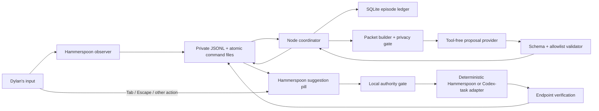

# Computer-use autocomplete V0 design

## Decision summary

V0 is a Dylan-only Mac prototype for testing one product claim:

> After observing the current state and a short personal workflow history, can
> the system proactively offer a deterministic navigation completion that
> Dylan naturally begins accepting with Tab?

The governing rule is **log everything, run almost nothing**. V0 records the
complete lifecycle of every prediction opportunity but executes only four
reversible primitives:

1. activate an already-running application;
2. focus an existing window;
3. focus an existing Codex task through a structured adapter; and
4. open an HTTPS URL.

There is no visual computer-use executor, Arc extension, candidate-enumeration
system, authored text generation, consequential action, recovery planner, or
fine-tuning in V0.

The design is derived from
[[computer-use-autocomplete-v1-brainstorm-and-scope|the approved V0 contract]].
The runtime evidence and broader future architecture remain in
[[computer-use-autocomplete-runtime-decision-audit-2026-07-30|the runtime
decision audit]].

## Success and stop conditions

### Primary success signal

After a short safety calibration, Dylan leaves the prototype enabled during
five normal workdays. The primary read is behavioral: Dylan begins reaching
for Tab when a useful navigation completion appears and notices its absence
during a subsequent half-day with the prototype disabled.

Roughly 50 displayed suggestions is a useful exposure target, not a quota. V0
does not lower a display threshold, repeat stale suggestions, or manufacture
opportunities to reach it.

### Diagnostic measures

- displayed suggestions, accepts, explicit dismissals, ignores, expiries,
  overrides, and stale cancellations;
- proposal validity and latency;
- execution dispatch, endpoint verification, and failure reason;
- top-one and top-three retrospective accuracy against the next observable
  human destination;
- offline state-only versus state-plus-history replay; and
- the distribution of triggers and accepted primitive types.

### Stop conditions

The active habit trial does not begin if any of these remains true:

- neither proposal provider produces five valid tool-free responses with p50
  at or below roughly 2.5 seconds on representative real packets;
- the observer cannot put exact active Codex task identity into the packet or
  the local product cannot focus that task through a callable structured
  adapter;
- any controlled trial steals a Tab keystroke during typing, editable focus,
  sensitive focus, stale context, or absence of a visible suggestion; or
- the synthetic secret test leaks a protected canary into persistence or an
  outbound request.

These are falsifiers, not invitations to build compensating subsystems. A
failed probe produces a short decision note before the product shell expands.

## System boundary

Implementation should live in a new dedicated repository at
`/Users/dylanvu/Projects/computer-use-autocomplete`, not in the public notes
vault and not in the dirty July capture-spike repository. The new repository
may port narrowly selected observer patterns from
`/Users/dylanvu/Projects/computer-use-nap/spike/hammerspoon-spike.lua` and
tool-free invocation patterns from
`/Users/dylanvu/notes/scripts/computer-use-nap-v5/lib/codex-adapter.mjs`.
Historical harnesses remain unchanged.

Runtime data lives outside Git under
`~/Library/Application Support/ComputerUseAutocompleteV0/`. Source code must
never write screenshots, packets, SQLite files, credentials, or private event
logs into either Git repository.

The implementation uses two small runtimes already installed on Dylan's Mac:

- **Hammerspoon/Lua:** physical input observation, app/window observation,
  one-shot screenshots, the visible pill, global Tab/Escape gating, and the
  four deterministic actuator primitives; and
- **Node.js 24/ES modules:** packet construction, provider calls, validation,
  episode state, SQLite persistence, offline replay, and coordination.

They communicate through a private local file bridge. Hammerspoon appends
normalized events to JSONL. Node writes versioned commands and suggestion
state through atomic rename. Hammerspoon watches that path and emits execution
results back to JSONL. This reuses the proven append-only Hammerspoon path and
avoids adding a network server, `hs.ipc`, or an embedded private Codex runtime
to V0.

## Architecture



The model can propose but cannot dispatch. Hammerspoon owns the physical Tab
decision. The Node coordinator owns episode causality and validates that an
accepted action still belongs to the current context epoch. The deterministic
adapter owns dispatch and verification.

## Components and contracts

### 1. Hammerspoon observer

The observer emits a small ordered event stream using one monotonic sequence
and clock. Required event kinds are:

- `app_activated`;
- `window_focused` and `window_title_changed`;
- `typing_burst_started` and `typing_burst_ended` without characters;
- `scroll_burst_started` and `scroll_burst_ended`;
- `click` without semantic target traversal;
- `decision_idle_started` after meaningful activity becomes quiet;
- `state_stabilized`;
- `secure_input_changed` and `privacy_paused`; and
- suggestion, feedback, action, and verification events produced by the
  product itself.

`decision_idle_started` deliberately means the start of a stable decision
pause—the end of a human interaction burst—not the moment the user resumes
from OS-level idle. The name prevents the prior “idle-end” ambiguity.

Literal printable characters, clipboard contents, form values, continuous
video, complete Accessibility trees, and per-click semantic resolution are
out of scope. The observer records the focused bundle ID, PID, window ID,
sanitized window title, display ID, bounds, focused Accessibility role, and
editable/sensitive classification when available.

### 2. Trigger and context-epoch manager

One `context_epoch` represents a stable state in which a proposal could still
be valid. The epoch increments on app/window/task changes, meaningful clicks,
navigation, typing or scrolling resumption, privacy changes, and any accepted
or externally observed navigation.

A proposal opportunity may begin after:

- an app or window transition followed by state stabilization;
- a structured, observable LLM-response completion followed by stabilization;
- the end of a click, typing, or scroll burst followed by stable decision
  idle; or
- the manual `Control-Option-Space` fallback.

Automatic opportunities require non-editable, non-sensitive focus and a
meaningful state change since the last opportunity. There is at most one live
proposal per epoch. New human activity cancels the provider request when
possible, marks the episode stale, and prevents display even if the response
arrives later.

### 3. Context packet

The packet schema is versioned and immutable. It contains:

- packet and context-epoch IDs;
- trigger kind and timestamps;
- a redacted active-display screenshot plus an optional low-resolution second
  display thumbnail;
- current app, window, focused-role, and display metadata;
- exact current Codex task ID and readable title when Codex is active;
- the chronological recent-event buffer;
- recent app/window/Codex-task/URL identifiers needed to resolve a proposed
  target; and
- recent product feedback episodes when available.

The buffer is bounded by both time and count. The initial defaults are the
most recent 15 minutes and at most 100 normalized events, whichever is
smaller. This is configuration, not long-term retrieval.

Every persisted packet records its schema version, serialized-body hash,
snapshot hashes, provider configuration, prompt hash, and creation time. The
offline state-only derivative removes the recent-event and prior-feedback
fields while retaining the same current screenshot and current-state
metadata. It never adds later destination labels.

### 4. Codex task adapter

The adapter contract is:

```text
currentTask() -> { threadId, title } | null
focusTask(threadId) -> { dispatched, observedThreadId, verified }
```

The feasibility probe must establish that both methods are callable from the
standalone local product—not merely from an interactive Codex task tool. The
adapter may use a documented Codex app-server or desktop navigation surface,
but may not embed the private Computer Use runtime or scrape the Codex UI with
coordinates.

If exact task identity or verified focusing is unavailable, the Codex
primitive fails its probe and the habit trial is blocked. V0 does not silently
downgrade the V5 mechanism to generic Codex activation.

### 5. Proposal-provider interface

Codex app-server and Claude Code headless implement the same contract:

```text
propose(packet) -> ranked candidates | ABSTAIN
cancel(requestId) -> acknowledged | timed_out
```

Each provider runs without computer use, browser access, shell access,
plugins, MCP tools, file writes, or external retrieval. A Codex app-server
configuration counts as a valid probe candidate only if the standalone client
can establish this tool-free boundary. Prompt instructions alone do not count
as enforcement.

The structured response contains one to three candidates:

```json
{
  "candidates": [
    {
      "rank": 1,
      "display_label": "Go to Codex · Patch NAP blog prep in vault",
      "confidence": "high",
      "action": {
        "kind": "focus_codex_task",
        "thread_id": "known-thread-id"
      }
    }
  ],
  "abstain_reason": null
}
```

Allowed action kinds are `activate_app`, `focus_window`,
`focus_codex_task`, and `open_url`. Confidence is stored as uncalibrated model
output; V0 does not claim it is a probability.

The proposal validator rejects unknown fields, unknown action kinds,
unresolvable identifiers, non-HTTPS URLs, URLs containing credentials, and
targets unsupported by the live adapters. App, window, and Codex identifiers
must resolve to current or recent packet state. A URL must appear exactly in
the sanitized current/recent packet. The model cannot invent a new executable
target.

The highest-ranked valid and currently executable candidate is eligible for
display. Provider abstention, invalid output, or an entirely unsupported top
three produces no pill but remains a complete logged episode. V0 uses no
additional confidence threshold until prospective feedback supplies evidence
for one.

### 6. Suggestion pill and Tab authority

The pill appears adjacent to the active window and states exactly what the
current Tab will finish, for example:

```text
Go to Codex · Patch NAP blog prep in vault                         Tab
```

It does not expose the inferred larger goal or the silent second and third
candidates. It expires after five seconds or immediately on context change.
After acceptance it changes to a compact progress state until verification or
failure. Escape dismisses a displayed suggestion and stops an accepted route
before any undispatched primitive.

Hammerspoon may consume a physical Tab only when all conditions are true in
its local state at keydown:

- a visible suggestion is marked armed;
- its five-second TTL has not expired;
- the observer epoch matches the suggestion epoch;
- no typing burst is active and at least 750 milliseconds of keyboard quiet
  has elapsed;
- Secure Input is off and privacy is not paused;
- focused Accessibility state is known and not editable or sensitive; and
- no other Hammerspoon/product action is executing.

If any condition is false, the observer returns the event to macOS unchanged.
It never waits for Node to decide whether to swallow the key. This local
keydown gate is the load-bearing Tab-safety boundary.

### 7. Deterministic executor

The coordinator freezes the accepted completion and revalidates its epoch
before dispatch. It permits one primitive per accepted suggestion:

| Primitive | Dispatch | Verification |
| --- | --- | --- |
| `activate_app` | Raise an already-running bundle ID | Frontmost bundle ID matches |
| `focus_window` | Focus a live Hammerspoon window ID | Frontmost bundle and focused window ID match |
| `focus_codex_task` | Call the structured Codex task adapter | Adapter reports and re-reads the requested thread ID |
| `open_url` | Open a sanitized HTTPS URL through the system browser | Dispatch success plus browser activation and observable title/state change; record verification as partial when exact URL is unavailable without an extension |

There is no multi-primitive route in V0. A semantic completion that would
require more than one primitive is unsupported and not displayed. No retry or
recovery action occurs automatically. Failure is shown briefly, logged, and
returned to observation.

### 8. Product-owned ledger

SQLite runs locally in WAL mode. The schema has six narrow tables:

- `events`: immutable normalized human, product, model, and system events;
- `snapshots`: private paths, hashes, capture metadata, and privacy state;
- `packets`: immutable packet bodies and artifact references;
- `episodes`: trigger, provider request, presentation, feedback, validity,
  and terminal states;
- `candidates`: ranked provider output plus validation/executability result;
  and
- `actions`: accepted primitive, dispatch, endpoint evidence, result, and
  timing.

Every record carries a schema version, monotonic timestamp, wall timestamp,
origin, context epoch, and applicable episode/action IDs. Episode state
changes are transactional. Raw provider transcripts may be retained as private
artifacts, but the normalized ledger—not transcript inference—is authoritative.

Feedback classifications are distinct:

- **accepted:** Tab was consumed under the authority gate;
- **dismissed:** Escape explicitly rejected the visible suggestion;
- **ignored:** a later observable human action chose another path while the
  suggestion was valid;
- **expired:** TTL ended without another classification;
- **stale:** context changed before display or while visible;
- **cancelled:** product/provider interruption without user judgment;
- **override:** Dylan chose a different resolvable destination; and
- **execution failure:** acceptance was valid but dispatch or verification
  failed, separate from prediction quality.

The first later human destination is recorded only when the observer can
resolve it. Missing evidence remains null rather than post-hoc narration.

## Phase-zero feasibility probes

The probes are small programs and controlled Mac trials, not polished product
features.

### Probe A — proposal latency and authority

Build one packet fixture set from representative current-state plus recent
history examples without future labels. Run Codex app-server and Claude Code
headless behind the identical prompt, input schema, output schema, and
cancellation contract.

For each provider:

1. prove tool-free enforcement before counting a response;
2. record one cold call separately;
3. collect at least five valid warm calls across the same packet set;
4. record every raw latency and response-validity result; and
5. test cancellation once while a call is outstanding.

A provider passes when all five counted calls return schema-valid output and
warm p50 is at or below roughly 2.5 seconds. Choose the faster passing provider
for V0. If neither passes, stop before building the overlay and evaluate a
different proposal surface in a new decision note.

### Probe B — Codex task identity and focus

Across repeated switches among at least three existing Codex tasks, verify
that the standalone adapter:

- identifies the active task ID and readable title;
- emits changes in order;
- retains the task in the recent buffer after moving to another application;
  and
- focuses each requested task and verifies the resulting ID.

All controlled identity reads and focus requests must resolve to the intended
task. A generic Codex window title is not a pass.

### Probe C — Tab safety

Exercise at least 20 controlled Tab trials across Codex, Arc, VS Code, and a
normal native app. Include active typing, recent typing quiet shorter and
longer than 750 milliseconds, editable and non-editable focus, Secure Input or
a synthetic sensitive field, stale epoch, expired suggestion, no suggestion,
and one valid acceptance.

The probe passes only when every unsafe Tab reaches the foreground app and the
single valid armed Tab is consumed by the product. Any stolen unsafe Tab blocks
the habit trial.

### Secret fail-closed test

Before any real cloud packet, use synthetic canaries to verify:

- password/secure fields suppress key-derived context and screenshots;
- denylisted apps and authentication dialogs suppress packet creation;
- URL credentials, query strings, and fragments are removed before storage or
  transmission; and
- manual privacy pause suppresses capture and transmission while a canary is
  visible in an otherwise ordinary app.

V0 does not claim automatic detection of arbitrary secrets rendered in an
ordinary screenshot. The visible paused state and denylist are explicit
controls for that limitation. Any protected canary in a ledger artifact or
outbound body is a blocker.

## Normal opportunity flow

1. Hammerspoon observes a meaningful transition or interaction-burst end.
2. After stabilization, Node freezes the epoch and immutable context packet.
3. The selected tool-free provider returns top three or abstains.
4. The validator resolves action identifiers against packet/live state.
5. If the epoch is still current, the best executable candidate is written to
   the Hammerspoon suggestion state.
6. Hammerspoon displays the pill only when its local Tab-safety gate is true.
7. Tab freezes acceptance; Escape, another human action, TTL, or context change
   produces the corresponding terminal feedback state.
8. On acceptance, Node revalidates the epoch and dispatches one allowlisted
   primitive.
9. The adapter verifies the endpoint and emits the terminal result.
10. The ledger commits every stage whether or not anything was displayed or
    executed.

## Failure behavior

- **Observer uncertainty:** increment the epoch, suppress the pill, and log the
  reason.
- **Privacy unknown or sensitive:** capture no screenshot, send no packet, and
  display no suggestion.
- **Provider timeout, crash, malformed output, or unauthorized capability:**
  show nothing and close the episode with the exact failure class.
- **Late provider response:** persist it as late/stale but never display it.
- **Bridge or coordinator restart:** Hammerspoon disarms immediately; Node
  closes any recoverable active episode as cancelled on startup.
- **Action target disappeared:** dispatch nothing and record
  `precondition_failed`.
- **Verification mismatch:** stop after the one dispatched primitive, report
  failure, and do not recover automatically.
- **Escape during execution:** cancel only work not yet dispatched. V0 cannot
  undo an app/window focus already performed.

## Offline history comparison

After the habit week, replay each immutable packet twice through the frozen
winning provider configuration:

1. the original state-plus-history packet; and
2. the deterministic derivative containing only current screenshot and
   current-state metadata.

Use the next independently observed human destination as the label only after
both predictions are stored. Preserve top-one, top-three, semantic/usefulness,
and unsupported-target outcomes separately. Store model, prompt, schema, and
packet hashes so provider drift is visible.

This is a prospective product diagnostic, not a claim of a randomized causal
experiment. Replay avoids dual live latency and cost but can be confounded by
provider nondeterminism or later model updates.

## Testing strategy

### Automated tests

- packet schema, hashing, redaction, and history stripping;
- provider-schema parsing, target resolution, and rejection cases;
- context-epoch invalidation and late-response handling;
- authority-state transitions and feedback classification;
- SQLite transaction and restart recovery;
- command-file atomicity and duplicate-event handling; and
- executor preconditions and endpoint predicates with fakes.

### Controlled Mac tests

- all phase-zero probes;
- the secret canary suite;
- app, window, Codex-task, and URL dispatch/verification;
- context changes during prediction, display, and accepted progress; and
- five to ten complete opportunities before enabling normal use.

The short sanity run must include returned, abstained, malformed, stale,
dismissed, ignored, accepted-success, and accepted-failure episodes. It is not
an extended shadow experiment.

## Explicitly deferred

- computer-use or coordinate-based execution;
- multi-step semantic completions;
- Arc extension or browser-tab enumeration;
- candidate registries and hierarchical ranking;
- authored text, Send, Submit, Publish, Edit, or other commit actions;
- automatic retries and route recovery;
- long-term retrieval, embeddings, task graphs, or fine-tuning;
- confidence calibration or suggestion quotas;
- automatic detection of arbitrary secrets visible in normal screenshots;
- production packaging, updates, multi-user controls, and broad security
  architecture; and
- formal online randomization or agency-effect measurement.

Observed failures during the habit week decide which deferred layer, if any,
earns implementation next.

## Design acceptance checklist

- The predictor has no action authority.
- Hammerspoon—not Node or the model—owns whether physical Tab is consumed.
- Only four deterministic one-primitive completions can execute.
- Exact Codex task identity is a blocking probe, not an assumed capability.
- Full opportunity telemetry survives even when nothing is displayed.
- State-only comparison can be reconstructed without future-label leakage.
- Unsafe or unknown privacy state sends no cloud packet.
- No existing capture harness, Screenpipe data, or public vault file is used
  as the runtime data directory.
- A failed feasibility probe stops expansion instead of triggering speculative
  infrastructure work.

## Links

- [[computer-use-autocomplete-v1-brainstorm-and-scope|Computer-use
  autocomplete V1 brainstorm and scope]]
- [[computer-use-autocomplete-runtime-decision-audit-2026-07-30|Computer-use
  autocomplete runtime decision audit]]
- [[computer-use-autocomplete-mvp-context-stack-2026-07-30|The fastest
  credible MVP context stack is a thin Mac observer plus a product-owned
  ledger]]
- [[computer-use-nap-v5-post-results-synthesis|What NAP V5 established and
  what a first navigation autocomplete still needs]]
- [[personal-ai-context-learning|Personal AI Context Learning]]
