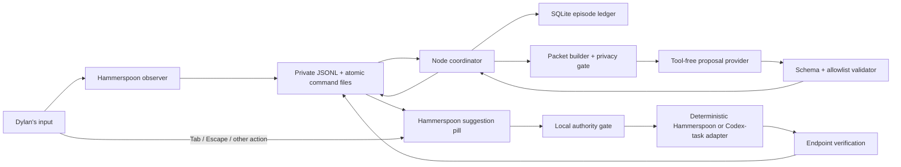

# Computer-use autocomplete V0 design

> [!important] 2026-07-31 prototype scope correction
> The V0 threat model is a Dylan-only personal prototype, not untrusted
> multi-party science. Preserve privacy/canary gates, reversible installation,
> physical Tab safety, full episode logging, and predictions-frozen-before-labels.
> Replace Chunk 2 sanity manifests, trial-unlock/release inventories,
> disabled-half-day proof choreography, and the public renderer with tests,
> guided trials, concise notes, and Git tags. Probe Claude headless first; probe
> Codex app-server only if Claude fails. Defer `open_url` as a candidate and
> execution primitive while retaining read-only Arc URL access for privacy.
> This amendment supersedes conflicting later sections of this design.

> [!warning] 2026-07-31 implementation blocker
> Phase-zero capture calibration is stopped after the preregistered one
> diagnostic, one focused fix, and one rerun. Both immutable ten-shot attempts
> failed before capture because the local Hammerspoon probe window exposed no
> usable macOS focused accessibility element. The repair explicitly focused its
> static button but did not change the result. The fresh privacy suite passed,
> no screenshots or canaries were written, cleanup/restoration passed, and all
> later work remains blocked. This is one persistent failure, not evidence of a
> second independent architecture failure; do not retry or broaden the harness
> without a new decision.

> [!success] 2026-07-31 metadata-only V0 decision
> V0 now proceeds without screenshots. V5's history wins came from task identity
> in history, while pixels did not rescue the fine-control targets. Removing
> screenshots deletes the largest cloud-privacy exposure, reduces proposal
> payload and latency, and removes Claude image-transport eligibility as a
> dependency. Capture is an optional V0.1 capability, not a phase-zero gate.
> One non-blocking TextEdit readiness falsifier may distinguish a synthetic
> Hammerspoon-webview artifact from a general capture limitation, but neither
> result may delay the JSON-only provider bakeoff.

> [!warning] 2026-07-31 provider stop
> The metadata-only packet and validator path is implemented, but the strict
> zero-tool provider gate currently has no eligible provider. Claude Code
> `2.1.119` requires `--bare` for isolation, and that mode requires an
> `ANTHROPIC_API_KEY`; Dylan's installed OAuth session cannot enter it. Codex
> CLI `0.144.6` rejects `tools.update_plan.enabled=false`, so its unconditional
> `update_plan` tool cannot be removed. The reviewed preflight made zero model
> calls and froze `authority_qualified: false`, `live_qualified: false`, and no
> selected provider. The product plan stops before Task 5 until Dylan either
> supplies a Claude API key or explicitly narrows the rule from “zero tools
> advertised” to “no external-effect tools, and any tool call invalidates the
> response.” Implementation checkpoint: `5bfbac7` in the private V0 repository.

> [!failure] 2026-08-01 two-sided provider result
> Dylan approved the narrow Codex amendment: only `update_plan` may be
> advertised, any invocation invalidates that call, and warm invocation
> frequency is reported as `n/5`. Claude remained structurally tool-free and
> received a private API key for the run. The reviewed implementation at
> `5afab1b` ran both arms and froze manifest
> `412eed079f3ec4c4762590cafcea5680f1ccb170097544a214c362d30c2b0540`.
> Neither passed. Claude returned `0/5` valid warm calls, no tool invocations,
> and `4,080.54 ms` warm p50; Codex failed its fresh local authority proof
> before a model call because it produced no exact generated request from
> which to verify the one-tool advertisement. No provider was selected. Task 5
> remains blocked. See
> [[computer-use-autocomplete-provider-bakeoff-2026-08-01|the provider bakeoff
> result]].

> [!note] 2026-08-01 attempt 000002 preregistration
> Attempt `000002` adds a direct Anthropic Messages API adapter and does not
> rewrite or silently replace `000001`. The CLI and Codex arms are not rerun.
> The direct arm uses the exact five frozen `000001` packets, unchanged
> predictor instruction, unchanged local response validator, five-second
> deadline, one separate cold call, and five counted warm calls. It is pinned
> to `claude-haiku-4-5-20251001`, one user turn, `max_tokens: 1024`, and
> `output_config.format` structured output. The request body contains no
> `tools` field; authority is asserted from the exact request body rather than
> a CLI startup stream. Anthropic-unsupported scalar schema constraints are
> omitted only from the API generation grammar and remain enforced by the
> unchanged local validator; both hashes are recorded. The bar remains `5/5`
> valid warm calls, p50 at or below `2,500 ms`, acknowledged cancellation, and
> deadline enforcement. Codex repair and the overlay stay blocked unless this
> arm passes.

> [!failure] 2026-08-01 attempt 000002 result
> The direct Anthropic arm returned `0/5` valid warm calls and selected no
> provider. All six counted/diagnostic bakeoff calls failed immediately with
> `http_400`; a separate non-counted diagnostic request identified the exact
> cause as insufficient Anthropic API credit. Warm p50 was `174.58 ms`, but it
> measures rejection latency rather than model inference. The live result was
> written under attempt `000002`; an overly strict manifest trial schema then
> rejected the runner's `authority_failed` status. No model call was repeated.
> The exact result and failure provenance were frozen and verified in salvage
> attempt `000003`, manifest
> `ee475d552cb98838ac67987428e055a7ee83a9f6c66fc675fe4e45f84b3271e9`.
> Task 5 and the overlay remain blocked. See
> [[computer-use-autocomplete-provider-bakeoff-2026-08-01|the provider bakeoff
> result]].

> [!bug] 2026-08-01 credential-selection correction
> The `000002`/`000003` run did not use either key Dylan supplied. A temporary
> loader silently selected an unrelated key from `~/.codex/history.jsonl`.
> Console inspection showed the intended workspace, credits, spend limit, and
> rate limits were healthy, and the exact plain Messages request returned HTTP
> `200` with the intended new key. Preserve the frozen failure, but do not use
> it as evidence about Anthropic billing, Haiku latency, or direct-provider
> validity. A new attempt must bind the exact credential through private
> `provider.env`; Task 5 and the overlay remain blocked until it passes.

> [!note] 2026-08-01 attempt 000004 preregistration
> The intended credential is now bound only through private `provider.env`; no
> transcript/history search is permitted during qualification. An exact plain
> Messages request returned HTTP `200`. The remaining adapter preflight failed
> because Anthropic structured outputs reject `oneOf`. The API generation
> projection therefore recursively maps canonical `oneOf` unions to supported
> `anyOf`, while the unchanged canonical schema and local validator continue to
> enforce the exact candidate-versus-abstention union. A subsequent non-counted
> preflight exposed Anthropic's `minItems: 3` restriction, so `minItems` is also
> omitted only from the generation projection. The next non-counted response
> rejected `maxItems` as well, so both array-size constraints are omitted only
> from generation while local validation retains
> exact three-candidate cardinality. The next non-counted response rejected
> tuple-form `prefixItems`, so generation projects the three ranked shapes to
> supported `items.anyOf` while local validation retains rank order and count.
> The first schema-accepted warm preflight produced a legitimate abstention but
> a `358`-character reason beyond the unchanged local `256`-character bound;
> generation now describes those text fields as concise and within the bound.
> Attempt `000004` reuses
> the same five packets, prompt, model, no-tools body, deadline, lifecycle
> checks, and `5/5` plus `2,500 ms` gate. No overlay work begins unless it
> passes.

> [!failure] 2026-08-01 attempt 000004 result
> The corrected direct Anthropic arm froze and verified but did not qualify:
> `3/5` warm calls were locally valid, versus the required `5/5`. Warm p50
> passed at `1,910.02 ms`; tool use was `0/5`; cancellation and forced-deadline
> checks passed. Two calls failed only as `candidate_schema`, and counted raw
> responses were not frozen, so the exact subpredicate is unknown. The blocker
> is response-format reliability at usable latency. Task 5 remains locked until
> a metadata-safe validation subpredicate identifies the cause and a new frozen
> attempt passes.

> [!note] 2026-08-01 attempt 000005 diagnostic amendment
> Keep the predictor and gate unchanged. Refine only metadata-safe local failure
> evidence into `abstention_text_bound`, `candidate_cardinality`, or fallback
> `candidate_schema`; retain no response text or payload values. Rerun the same
> five packets once. The result is diagnostic and cannot unlock Task 5 by
> itself.

> [!note] 2026-08-01 attempts 000005–000006
> Attempt `000005` again reached `3/5` validity with `1,871.94 ms` p50 and all
> non-validity gates passing, but both diagnostic predicates became
> `unspecified` because the generic sanitizer lacked the new closed values.
> Attempt `000006` changes only that allowlist and reruns the same schedule once.
> It cannot unlock Task 5 or authorize normalization by itself.

> [!note] 2026-08-01 attempts 000006–000007
> Attempt `000006` named the blocker: cold plus three warm failures were all
> `abstention_text_bound`; no action-bearing field failed. Warm p50 passed at
> `1,766.93 ms`, tool use was `0/5`, and lifecycle passed. Attempt `000007`
> normalizes only an otherwise exact abstention explanation to the existing
> 256-character interface bound. The abstention decision and all candidate
> fields remain untouched; Task 5 still requires a strict `5/5` pass.

> [!success] 2026-08-01 attempt 000007 passed
> Direct Anthropic Haiku is selected. Cold was valid; all `5/5` warm calls were
> valid; warm p50 was `2,045.63 ms`; tool use was `0/5`; both lifecycle checks
> passed; and there were no failures. Frozen manifest:
> `0180952b88c5d83959bbf196eb873214df08a98c900e82e00139841c49038b2f`.
> Task 5 is unlocked. Two warm calls exceeded 2.5 seconds individually, so tail
> latency remains a habit-week risk even though the frozen p50 gate passed.

> [!failure] 2026-08-01 Task 5 exact Codex identity result
> Task 5 froze and verified as FAIL under manifest
> `3405bf06476d2132fee2d62e15877412a7cb3cc50068c131e882c7f3811bfe5f`.
> The installed app registers `codex://`; its public app-server exposes thread
> list/read and `turn/completed`; and its AppleScript dictionary declares active
> tab URL/title. But a visible, frontmost task window still exposes zero
> scriptable windows, and the generic macOS window has no document URL. The
> app-server cannot identify which thread the desktop UI selected. Exact active
> task identity is therefore unavailable, exact focus-and-reread was not
> attempted, and the plan stops before the Tab gate/pill. No generic activation,
> Electron/private-state access, arbitrary UI traversal, or coordinate fallback
> is permitted. See
> [[computer-use-autocomplete-task-5-codex-identity-probe-2026-08-01|the Task 5
> probe result]].

> [!success] 2026-08-01 Task 5 activity-derived identity amendment
> A bounded AX spike found the selected Codex task title in the public
> `AXWebArea` and confirmed exact deep-link routing, but immutable attempts
> `000002` and `000003` still could not make the title-to-app-server-ID join
> reliable enough for exact authority. V0 therefore keeps exact
> `codex://threads/<id>` dispatch while recording immediate frontmost-Codex
> verification as `observed_partial`. Product-owned dispatch IDs and qualifying
> observable task events supply exact identity; otherwise Codex context and
> labels remain app-level. Exact-task and app-only outcomes are separate
> strata, and generic Codex activation remains forbidden. Task 6 remains
> blocked until the frozen desktop event-visibility probe passes 3/3.

> [!warning] 2026-08-01 preregistered Codex event-visibility gate
> Before Task 6, attach an app-server listener exactly as V0 will attach it,
> without starting a session or turn. Across three existing tasks, Dylan must
> manually focus the task in Codex Desktop, type a short composer message, and
> send it. Pass only if 3/3 desktop-originated trials produce an app-server
> event carrying the correct thread ID within the 30-second label horizon.
> The app-server event's `turn.startedAt` supplies the observed send timestamp;
> the listener buffers before Dylan acts and, after Dylan confirms a send,
> waits long enough to cover at least the full horizon when no event appears.
> Probe code never focuses, types, clicks, submits, or otherwise drives the UI.
> Freeze event kind, thread-ID match, latency, and whether unplanned listener
> configuration was required; expect zero provider calls and zero cache hits.
> A 0/3 or partial result is an architecture stop before Task 6, with no title
> join or generic-activation fallback. Exact-task labels are expected to be
> sparse and composer-concentrated; read-only visits remain app-only. Sparse
> exact-stratum counts are the design working, not model failure.
> Pre-trial reservation `000001` was aborted before any send after its
> arm-before-send wording was rejected. It has no manifest and is not evidence.

> [!failure] 2026-08-01 Codex event-visibility gate failed 0/3
> Attempt `codex-activity/000002` attached the planned sessionless standalone
> app-server listener. Dylan manually sent a short message in three distinct
> existing Codex tasks; probe code remained passive. No trial produced an
> observable task event. Every trial froze `event_not_observed`, null event kind
> and latency, false thread-ID match, and zero provider/cache calls. Manifest:
> `3cf152c8aa6e68dbae7417106bbbfc38433230e62b8eaf8ffa9eb55846085461`.
> Task 6 remains blocked pending an architecture decision. Do not add a title
> join or generic Codex activation fallback. See
> [[a-standalone-codex-app-server-listener-cannot-observe-desktop-originated-task-events|the event-visibility finding]].

> [!success] 2026-08-02 Codex read-derived identity passed 3/3
> The `0/3` push-event result ruled out only a standalone listener. Frozen
> read-path attempt `codex-activity/000003` captured a full thread-list baseline
> and scheduled 2-, 10-, and 30-second reads around Dylan-only sends in three
> distinct tasks. All reads succeeded, all expected IDs matched, and all three
> tasks showed `recencyAt` advancement plus raw-order movement by the first
> scheduled read. Manifest:
> `057ce508a067030a09d834dc94f1355c08a9c38f3aa67751c2d5528f8e219de5`.
> V0 now resolves exact next-human Codex labels offline from list diffs inside
> the label horizon and supplies that list as the exact-ID/title candidate
> catalog. Read-only visits remain app-level; product-owned dispatches retain
> exact identity. Task 6 is unblocked. See
> [[codex-thread-list-recency-reveals-desktop-originated-task-activity|the
> read-path finding]].

> [!warning] 2026-08-02 Task 6 physical-evidence amendment
> The twenty-case guided physical Tab matrix is retired. Attempts `000001`
> through `000005` never froze manifests and are not evidence. In the last
> case-4 run, `suggestion_shown` and matching arm generation were observed, but
> rejected keydowns carried no timestamp or gate predicate; the old three-second
> cue delay made five-second TTL expiry plausible. Do not classify that
> passthrough as a gate failure. Run the complete predicate grid synthetically
> first, then a seven-cell physical matrix with the valid consume cell first.
> Before that matrix, require one fully instrumented consume-only pass. Every
> physical keydown record must come from the Lua authority at keydown and include
> armed state, pill-visible state, TTL remaining, generation validity, and the
> exact predicate. Dylan's foreground and pill-visibility answers corroborate
> rather than define the outcome. Arm only after fresh case-specific focus
> verification, cue immediately after arm, and automatically invalidate and
> re-cue TTL-expired presses. Freeze the exact seven physical cells before the
> full matrix; do not revive the twenty-case script.

> [!success] 2026-08-02 instrumented consume and exact seven-cell freeze
> The first instrumented consume failed safely because rendering the
> product-owned pill changed the privacy `visible_windows` fingerprint and
> invalidated its own arm. Component-level diagnostics isolated that single
> field. Generation tracking now relies on the window observer for real window
> changes while the synchronous Tab gate still rescans every visible window for
> sensitive or denylisted state. The repaired consume passed: the pill rendered,
> the authority consumed Tab with `accepted`, generation stayed unchanged, and
> the foreground did not receive the key. Manifest:
> `e799066d99b314b7ac2a530f3ab8f6dc9544fdd589dc78ac6a99439acd2c6cad`.
> The full physical matrix is frozen in this exact order: `valid_consume`,
> `hidden_pill`, `typing_activity`, `generation_changed`, `context_changed`,
> `heartbeat_expired`, and `adapter_changed`. These cover one accepted path and
> six distinct unsafe keydown predicates. Editable, sensitive, Secure Input,
> pause, and authentication-window transitions remain in the separate armed
> privacy probe. TTL expiry remains an automatic re-cue rather than a scored
> cell.

> [!success] 2026-08-02 Task 6 passed
> The exact seven-cell physical matrix passed at source commit `0d2bcb1`.
> `valid_consume` was accepted and consumed; `hidden_pill`, `typing_activity`,
> `generation_changed`, `context_changed`, `heartbeat_expired`, and
> `adapter_changed` all reached the foreground with their exact expected
> keydown predicates. One expired consume cue passed through and was preserved
> as an unscored automatic re-cue. The pill never stole window focus. Verified
> manifest:
> `ec67bedf5d9a8e2078e0a943d75f26bd5300e4a2860e4505e37ffbc4a295f924`.
> The armed privacy matrix then passed `4/4` for Secure Input, sensitive role,
> manual pause, and background authentication transitions; every arm disarmed
> before Tab, every unsafe Tab reached the foreground, and the full private-root
> scan found zero canary bytes. Verified manifest:
> `9603d81eec93a97f255e749ac09047060ed87bcfcb37f0ea5ed6870f09ab81e2`.
> During the manual-pause trial Dylan found that the yellow paused indicator
> flashed instead of persisting. Commit `c0c0b0e` changes only the paused branch
> of local disarm rendering so the indicator is re-rendered while paused;
> `427/427` tests passed, install/restart and preflight passed, and Dylan manually
> verified the indicator remains visible after releasing the hotkey. The two
> immutable manifests remain bound to their exact `0d2bcb1` source; the
> post-probe paused-renderer fix is separately recorded rather than silently
> treated as part of those trials. Privacy was resumed and the stabilization
> handshake completed after verification.

> [!success] 2026-08-02 phase zero passed
> The final aggregate gate passed under immutable manifest
> `f4455bc12722af009a6acbc4c489c57b37cf499785991a27edaf1f14b7daedc3`.
> It binds metadata-only capability, the selected direct Anthropic Haiku
> provider (`5/5` warm validity, `2,045.63 ms` p50, zero tool calls), the `3/3`
> read-derived Codex identity result, the `7/7` physical Tab matrix, and all
> three leak-free privacy boundaries. The missing provider-transport privacy
> proof was frozen separately with zero network launches and zero canary bytes;
> privacy-base was rerun on the final verifier source. The prompt-caching and
> persistent-pause amendments are explicitly bound into the aggregate current
> execution-source closure. `445/445` tests and final read-only verification
> pass. Phase zero is closed and Chunk 2 / Task 8 is now authorized.

> [!success] 2026-08-02 runtime ledger and episode state machine landed
> Task 8 is committed at `29c8b03`. V0 now has the exact six-table local SQLite
> ledger plus a pure reducer for prediction, validity, presentation, feedback,
> and execution. Event ingest is ordered, idempotent, and transactional with
> state changes; database/WAL/SHM leaves are revalidated at `0600`; restart and
> bridge resync close incomplete work without overwriting feedback or reviving
> stale suggestions. The focused suite passes `22/22`, the full repository
> passes `467/467`, and the frozen phase-zero aggregate remains unchanged and
> passing. Task 9—context epochs, triggers, and causal destination
> transitions—is next.

> [!success] 2026-08-02 causal opportunity state landed
> Task 9 is committed at `6d0c7ee` after the explicit ledger-policy-hash index
> correction at `eb75ac0`. Node now solely owns context epochs, exact
> stabilization, automatic/manual opportunity arbitration, and causal
> destination transitions. Physical human tokens and product action IDs remain
> distinct; ambiguous races stay unknown; related watcher events coalesce into
> one full identity set; pending feedback becomes override only for a different
> supported human destination. The bounded adapter loop owns 200 ms polling and
> 350 ms leases and invalidates before publishing any changed value. The full
> repository passes `496/496`, and the original phase-zero aggregate remains
> unchanged and passing. Task 10—immutable live packets and frozen resolution
> catalogs—is next.

> [!success] 2026-08-02 immutable packet runtime landed
> Task 10 is committed at `35637e8`. Live V0 packets now preserve the closed
> phase-zero metadata schema, omit every screenshot field and capture call,
> bound history to 15 minutes and 100 events, and include exact Codex task
> identity only while Codex is focused. The frozen catalog deduplicates exact
> app/window/task identities with explicit `current_state|history_context`
> provenance; state-only replay derives its resolver solely from the current
> subset. Packet construction rechecks epoch, local generation, adapter value,
> and fixed lease before persistence. One private immutable envelope contains
> the full packet, state-only derivative, catalog snapshot, and all hashes; a
> retry verifies the existing envelope before completing the SQLite packet-row
> handoff. Metadata-only V0 writes no snapshot row. `510/510` tests and the
> original phase-zero aggregate pass. Task 11—live proposal coordination,
> validation, and local promise rendering—is next.

> [!success] 2026-08-02 live proposal coordination landed
> Task 11 is committed at `dca267a`. The runtime now pins the selected direct
> Anthropic/Haiku proposal contract to the frozen aggregate, launches at most one
> request per epoch, enforces the five-second deadline, and records cancellation
> intent before the terminal cancelled state. Abort races and late output are
> evidence-only. The coordinator persists the episode, request, and immutable
> packet before launch; validates exact-three or abstention output; stores every
> rank; chooses the highest executable target; and emits one arm intent with the
> exact epoch, local generation, fixed TTL, and required adapter leases. Promise
> text comes only from the frozen local catalog, never `model_target_label`.
> Malformed abstentions, partial lists, unresolved targets, stale packets, and
> dormant `open_url` display nothing. The focused suite passes `15/15`, the full
> repository passes `525/525`, and the original phase-zero aggregate remains
> unchanged and passing. Task 12—three deterministic executors and exact endpoint
> verification—is next.

Metadata-only packets retain the focused app/window identity, an exact Codex task
only when a product-owned dispatch or bounded read-derived activity record
currently supplies one,
focused accessibility role, and up to five privacy-allowed currently open
window titles observed at packet freeze. The titles describe the current scene,
not chronological history. Focused-state privacy remains fail-closed for raw
Arc URL risk, Secure Input, editable/sensitive roles, manual pause, unknown
queries, and denylisted focused metadata. Background-window/display
intersection no longer suppresses metadata because no background pixels or
implicit background content leave the Mac. Required focused-state query failure
suppresses the packet; an optional background-title query failure simply omits
that title from the bounded catalog.

## Decision summary

V0 is a Dylan-only Mac prototype for testing one product claim:

> After observing the current state and a short personal workflow history, can
> the system proactively offer a deterministic navigation completion that
> Dylan naturally begins accepting with Tab?

The governing rule is **log everything, run almost nothing**. V0 records the
complete lifecycle of every prediction opportunity but executes only four
reversible primitives:

1. activate an already-running application;
2. focus an existing window;
3. focus an existing Codex task through a structured adapter; and
4. open an HTTPS URL.

There is no visual computer-use executor, Arc extension, candidate-enumeration
system, authored text generation, consequential action, recovery planner, or
fine-tuning in V0.

The design is derived from
[[computer-use-autocomplete-v1-brainstorm-and-scope|the approved V0 contract]].
The runtime evidence and broader future architecture remain in
[[computer-use-autocomplete-runtime-decision-audit-2026-07-30|the runtime
decision audit]].

## Success and stop conditions

### Primary success signal

After a short safety calibration, Dylan leaves the prototype enabled during
five normal workdays. The primary read is behavioral: Dylan begins reaching
for Tab when a useful navigation completion appears and notices its absence
during a subsequent half-day with the prototype disabled.

Roughly 50 displayed suggestions is a useful exposure target, not a quota. V0
does not lower a display threshold, repeat stale suggestions, or manufacture
opportunities to reach it.

### Diagnostic measures

- displayed suggestions, accepts, explicit dismissals, ignores, expiries,
  overrides, and stale cancellations;
- proposal validity and latency;
- execution dispatch, endpoint verification, and failure reason;
- top-one and top-three retrospective accuracy against the next observable
  human destination;
- offline state-only versus state-plus-history replay; and
- the distribution of triggers and accepted primitive types.

### Stop conditions

The active habit trial does not begin if any of these remains true:

- neither proposal provider produces five valid tool-free responses with p50
  at or below roughly 2.5 seconds on representative real packets;
- the observer cannot put exact active Codex task identity into the packet or
  the local product cannot focus that task through a callable structured
  adapter;
- any controlled trial steals a Tab keystroke during typing, editable focus,
  sensitive focus, stale context, or absence of a visible suggestion; or
- the synthetic secret test leaks a protected canary into persistence or an
  outbound request.

These are falsifiers, not invitations to build compensating subsystems. A
failed probe produces a short decision note before the product shell expands.

## System boundary

Implementation should live in a new dedicated repository at
`/Users/dylanvu/Projects/computer-use-autocomplete`, not in the public notes
vault and not in the dirty July capture-spike repository. The new repository
may port narrowly selected observer patterns from
`/Users/dylanvu/Projects/computer-use-nap/spike/hammerspoon-spike.lua` and
tool-free invocation patterns from
`/Users/dylanvu/notes/scripts/computer-use-nap-v5/lib/codex-adapter.mjs`.
Historical harnesses remain unchanged.

Runtime data lives outside Git under
`~/Library/Application Support/ComputerUseAutocompleteV0/`. Source code must
never write screenshots, packets, SQLite files, credentials, or private event
logs into either Git repository.

The implementation uses two small runtimes already installed on Dylan's Mac:

- **Hammerspoon/Lua:** physical input observation, app/window observation,
  one-shot screenshots, the visible pill, global Tab/Escape gating, and the
  three native primitives for app activation, window focus, and URL opening;
  and
- **Node.js 24/ES modules:** packet construction, provider calls, validation,
  episode state, SQLite persistence, offline replay, coordination, and the
  structured Codex-task adapter.

They communicate through a private local file bridge. Hammerspoon appends
source events to JSONL with its own monotonic time and `source_seq`. Node is the
only ledger ingress: it assigns the authoritative `ingest_seq` and `event_id`
to every Hammerspoon, provider, coordinator, and Codex-adapter event in arrival
order while retaining source clocks for diagnostics. Episode transitions use
only this ingress sequence; no cross-process timestamp merge decides product
state.

Node writes versioned commands and suggestion state through atomic rename.
Every bridge launch has a random `bridge_session_id`; Node refreshes a
heartbeat every 250 milliseconds, and Hammerspoon treats it as dead after one
second. Commands carry session ID, increasing command sequence, context epoch,
Hammerspoon `local_generation`, and a TTL duration. The first arm command for a
new `suggestion_instance_id` makes Hammerspoon derive one immutable local
expiry from its own monotonic receipt time. Later heartbeat or adapter-lease
updates for that same suggestion instance can change freshness data but can
never reset or extend its expiry. Hammerspoon then acknowledges the command
into the source event stream. Acknowledgements and lease refreshes may advance
`source_seq` but do not change `local_generation`. Session change, heartbeat
loss, generation mismatch, command gap, or locally derived expiry disarms the
pill before any physical Tab can be consumed. This reuses the proven
append-only Hammerspoon path and avoids adding a network server, `hs.ipc`, or
an embedded private Codex runtime to V0.

Node is the sole owner of `context_epoch`. Hammerspoon owns only an immediate
`local_generation` safety counter. Every physical input except an atomically
accepted Tab or product-handled Escape, plus app/window/title/focused-role
changes, increments that counter and disarms locally before the event reaches
Node. Node increments the authoritative epoch when it ingests the
corresponding event. A suggestion
command carries the exact epoch and local generation used to build it;
Hammerspoon arms only if its current generation still matches. Adapter-only
Codex-task or Arc-URL changes increment the Node epoch and generate an atomic
`invalidate` command. While a proposal or pill is live, adapter leases below
must remain fresh; otherwise Hammerspoon disarms even before an explicit
invalidation arrives.

Every Secure Input change, manual privacy pause/resume, focused sensitive-role
change, denylisted-app transition, or privacy-classification change also
increments `local_generation` and disarms synchronously in Hammerspoon before
Node processing. Privacy transitions can never reuse a previously armed local
generation.

If Hammerspoon observes a command-sequence gap, it disarms and emits
`bridge_resync_requested`. Node responds by rotating `bridge_session_id`,
writing a complete unarmed state snapshot, and starting a new heartbeat.
Hammerspoon acknowledges the new session before it may accept a later
suggestion command; commands from the previous session remain invalid. At
ledger ingress, the resync event immediately hides any presentation, marks a
live prediction stale and cancel-requested, cancels accepted work that has not
dispatched, and records no user feedback. A dispatched primitive is allowed
only to report its observed terminal result. The interrupted episode can
never redisplay; only a later meaningful state change can create a new
eligible opportunity in the new bridge session.

## Architecture



The model can propose but cannot dispatch. Hammerspoon owns the physical Tab
decision and dispatches `activate_app`, `focus_window`, and `open_url`. The
Node-owned structured Codex adapter dispatches `focus_codex_task` through an
exact registered thread route. The Node
coordinator owns episode causality and validates that an accepted action still
belongs to the current context epoch. Every actuator reports through the same
Node ledger ingress and verification contract.

## Components and contracts

### 1. Hammerspoon observer

The observer emits a small ordered source stream using one monotonic sequence
and clock. Required Hammerspoon event kinds are:

- `app_activated`;
- `window_focused` and `window_title_changed`;
- `key_activity` without key content;
- `typing_burst_started` and `typing_burst_ended` without characters;
- `scroll_burst_started` and `scroll_burst_ended`;
- `click` without semantic target traversal;
- `local_quiet` after meaningful activity becomes quiet;
- `secure_input_changed` and `privacy_paused`; and
- suggestion, feedback, action, and verification events produced by the
  product itself.

Node derives `decision_idle_started` and `state_stabilized` after ingesting
`local_quiet` and confirming structured adapter state. `decision_idle_started`
deliberately means the start of a stable decision pause—the end of a human
interaction burst—not the moment the user resumes from OS-level idle. The name
prevents the prior “idle-end” ambiguity.

Initial event timing is explicit and versioned:

- keydown processing checks a product-handled Escape first, then an atomically
  acceptable Tab, before generic invalidation;
- every other physical keydown resets keyboard quiet, increments
  `local_generation`, and disarms the pill before macOS receives the event;
- a printable-text typing burst starts on the first unmodified printable key
  and ends after 750 milliseconds without another such key; non-printable keys,
  Return, arrows, and shortcuts remain content-free `key_activity` events;
- a scroll burst ends after 400 milliseconds without a scroll event;
- a click, app/window/task change, completed burst, or supported response
  completion schedules stabilization; and
- Hammerspoon emits `local_quiet` after 800 milliseconds without another
  generation-changing human event; Node emits `state_stabilized` only after it
  ingests that event, reads the current task/URL adapters, and confirms that
  bundle ID, window ID, title, task ID, URL, focused role, privacy state, and
  display ID still match the scheduled state.

These are first-run defaults, not inferred values. Their exact runtime-policy
snapshot is stored with every episode.

When a pill is shown, Escape is consumed locally, emits one
`escape_dismissed` event, increments `local_generation`, and disarms; it does
not also emit generic `key_activity`. While an accepted primitive is waiting
but has not dispatched, Escape instead emits `escape_stop_requested` and
disarms. With no displayed or stoppable product state, Escape follows the
generic invalidation path and reaches the foreground app unchanged. Node
applies dismissal/stop semantics from that single source event before the same
event's epoch invalidation, preventing an `ignored` race.

Literal printable characters, clipboard contents, form values, continuous
video, complete Accessibility trees, and per-click semantic resolution are
out of scope. The observer records the focused bundle ID, PID, window ID,
sanitized window title, display ID, bounds, focused Accessibility role, and
editable/sensitive classification when available.

### 2. Trigger and context-epoch manager

One Node-owned `context_epoch` represents a stable state in which a proposal
could still be valid. “Meaningful state change” means one of these observed
events: app/window/title/Codex-task identity change, click, browser URL change,
any physical key activity, scroll burst start, focused-role change,
privacy-state change, accepted product navigation, or another human
destination transition. Each increments the epoch exactly once at Node ledger
ingress. Hammerspoon never computes or advances this epoch.

A proposal opportunity may begin after:

- an app or window transition followed by state stabilization;
- a Codex task adapter `turn/completed` event for the currently active thread,
  followed by stabilization;
- the end of a click, typing, or scroll burst followed by stable decision
  idle; or
- the manual `Control-Option-Space` fallback.

Automatic opportunities require non-editable, non-sensitive focus and a
meaningful state change since the last opportunity. There is at most one live
proposal per epoch. New human activity cancels the provider request when
possible, marks the episode stale, and prevents display even if the response
arrives later.

While Codex or Arc is current and an opportunity is predicting or displayed,
Node refreshes the applicable task/URL adapter at most every 200 milliseconds.
Each successful read writes a 350-millisecond adapter lease into suggestion
state. Hammerspoon will not consume Tab after that lease expires. Any observed
task or URL change increments the epoch and writes `invalidate` before the next
lease. User-driven changes also produce immediate Hammerspoon generation
changes, so the local gate does not wait on polling.

V0 does not infer LLM completion from pixels, spinners, or arbitrary app UI.
If Probe B cannot expose the structured active-thread completion event, that
trigger is disabled and the other three triggers remain valid. A single epoch
can produce at most one automatic opportunity; dismissal, ignore, expiry, or
provider failure does not retrigger until another meaningful state change.

### 3. Context packet

The packet schema is versioned and immutable. Provider-visible fields are
split so the history ablation is mechanical:

- `current_state`: the current screenshot, current app/window/focused-role/
  display metadata, only the currently active Codex task or Arc URL, and the
  exact structured adapter leases on which that state depends;
- `history_context`: chronological pre-trigger events, including historical
  app, window, Codex-task, and URL references;
- `feedback_context`: recent pre-trigger product episodes; and
- `request_meta`: packet ID, epoch, trigger, schema, and time.

The packet therefore contains:

- packet and context-epoch IDs;
- trigger kind and timestamps;
- one redacted active-display screenshot; V0 captures no secondary-display
  thumbnail;
- current app, window, focused-role, and display metadata;
- exact current Codex task ID and readable title when Codex is active;
- the chronological recent-event buffer;
- recent product feedback episodes when available.

A separate `local_resolution_catalog_snapshot` contains live and recent app,
window, Codex-task, and URL identifiers for post-response validation. It is
serialized canonically, hashed, persisted immutably with the packet envelope,
and never sent to the provider. Every entry records whether it came from
`current_state` or `history_context`. The model may emit only an exact target
reference copied or reconstructed from its provider-visible packet. There is
no `target_hint` field or semantic resolver in V0. The original history condition validates
against this frozen full snapshot. The state-only replay derives its resolver
subset from entries marked `current_state` in that same snapshot; it never
reconstructs resolution state from the later machine or uses historical
entries to make a destination executable or exact after prediction.

`required_adapter_leases` is frozen from current-state construction, not from
the candidate action. If current state includes a Codex task or Arc URL, that
adapter lease remains required until the pill disappears even when the
candidate proposes a different application or window.

Before screenshot capture, the local Arc adapter inspects the raw active URL.
If it contains user information, a query, or a fragment, Node records only a
metadata-safe suppressed episode and captures or transmits no screenshot or
packet. Node then asks Hammerspoon for the bundle, window role/subrole, and
privacy classification of every visible window whose frame intersects the
active display. If any intersecting window belongs to a denylisted process,
authentication surface, secure role, or unknown privacy class, the episode is
also suppressed before capture—even when that window sits behind the focused
app. This prevents sensitive values from leaking through browser chrome, page
content, translucent windows, or an exposed background region after metadata
sanitization. Because V0 captures only the active display, a sensitive
application visible on another monitor cannot enter a secondary thumbnail.

The buffer is bounded by both time and count. The initial defaults are the
most recent 15 minutes and at most 100 normalized events, whichever is
smaller. This is configuration, not long-term retrieval.

Every persisted packet records its schema version, serialized-body hash,
snapshot and resolution-catalog hashes, provider configuration, prompt hash,
and creation time. The
offline state-only derivative retains only `current_state` and `request_meta`.
It removes all pre-trigger history, feedback, historical target references,
and derived summaries. Evaluator-only resolution data remains outside both
provider-visible variants. Neither variant ever includes later destination
labels.

### 4. Codex task adapter

The adapter contract is:

```text
currentTask() -> { threadId, title } | null
focusTask(threadId) -> { dispatched, observedThreadId, verified }
subscribe(callback) -> task_changed | turn_completed | disconnected
```

The feasibility probe must establish that both methods are callable from the
standalone local product—not merely from an interactive Codex task tool. The
adapter may use a documented Codex app-server or desktop navigation surface,
but may not embed the private Computer Use runtime or scrape the Codex UI with
coordinates.

If exact task identity or verified focusing is unavailable, the Codex
primitive fails its probe and the habit trial is blocked. V0 does not silently
downgrade the V5 mechanism to generic Codex activation.

The adapter should prefer structured task and turn events. If the documented
surface cannot subscribe, it may poll `currentTask()` every 200 milliseconds
only while Codex is current and an opportunity is predicting or displayed.
Either path must emit ordered adapter events into Node ledger ingress and
maintain the 350-millisecond freshness lease. A disconnect or expired lease
invalidates the epoch and disarms the pill.

### 5. Proposal-provider interface

Codex app-server, Claude Code headless, and the direct Anthropic Messages API
adapter implement the same contract:

```text
propose(packet) -> ranked candidates | ABSTAIN
cancel(requestId) -> acknowledged | timed_out
```

Every request has a five-second monotonic deadline. Context invalidation first
sets `cancel_requested` and invokes `cancel`; provider acknowledgement sets the
terminal state `cancelled`. If the request or cancellation has not completed at
the five-second deadline, the terminal state is `timed_out` and the child/
stream is terminated. Any response arriving after a terminal cancellation or
timeout is stored as a `late_provider_response` event and artifact without
reopening the terminal state.

Each provider runs without computer use, browser access, shell access,
plugins, MCP tools, file writes, or external retrieval. A Codex app-server
configuration counts as a valid probe candidate only if the standalone client
can establish this tool-free boundary. Prompt instructions alone do not count
as enforcement.

The structured response contains exactly three distinct ranked candidates or
an explicit `ABSTAIN` result. A one- or two-candidate response is a
schema-invalid partial result: it is logged, not displayed, and excluded from
valid top-three denominators.

```json
{
  "candidates": [
    {
      "rank": 1,
      "model_target_label": "Patch NAP blog prep in vault",
      "confidence": "high",
      "action": {
        "kind": "focus_codex_task",
        "thread_id": "known-thread-id"
      }
    },
    {
      "rank": 2,
      "model_target_label": "Arc",
      "confidence": "medium",
      "action": {
        "kind": "activate_app",
        "bundle_id": "company.thebrowser.Browser"
      }
    },
    {
      "rank": 3,
      "model_target_label": "Project notes",
      "confidence": "low",
      "action": {
        "kind": "open_url",
        "url": "https://example.com/project-notes"
      }
    }
  ],
  "abstain_reason": null
}
```

Allowed action kinds are `activate_app`, `focus_window`,
`focus_codex_task`, and `open_url`. Confidence is stored as uncalibrated model
output; V0 does not claim it is a probability.

`model_target_label` is telemetry and is never shown directly. The proposal
validator rejects unknown fields, unknown action kinds,
unresolvable identifiers, non-HTTPS URLs, URLs containing credentials, and
targets unsupported by the live adapters. App, window, and Codex identifiers
must resolve uniquely in the local catalog. A URL must resolve to an exact URL
previously observed by the structured Arc URL adapter. The model cannot invent
a new executable target.

Because V0 removes URL queries and fragments before persistence or cloud
transmission, an observed URL with user information, query parameters, or a
fragment is not executable. It may contribute only redacted host/path metadata
to context. V0 does not silently open a lossy sanitized substitute.

The product generates the visible promise locally from the validated canonical
target:

- `Go to {canonical app name}`;
- `Go to {canonical app name} · {canonical window title}`;
- `Go to Codex · {canonical task title}`; or
- `Open {canonical URL host and path}`.

The renderer strips control and bidirectional characters, collapses
whitespace, and caps the promise at 120 display characters. The action object
and displayed promise therefore cannot disagree.

The highest-ranked valid and currently executable candidate is eligible for
display. Provider abstention, invalid output, or an entirely unsupported top
three produces no pill but remains a complete logged episode. V0 uses no
additional confidence threshold until prospective feedback supplies evidence
for one.

### 6. Suggestion pill and Tab authority

The pill is a non-activating, non-focusable Hammerspoon canvas that ignores
mouse events. It appears adjacent to the active window without changing
focused application, window, or control and states exactly what the
current Tab will finish, for example:

```text
Go to Codex · Patch NAP blog prep in vault                         Tab
```

It does not expose the inferred larger goal or the silent second and third
candidates. Each display has one immutable `suggestion_instance_id` and
expires five seconds after Hammerspoon receives its first arm command, or
immediately on context change. Heartbeat and adapter-lease refreshes cannot
extend that deadline. After acceptance it changes to a compact progress state
until verification or failure. Escape dismisses a displayed suggestion and
stops an accepted route before any undispatched primitive.

Hammerspoon may consume a physical Tab only when all conditions are true in
its local state at keydown:

- a visible suggestion is marked armed;
- its `bridge_session_id` matches a heartbeat whose Hammerspoon-observed age is
  no more than one second;
- its five-second TTL has not expired;
- its Node `context_epoch` matches Hammerspoon's most recently acknowledged
  suggestion/invalidation command;
- its Hammerspoon `local_generation` still matches the local observer;
- every structured adapter dependency recorded in the packet—independent of
  the proposed action kind—has a lease no more than 350 milliseconds old;
- no key activity has occurred for at least 750 milliseconds and no printable
  typing burst is active;
- Secure Input is off and privacy is not paused;
- focused Accessibility state is known and not editable or sensitive; and
- no other Hammerspoon/product action is executing.

If any condition is false, the observer returns the event to macOS unchanged.
It never waits for Node to decide whether to swallow the key. This local
keydown gate is the load-bearing Tab-safety boundary.

### 7. Deterministic executor

The coordinator freezes the accepted completion and revalidates its epoch
before dispatch. It permits one primitive per accepted suggestion:

| Primitive | Dispatch | Verification |
| --- | --- | --- |
| `activate_app` | Raise an already-running bundle ID | Frontmost bundle ID matches |
| `focus_window` | Focus a live Hammerspoon window ID | Frontmost bundle and focused window ID match |
| `focus_codex_task` | Node opens only the exact registered thread route | Frontmost Codex yields `observed_partial`; a matching qualifying task event within the bounded horizon may yield `verified_exact` |
| `open_url` | Hammerspoon opens a sanitized HTTPS URL through Arc/system browser | Read-only Arc AppleScript URL adapter returns the exact normalized URL |

There is no multi-primitive route in V0. A semantic completion that would
require more than one primitive is unsupported and not displayed. No retry or
recovery action occurs automatically. Failure is shown briefly, logged, and
returned to observation.

The durable two-Tab authority boundary is preserved by exclusion: V0 supports
no authored or consequential primitive at all. Any later completion that
prepares and then commits an action must stop after preparation and require a
new visible promise plus a fresh Tab. That future second stage is not present
in this implementation.

The Arc URL adapter contract is:

```text
currentUrl() -> normalized HTTPS URL | null
openUrl(url) -> { dispatched, observedUrl, verified }
subscribe(callback) -> url_changed | disconnected
```

A July 31 read-only local check confirmed that Arc exposes the active tab URL
through its native AppleScript dictionary. If Arc supplies no structured URL
change subscription, the adapter polls `currentUrl()` every 200 milliseconds
only while Arc is current and an opportunity is predicting or displayed. It
also queries at stabilization and after an `open_url` dispatch. Every changed
or disconnected result enters Node ledger ingress and invalidates the current
epoch. There is no extension or background browser polling outside those
bounded states. If the query is unavailable or its 350-millisecond lease
expires, the URL primitive is non-executable and no URL suggestion is armed.

Dispatch and verification remain separate ledger axes. `dispatched` means the
primitive was issued; `verified_exact` means the canonical endpoint matched;
`observed_partial` records evidence insufficient for an exact match; and
`failed` covers precondition, dispatch, or mismatch failure. Only
`verified_exact` counts as execution success in V0.

### 8. Product-owned ledger

SQLite runs locally in WAL mode. The schema has six narrow tables:

- `events`: immutable normalized human, product, model, and system events;
- `snapshots`: private paths, hashes, capture metadata, and privacy state;
- `packets`: immutable packet bodies and artifact references;
- `episodes`: trigger, provider request, presentation, feedback, validity,
  and terminal states;
- `candidates`: ranked provider output plus validation/executability result;
  and
- `actions`: accepted primitive, dispatch, endpoint evidence, result, and
  timing.

Every record carries a schema version, monotonic timestamp, wall timestamp,
origin, context epoch, and applicable episode/action IDs. Each episode also
stores the complete runtime-policy snapshot: trigger timers, TTL and bridge
lease, privacy-policy version, provider/model/sampling configuration, prompt
and schema hashes, and observer/adapter versions. Episode state changes are
transactional. Raw provider transcripts may be retained as private artifacts,
but the normalized ledger—not transcript inference—is authoritative.

Episode state is stored on orthogonal axes:

- `prediction_state`: `pending`, `returned`, `abstained`, `invalid`, `failed`,
  `cancel_requested`, `cancelled`, or `timed_out`;
- `validity_state`: `current` or `stale`;
- `presentation_state`: `not_shown`, `shown`, `hidden`, or `expired`;
- `feedback_state`: `none`, `accepted`, `dismissed`, `ignored`, or `override`;
  and
- `execution_state`: `not_started`, `precondition_failed`, `dispatched`,
  `verified_exact`, `observed_partial`, `failed`, or `cancelled_before_dispatch`.

Transition precedence makes classifications reproducible:

1. a locally authorized Tab sets feedback to `accepted` before dispatch;
2. Escape while shown sets `dismissed` and hides the pill;
3. any other physical input while shown immediately hides the pill and makes
   validity stale, but leaves feedback pending under that input's
   `human_cause_token`; if its coalesced transition contains a different
   resolvable supported destination, closing the token sets `override`, while
   a token that closes without one sets `ignored`; neither classification
   requires the episode to remain current after the originating input;
4. TTL with no feedback sets presentation to `expired` while feedback remains
   `none`;
5. context change before display sets validity `stale` and presentation
   `not_shown`; cancellation follows the explicit prediction transitions
   above, and any later model response is only a `late_provider_response`
   event; and
6. execution failure changes only the execution axis, never accepted feedback.

When competing events arrive together, the lower authoritative `ingest_seq`
wins the applicable transition. A pending feedback token blocks TTL or later
input from replacing its eventual classification; accepted or dismissed can
only win if its source event entered first. `ignored` is an ambiguous
non-accept, not a negative label. Provider or product cancellation is
represented on the prediction or execution axis, not as user feedback.

Every trigger suppressed by privacy is still represented by a metadata-only
episode with trigger, epoch, timestamp, and a coarse suppression reason. It
contains no screenshot, packet body, focused value, window title, URL, or
other sensitive payload.

Every episode separately stores two human-event references:

- `first_post_trigger_human_event_id`: the first human-origin event after the
  trigger, preserving activity that stales a prediction before presentation;
  and
- `next_human_event_id`: the first human-origin event after the outcome anchor.
  The anchor is execution terminal for an accepted episode,
  `suggestion_shown` for a shown non-accepted episode, and the prediction or
  suppression terminal event when nothing was shown.

Either field may refer to a non-destination input event. The later destination
label is a different nullable field governed by the evaluator below. Missing
evidence remains null rather than post-hoc narration.

Origin is assigned causally rather than inferred from watcher arrival order.
Every physical click or keydown is `origin=human` and opens a one-second
`human_cause_token` carrying its source sequence. The token closes on the next
physical input, product dispatch, or deadline. App/window/title/task/URL
transitions after the token and before it closes are tentatively human-origin;
there is no heuristic about which key “should” cause which transition.

Before product dispatch, the actuator emits `action_dispatched` with
`action_id`, expected endpoint, and source-sequence floor. Hammerspoon marks
that action in flight; matching app/window/URL events until verification or
deadline carry `origin=product` and the same action ID. The Codex adapter emits
its task events with the action ID directly. Synthetic CGEvents, if ever used
by tests, also carry Quartz event source user data.

If a transition plausibly matches both an active human token and a product
action, or matches neither causal rule with confidence, its origin is
`unknown`, not guessed. `origin=system` is reserved for known lifecycle or
automatic application changes. Unknown transitions cannot create override or
destination labels. Controlled tests interleave product actions and physical
human actions to verify this correlation before evaluation data is trusted.

Related app, window, Codex-task, and Arc-URL events with the same cause token or
action ID are coalesced after 300 milliseconds of semantic-transition quiet,
with a hard one-second maximum. The resulting `destination_transition` stores
all contributing event IDs and a preserved identity set:

```text
app:{bundle_id}
window:{bundle_id}:{window_id}             when observed
codex_task:{thread_id}                     when observed
url:{normalized_https_url}                 when observed
```

The fixed most-specific display order is Codex task, URL, window, then app,
but evaluation retains the entire identity set. It never chooses a label from
whichever asynchronous watcher reached ledger ingress first.

## Phase-zero feasibility probes

The probes are small programs and controlled Mac trials, not polished product
features.

### Probe A — proposal latency and authority

Build one packet fixture set from representative current-state plus recent
history examples without future labels. Run Codex app-server and Claude Code
headless behind the identical prompt, input schema, output schema, and
cancellation contract.

Before provider timing, capture ten one-shot packet screenshots across both
displays, including the negative-origin display, app switches, and window
changes. All ten must target the correct active display and show the intended
post-transition state; record every capture latency and require p95 below 500
milliseconds. A failed capture calibration is repaired before provider
latency is interpreted.

For each provider:

1. prove tool-free enforcement before counting a response;
2. record one cold call separately;
3. collect at least five valid warm calls across the same packet set;
4. record every raw latency and response-validity result; and
5. test acknowledged cancellation and a provider that ignores cancellation
   until the five-second deadline.

A provider passes when all five counted calls return schema-valid output and
warm p50 is at or below roughly 2.5 seconds. Choose the faster passing provider
for V0. If neither passes, stop before building the overlay and evaluate a
different proposal surface in a new decision note.

### Probe B — Codex task identity and focus

Across repeated switches among at least three existing Codex tasks, verify
that the standalone adapter:

- identifies the active task ID and readable title;
- emits changes in order;
- retains the task in the recent buffer after moving to another application;
  and
- focuses each requested task and verifies the resulting ID.

Change tasks once during an outstanding proposal and once while a pill is
displayed. In both cases the adapter event must increment the Node epoch,
invalidate the Hammerspoon lease, and prevent Tab consumption within the
350-millisecond adapter lease.

All controlled identity reads and focus requests must resolve to the intended
task. A generic Codex window title is not a pass.

### Probe C — Tab safety

Run the complete authority predicate grid synthetically. Only after it passes,
run one fully instrumented consume-only physical smoke, then the frozen
seven-cell physical matrix with valid consume first. Every physical case stores
the authority's keydown-owned gate record plus Dylan's corroborating foreground
and visible-pill answers. A keydown after TTL expiry is automatically
invalidated and re-cued rather than scored as a failed consume. The probe passes
only when the valid consume is accepted, every unsafe representative reaches
the foreground app, the pill never activates or takes focus, and every gate
record matches the intended predicate. Any stolen unsafe Tab, focus-stealing
pill, or armed state surviving bridge loss blocks the habit trial.

### Secret fail-closed test

Before any real cloud packet, use synthetic canaries to verify:

- password/secure fields suppress key-derived context and screenshots;
- denylisted apps and authentication dialogs suppress packet creation;
- URL credentials, query strings, and fragments are removed before storage or
  transmission;
- a denylisted or synthetic authentication window anywhere on the captured
  display suppresses capture even when a normal foreground window covers most
  of it; and
- manual privacy pause suppresses capture and transmission while a canary is
  visible in an otherwise ordinary app.

`Control-Option-P` toggles manual privacy pause in Hammerspoon. Both pause and
resume immediately increment `local_generation`, disarm the pill, and emit a
metadata-only privacy event. While paused, a persistent non-activating
`Autocomplete paused` indicator remains visible; no screenshot, packet, or
provider call is created. Resume requires a new quiet/stabilization cycle and
Node epoch before another suggestion can arm.

The initial denylist is configuration-versioned and includes password
managers, wallet applications, `com.apple.Passwords`, Keychain Access, and
system authentication processes such as SecurityAgent/authorizationhost.
Sensitive focus includes `AXSecureTextField`, browser password-field signals
when structurally available, Secure Input, and authentication-dialog bundle or
process identity. Unknown privacy classification produces a metadata-only
suppressed episode and no packet. Tests use synthetic bundle/role fixtures plus
one controlled system-password surface without entering a real secret. Rapid
Secure Input, sensitive-role, and pause/resume transitions are tested while a
pill is nominally armed; every transition must disarm locally before Tab.

V0 does not claim automatic detection of arbitrary secrets rendered in an
ordinary screenshot. The visible paused state and denylist are explicit
controls for that limitation. Any protected canary in a ledger artifact or
outbound body is a blocker.

## Normal opportunity flow

1. Hammerspoon observes a meaningful transition or interaction-burst end.
2. After stabilization, Node freezes the epoch and immutable context packet.
3. The selected tool-free provider returns top three or abstains.
4. The validator resolves action identifiers against packet/live state.
5. If the epoch is still current, the best executable candidate is written to
   the Hammerspoon suggestion state.
6. Hammerspoon displays the pill only when its local Tab-safety gate is true.
7. Tab, Escape, another human action, TTL, or context change updates the
   appropriate feedback, presentation, and validity axes under the frozen
   transition precedence.
8. On acceptance, Node revalidates the epoch and dispatches one allowlisted
   primitive.
9. The adapter verifies the endpoint and emits the terminal result.
10. The ledger commits every stage whether or not anything was displayed or
    executed.

## Failure behavior

- **Observer uncertainty:** increment the epoch, suppress the pill, and log the
  reason.
- **Privacy unknown or sensitive:** write only the metadata-safe suppressed
  episode, capture no screenshot, send no packet, and display no suggestion.
- **Provider timeout, crash, malformed output, or unauthorized capability:**
  show nothing and close the episode with the exact failure class.
- **Late provider response:** persist a `late_provider_response` event and
  private artifact without reopening the terminal prediction state or
  displaying it.
- **Bridge or coordinator restart:** Hammerspoon disarms no later than the
  one-second heartbeat lease; Node closes any recoverable active episode on
  startup through the prediction or execution cancellation axis.
- **Bridge command gap:** Hammerspoon disarms synchronously; Node hides the
  interrupted presentation, stales/cancels unfinished lifecycle work without
  user feedback, rotates the bridge session, and forbids redisplay of that
  episode.
- **Action target disappeared:** dispatch nothing and record
  `precondition_failed`.
- **Verification mismatch:** stop after the one dispatched primitive, report
  failure, and do not recover automatically.
- **Escape during execution:** cancel only work not yet dispatched. V0 cannot
  undo an app/window focus already performed.

## Offline history comparison

The label resolver uses the coalesced supported-destination identity set:

- `app:{bundle_id}`;
- `window:{bundle_id}:{window_id}`;
- `codex_task:{thread_id}`; and
- `url:{normalized_https_url}`.

For a non-accepted episode, the destination-label anchor is the trigger when
the pill was never shown and `suggestion_shown` when it was shown. The label is
the first coalesced human-origin `destination_transition` after that anchor and
within 30 seconds of the trigger. This destination field is independent of both
`first_post_trigger_human_event_id` and the outcome-relative
`next_human_event_id`. Product/model-origin actions are excluded. If no
supported destination appears, privacy
becomes suppressed, identity is ambiguous, or the horizon closes, the label is
null and the episode is unscorable for exact accuracy. Accepted episodes
remain valuable acceptance/execution evidence but are excluded from next-human
exact accuracy because the product caused the observed destination. Ignored
and override episodes remain observational and may still be influenced by
display; no causal claim is made.

After the habit week, replay each immutable scorable packet twice through the
frozen winning provider configuration:

1. the original state-plus-history packet; and
2. the deterministic derivative containing only current screenshot and
   current-state metadata.

Persist both replay predictions and their hashes before the evaluator attaches
the independently resolved identity set. Exact matching is primitive-specific:
`activate_app` compares the app identity, `focus_window` the window identity,
`focus_codex_task` the task identity, and `open_url` the URL identity. Top-one
or top-three is awarded only for an exact identifier match at the candidate's
own primitive kind, and results are reported by granularity rather than
crediting one kind as another. Semantic usefulness is a separate blind review
field and cannot change exact matching. Preserve unsupported-target,
null-label, provider-invalid, and abstain outcomes separately. Store model,
prompt, schema, sampling, policy, and packet hashes so provider drift is
visible.

This is a prospective product diagnostic, not a claim of a randomized causal
experiment. Replay avoids dual live latency and cost but can be confounded by
provider nondeterminism or later model updates.

## Testing strategy

### Automated tests

- packet schema, hashing, redaction, and history stripping;
- provider-schema parsing, target resolution, and rejection cases;
- state-only resolver isolation from historical targets;
- context-epoch invalidation, cancellation, deadline, and late-response
  handling;
- authority-state transitions and feedback classification;
- SQLite transaction and restart recovery;
- command-file atomicity and duplicate-event handling; and
- executor preconditions and endpoint predicates with fakes.

### Controlled Mac tests

- all phase-zero probes;
- the secret canary suite;
- app, window, Codex-task, and URL dispatch/verification;
- task/URL adapter changes during prediction and display;
- interleaved product actions and physical actions with exact origin and
  trigger-relative and outcome-relative human-event attribution;
- context changes during prediction, display, and accepted progress; and
- five to ten complete opportunities before enabling normal use.

The short sanity run must include returned, abstained, malformed, stale,
dismissed, ignored, accepted-success, and accepted-failure episodes. It is not
an extended shadow experiment.

## Explicitly deferred

- computer-use or coordinate-based execution;
- multi-step semantic completions;
- Arc extension or browser-tab enumeration;
- candidate registries and hierarchical ranking;
- authored text, Send, Submit, Publish, Edit, or other commit actions;
- automatic retries and route recovery;
- long-term retrieval, embeddings, task graphs, or fine-tuning;
- confidence calibration or suggestion quotas;
- automatic detection of arbitrary secrets visible in normal screenshots;
- production packaging, updates, multi-user controls, and broad security
  architecture; and
- formal online randomization or agency-effect measurement.

Observed failures during the habit week decide which deferred layer, if any,
earns implementation next.

## Implementation status — 2026-08-03

V0 controlled machinery certification passed and the ordinary natural-work
runtime is unlocked. The physical certification case used a guided-only
deterministic provider so prediction confidence could not block proof of the
actual product machinery. It produced one visible Finder pill, consumed one
physical Tab, dispatched one Finder activation, and verified Finder exactly.
The runtime episode ended accepted/verified-exact and SQLite integrity passed.

The first harness result incorrectly froze `state_read_abstained` even though
the successful lifecycle was already in the ledger. Dylan's visible report was
correct: the harness had polled after the fast interaction and prioritized a
later unrelated stabilization read over the terminal episode. Commit `9b7bdf3`
adds a failing-first regression and reverses that ordering while preserving
fail-closed behavior when no completed episode exists. The original private
artifact remains immutable and is superseded by a separate reconciliation
artifact; no physical case was repeated.

Certification evidence: 763/763 tests, current-Spoon preflight PASS, SQLite `ok`, clean
unarmed authority after the case, and an 8/8 metadata-only AX sweep with zero
content leakage. Two of four intended noneditable surfaces were eligible; the
six other rows failed closed on unavailable editability metadata. Final commit
`90f1536` was initially tagged `computer-use-autocomplete-v0-sanity`. The first
ordinary production-provider runtime subsequently exposed a narrow async race:
`onInvalidate` checked the active episode, awaited an invalidation state read,
then dereferenced shared state after another path had cleared it. Commit
`f6b237e` adds a failing-first regression and revalidates episode identity after
the await; 764/764 tests pass. The local sanity tag now points to `f6b237e`, and
the restarted production runtime is ready with no blocker codes after ingesting
a bounded set of live context changes. The immutable
August 2 phase-zero aggregate remains a historical attestation and deliberately
rejects the later source inventory; it was not silently refreshed.

This certifies mechanics, not model quality. The earlier real-provider
abstention remains valid evidence about prediction behavior. The next test is
natural use: whether proactive suggestions appear at useful moments and become
habit-forming, with the full local ledger supporting later state-only versus
history replay.

## Week-one exploration qualification — 2026-08-04

The week-one exploration policy is implemented at source commit `06bc781` but
is not installed or enabled. The change brightens the pill, asks the provider
to abstain only when it has genuinely no basis, preserves ranked top-three
provider output in the ledger, and displays the highest-ranked locally
executable candidate. The closed `conservative` / `explore_week_one` selector
keeps the prior behavior recoverable.

The full source suite passed 865/865 before the one authorized live
qualification. That five-call gate then failed its preregistered 5/5-valid bar:

- three calls returned valid abstentions in 1.90, 2.21, and 2.95 seconds;
- two calls exceeded the exact 5-second deadline;
- zero calls returned ranked candidates; and
- the frozen result is 3/5 valid, 0 returned, 3 abstained, 2 timed out.

The gate therefore stopped before tag advancement, Spoon installation, or
natural-runtime launch. The prior sanity tag remains at `f6b237e`, and the
runtime remains stopped. This is a provider-policy/latency qualification
failure, not a machinery-certification failure. Do not retry the immutable
attempt or silently change the prompt, provider, or deadline. A new attempt
requires an explicit preregistered amendment and a fresh source commit.

### Six-pair allowlist and instrumented Qualification V2 — 2026-08-04

The final week-one allowlist now derives from both frozen AX evidence sources,
not only the ten-row terminal manual sweep. The supplemental Arc page sample
was privacy-allowed and non-editable at
`(company.thebrowser.Browser, AXGroup)`. The six exact safe pairs are:

- Finder `AXApplication`;
- Codex `AXGroup`;
- Arc `AXWindow`;
- Arc `AXGroup`;
- VS Code `AXWebArea`; and
- Slack `AXGroup`.

This is still only an override for `unknown_focus`. It cannot override explicit
editable state, sensitive or denylisted state, Secure Input, or secure-text
roles. Private policy evidence
`637392328d38e31c72f020e853dfb0295a3a156d5e04449786ec16b3b5070b60`
binds both AX source hashes, the six-pair allowlist, and unchanged privacy and
synchronous Tab-predicate hashes.

Qualification V2 attempt `000001` retained only `invalid_response` for call 1;
it did not retain the local validation subpredicate or raw response. That exact
historical subpredicate is unrecoverable and was not guessed. Candidate
`23bbb96` adds a closed metadata-only validation taxonomy to all future
qualification evidence. A non-counted replay of the exact packet-1 bytes was
valid in 2470.746 ms, so no speculative normalization was added. The complete
source suite passed 911/911.

The fresh, no-retry five-call attempt `000002` then produced:

| Call | Outcome | Latency | Closed failure predicate |
| --- | --- | ---: | --- |
| 1 | returned | 3437.632 ms | — |
| 2 | invalid response | 3345.431 ms | `candidate_target_unavailable` |
| 3 | returned | 2812.917 ms | — |
| 4 | returned | 2302.052 ms | — |
| 5 | invalid response | 2048.646 ms | `candidate_cardinality` |

The terminal manifest is
`edb6469407e45df180cd463e604cf54e4e20dfdf307b9ce4b6eed825bf22c859`:
3/5 valid, 3 returned, 0 abstained. The fixed gate therefore failed again.
Structured output was already enabled; local validation correctly caught both
violations. Cardinality is a representation defect, but an unavailable target
is decision-bearing, so remapping it after generation would fabricate a model
choice. No deployment, tag move, warm-start regeneration, or runtime start
occurred. The next provider-contract amendment must prevent out-of-catalog
choice at generation time rather than silently salvage it afterward.

### Structural catalog ranking boundary — 2026-08-04

Candidate `14f4818` implements that repair without remapping model choices. Each
request now exposes at most 24 actual executable catalog entries under opaque
IDs. Anthropic structured output must either score every exposed ID or return
the structural abstention variant; local code alone resolves the top three,
canonical labels, confidence, and executor actions. A score-map tie remains
recorded as a rank response that locally abstained, rather than being confused
with provider abstention. The qualification evidence also refuses a second
counted attempt for the same source commit.

The full suite passed 931/931 and an independent review approved the final
source with no blockers. Before any counted qualification call, the required
non-counted maximum-size compiler check sent the exact 24-entry dynamic schema.
It hit the unchanged 5-second provider deadline at 5007.122 ms and froze
`failure_predicate=deadline` under manifest
`c284a6d943e7998e70d5a2909f4c309f7b2a61a86310eab4a646ed72bc1f482f`.

The stop rule therefore fired before the fresh five-call gate: zero counted
qualification calls were made. No tag move, Spoon installation, warm-start
regeneration, or natural-runtime start occurred. The runtime was already
stopped (`lock_missing`). This is now a maximum-cardinality structured-output
latency/compiler blocker, not another invalid-target or cardinality bug. Do not
retry the frozen boundary or alter its deadline without a new explicit
amendment.

## Review status

Five independent adversarial review passes were completed against the full
spec. The final pass identified four remaining contract gaps—fixed suggestion
expiry, pending override attribution, background-window privacy, and bridge
resync terminal behavior—which are incorporated above. Dylan approved this
design on July 31, 2026. Implementation is authorized only through the reviewed
task plan linked below; the stop conditions remain binding.

## Design acceptance checklist

- The predictor has no action authority.
- Hammerspoon—not Node or the model—owns whether physical Tab is consumed.
- Only four deterministic one-primitive completions can execute.
- Exact Codex task identity is a blocking probe, not an assumed capability.
- Full opportunity telemetry survives even when nothing is displayed.
- State-only comparison can be reconstructed without future-label leakage.
- Unsafe or unknown privacy state sends no cloud packet.
- No existing capture harness, Screenpipe data, or public vault file is used
  as the runtime data directory.
- A failed feasibility probe stops expansion instead of triggering speculative
  infrastructure work.

## Links

- [[2026-07-31-computer-use-autocomplete-v0|Computer-use autocomplete V0
  implementation plan]]
- [[computer-use-autocomplete-v1-brainstorm-and-scope|Computer-use
  autocomplete V1 brainstorm and scope]]
- [[computer-use-autocomplete-runtime-decision-audit-2026-07-30|Computer-use
  autocomplete runtime decision audit]]
- [[computer-use-autocomplete-mvp-context-stack-2026-07-30|The fastest
  credible MVP context stack is a thin Mac observer plus a product-owned
  ledger]]
- [[computer-use-nap-v5-post-results-synthesis|What NAP V5 established and
  what a first navigation autocomplete still needs]]
- [[personal-ai-context-learning|Personal AI Context Learning]]
