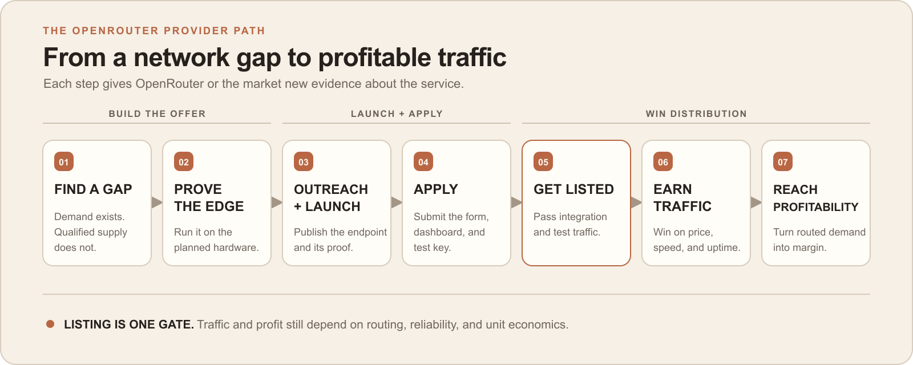
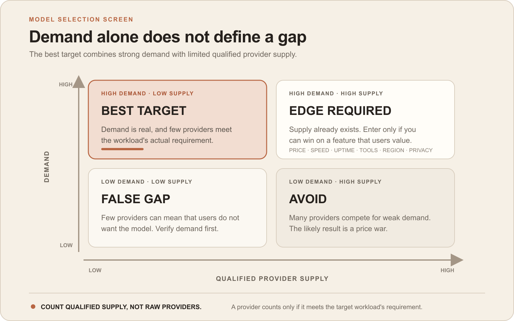
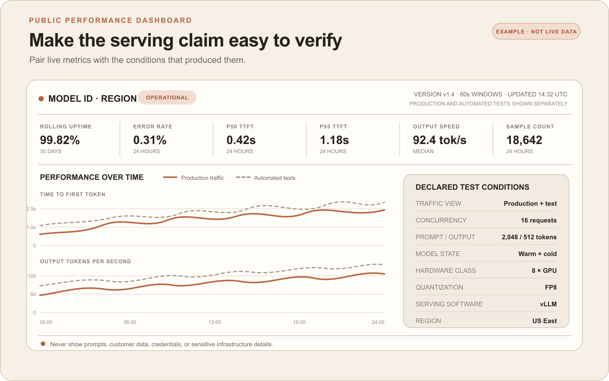

# How to get listed on OpenRouter as an inference provider

I read through OpenRouter's provider documents and compiled every public source I could find from inference providers that have already been listed on OpenRouter or another gateway. I then compared their launches with OpenRouter's published rules. This is what I learned about how a new provider can put its best foot forward to get listed.

[OpenRouter currently names two priorities](https://openrouter.ai/providers/apply): providers that bring models they own or control, and providers that fill gaps in its network. This guide covers the second.

A standalone application won't get you noticed. It's best to: first, find a gap, prove that you can serve it, and launch a public endpoint with performance data that anyone can inspect. Then formally apply, contact the provider team, and give them an offer they can test.

*Figure 1. Proposed provider path. This is the author's operating synthesis, not OpenRouter's official process. The official requirements and review stages come from [OpenRouter's provider page](https://openrouter.ai/providers/apply).*

## 1. Find a gap with real demand

A gap can appear in three ways:

- A strong, upcoming open-weight model release can create a day-zero opening.
- A new policy, outage, price change, quota change, license change, or popular client blowup can create replacement demand.
- An existing model can have users but still lack an important provider feature.

If you want to find a gap today instead of waiting for a market change, use this process:

1. Use the [OpenRouter rankings](https://openrouter.ai/rankings) to find models with rising usage.
2. Use the [OpenRouter Inference Provider Market Share dashboard](https://or-provider-dashboard.vercel.app/) to see which hosts serve the top models and how their routing share changes.
3. Confirm each candidate on its OpenRouter model and endpoint pages. The provider dashboard is unofficial and its model view covers only the top models.

*Figure 2. Demand and qualified provider supply screen. Source: author analysis using the [OpenRouter rankings](https://openrouter.ai/rankings) and the [unofficial provider market-share dashboard](https://or-provider-dashboard.vercel.app/).*

Give your agent a prompt like this:

> Using the OpenRouter rankings and provider market-share dashboard, find five open-weight models with rising OpenRouter usage and limited qualified provider supply. For each model, verify the current provider list on OpenRouter. Compare price, uptime, context length, region, privacy, latency, output speed, and tool support. Name the unmet need, cite each source, and state the evidence date. Do not recommend a model only because it has few providers.

Use the result to choose a gap worth testing. Before you commit hardware, estimate the price, capacity, and gross margin you can achieve. If you cannot show demand and a profitable edge, keep looking. Maybe move outside of OpenRouter's network if necessary.

## 2. Prove the edge on your hardware

Run the model on the hardware you plan to use through a private endpoint. Before each test, record the hardware, serving software, quantization, test duration, prompt and output lengths, and number of simultaneous requests. Repeat the test at several request levels. Measure time to first token, output speed, queue time, errors, GPU memory use, and cost per million tokens. This will show normal performance and the point where the service starts to fail.

Test how the endpoint behaves at that limit. When capacity is full, [return an HTTP `429` response quickly](https://openrouter.ai/docs/guides/community/for-providers#11-performance-metrics) instead of placing requests in a long hidden queue. A fast rejection gives clients a clear signal and prevents queue time from making the endpoint look slower than it is.

Performance alone is not enough. Compare output quality with the unmodified model. If you offer tool use, count valid calls, invalid calls, and execution failures separately. Confirm that the model license and your data policy permit the service. Then compare expected revenue with GPU and operating costs.

Start serious provider outreach only when the results are repeatable and the economics work.

## 3. Start provider outreach while you finish the endpoint

Once the internal test passes, contact the provider team while you finish the public service. The test result gives them something concrete to review. Tell them which model you plan to serve, what OpenRouter is missing, what you measured, and when the endpoint will be live. Ask whether that gap matters and whether OpenRouter is reviewing new providers.

You can email `providers@openrouter.ai`, and you can also contact one relevant person directly. [Shashank Goyal](https://www.linkedin.com/in/shashankgoyal1) works on OpenRouter's provider ecosystem. [Tomas Oliva](https://www.linkedin.com/posts/oliva-tomas_excited-to-share-that-today-marks-my-first-activity-7289788708579405824-tYx7) works in operations, support, and developer relations and has asked people to notify him when a new model drops.

At the same time, finish the minimum product that OpenRouter can inspect.

- Run the model on infrastructure that you operate, whether you own or rent it.
- Expose an authenticated public HTTPS endpoint that supports OpenAI-compatible chat requests, streaming answers, and accurate token counts.
- Publish a `/models` endpoint with the model ID, price, context length, features, capacity, location, and data-handling fields.
- Publish privacy terms that state whether you log prompts, how long you keep data, and whether you train on it.
- Set a price, prepare a separate OpenRouter test key, and support monthly invoicing.

Self-serve signup, retail billing, and a large marketing site can wait. The endpoint makes the application testable. The website only needs to support trust, documentation, and policy disclosure.

## 4. Launch with proof that anyone can inspect

### Make the offer easy to verify

Announce the model, base URL, price, context limit, region, privacy terms, capacity, and the gap it fills. Give readers one direct action: request a key, buy credit, or join a small retail plan.

Publish the benchmark method, workload, and result. One speed number can hide low concurrency, short prompts, a warm model, or test conditions that do not match production.

Include a public live performance dashboard in the launch post, API documentation, and OpenRouter application. It should show:

- Current status, rolling uptime, and error rate.
- Median and 95th-percentile time to first token, output tokens per second, and sample count.
- Concurrency, prompt and output lengths, warm or cold state, hardware class, quantization, serving software, and region.

*Figure 3. Example public performance dashboard. This is the author's recommended proof layout, not an OpenRouter requirement. Source: author design based on [OpenRouter's published provider review criteria](https://openrouter.ai/providers/apply).*

Use clear time windows and label production traffic and automated tests separately. Show the model version, method, and last update time. Never expose prompts, customer data, credentials, or sensitive infrastructure details.

### Send traffic to the endpoint

Post the launch on X, state what makes your endpoint different from the other providers, and link the dashboard. Set a promotion budget and track impressions, visits, key requests, successful calls, repeat use, and spend. Tag OpenRouter and one relevant provider-team contact so they can see the gap and test the endpoint.

### Get users onto the endpoint

Subsidized tokens can help attract early users and show how they use the service. Start with a time-limited flat-rate plan. Do not meter tokens, but cap the number of users, request rate, concurrency, campaign length, and total loss. Issue the first keys manually. Then move to a subscription with a token allowance and pay-per-token overage. If pay-per-token use becomes the stronger product, make it the default and retire the subscription plans.

This traffic can show that people want the service, but it does not guarantee OpenRouter acceptance. Buy traffic only after the service can handle it.

## 5. Submit one complete application

Apply through the [official provider form](https://openrouter.ai/providers/apply/form) when the endpoint is live. Submit it when you announce the service so the reviewer can test the current service and results.

Put everything the reviewer needs in one place:

- The model and the gap it fills.
- Proof that people want it.
- Your test result, how you ran the test, and the dashboard link.
- The API URL and a separate OpenRouter test key.
- Your price and the amount of traffic you can handle.
- Where the service runs, what you do with customer data, and who OpenRouter should contact if there is a problem.

## 6. Follow up when you have something new

Use the same email or direct-message thread and the same contact from Step 3. Tell them that the service is live. Send the endpoint, the gap it fills, the price, the test result, the dashboard, and the same OpenRouter test key.

After that, follow up only when you have new information, such as a better result or real users.

## 7. Getting listed does not guarantee traffic

Once [OpenRouter lists your service](https://openrouter.ai/providers/apply), it can start sending you requests. That does not mean you will receive enough traffic to build a business.

OpenRouter normally sends more requests to stable providers with lower prices. Users can also choose providers by response time or output speed. For requests that use tools, OpenRouter can consider how often the provider returns a valid tool call.

Uptime directly affects traffic. [OpenRouter starts measuring uptime after 100 requests](https://openrouter.ai/docs/guides/community/for-providers#10-uptime-monitoring-and-traffic-routing). Providers at 95% uptime or higher receive normal traffic. Providers between 80% and 94% receive less. Below 80%, OpenRouter uses them only as a backup.

After listing, track the requests OpenRouter sends you, revenue, GPU and operating costs, errors, and repeat use. Compare OpenRouter's speed and uptime numbers with your own dashboard. Other providers can also add the same model and remove your advantage.

Listing makes your service available. Traffic and profit make the listing valuable.

## Build the application that can be called

Find a gap with demand, then prove one edge on the hardware you will use. Start focused provider outreach, finish the endpoint, and launch with public evidence. Then apply and follow up with a separate OpenRouter test key.

Do not ask for a listing before the endpoint is callable. Give OpenRouter a useful gap, a live endpoint, a measurable edge, and a separate test key.

## Seven-step checklist

- Find demand with scarce qualified supply.
- Prove one edge on real hardware.
- Start focused outreach after internal proof.
- Ship the priced endpoint and live dashboard.
- Launch publicly and submit the form.
- Follow up with new evidence and a separate OpenRouter test key.
- Measure acceptance and routed traffic separately.

## Related research

- [[how-to-get-listed-on-openrouter-article-skeleton|Article skeleton and claim ledger]]
- [[openrouter-provider-selection-and-onboarding-primary-source-check-2026-08-19|OpenRouter provider selection and onboarding source check]]
- [[inference-model-opportunity-data-source-audit-2026-08-19|Inference opportunity data-source audit]]
- [[a-public-benchmarked-endpoint-and-paid-launch-can-test-gateway-distribution|Public endpoint and paid-launch hypothesis]]
- [[inference|Inference area]]
